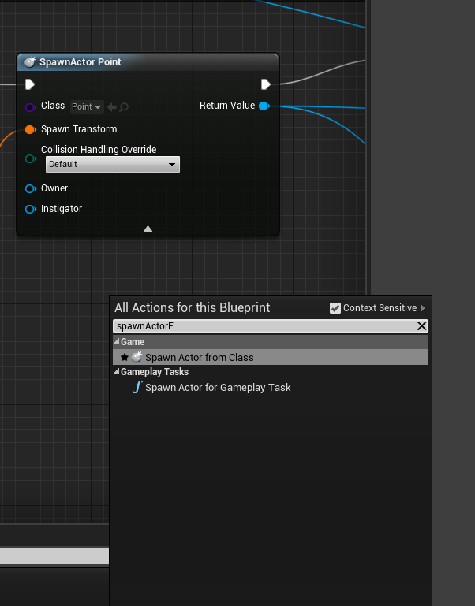
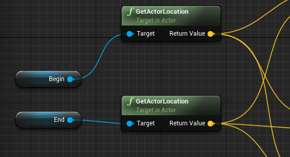
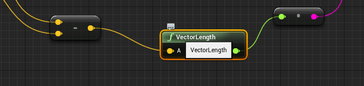

# 蓝图节点

## GetWorldLocation

获取当前对象在世界坐标中的位置，返回一个三维向量

## GetWorldRotation

获取一个物体的旋转，返回一个`Rotator` 对象。

## GetRotationXVector

将一个旋转值转换为X方向的向量。

## LineTraceForObjects

碰撞线性追踪：

碰撞的结果信息：

## Branch

相当于`if...else`，输入是一个`bool`类型，`true`和`false`代表不同的分支

## Make Transform

根据需要的值，新建一个`Transform`对象

## SpawnActorFromClass

根据一个`Actor`模板创建一个`Actor`的实例，用于新建一个对象

## Sequence

串行的执行多个操作，首先执行`then0`,完成后执行`then1`,以此类推

## Is Valid

校验一个对象是否非法

## GetActorLocation

获取Actor的位置

## Lerp(插值)

## VectorLength

向量的长度

## Draw Debug Line

画一条调试线

## Draw Debug String

画一条调试字符串

