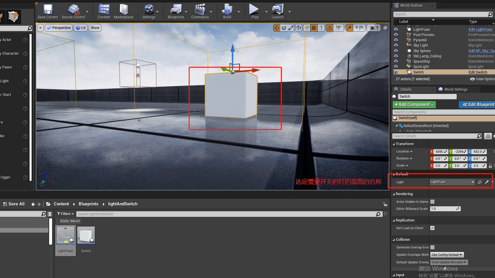
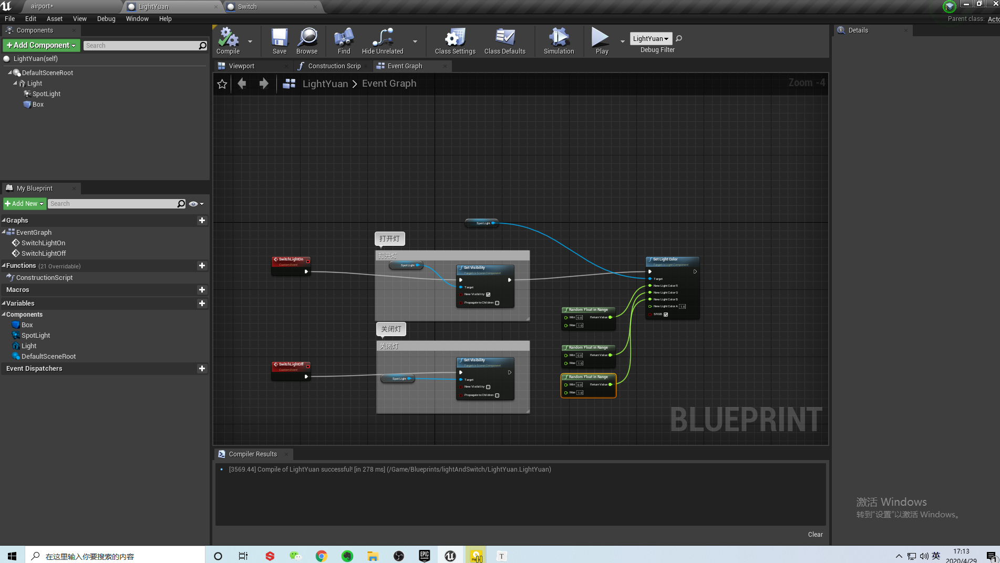
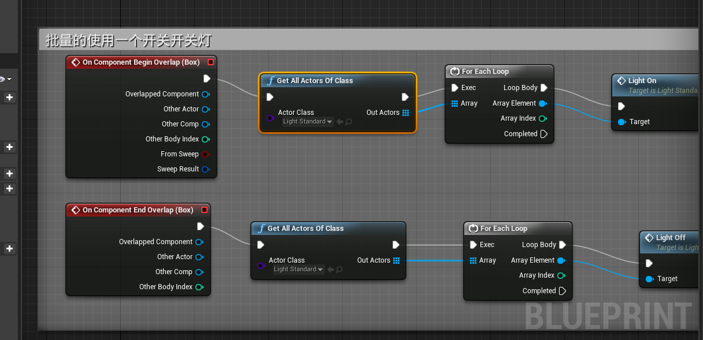
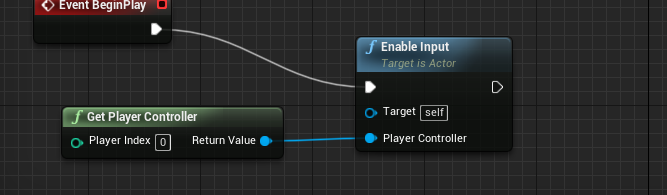

在场景中引用的时候，需要指定default:

灯的蓝图，需要自定义事件：

## 批量实现开关灯

在之前使用开关单独实现开关灯的基础上，我们无需改变灯的蓝图，只需要在开关的蓝图上做文章，我们需要让开关蓝图找到所有的`同类型`的灯蓝图，此时需要使用一个函数：`GetAllActorsOfClass`,并且指定需要找的蓝图名称，最后调用`forEachLoop`函数循环即可，完整的蓝图如下：

## 使用按键控制的注意事项

对于使用按键来控制的，需要在场景中打开`Input Enable`,如下图：

