# 第五天

## 1 开关门

### 1.1 开关门

设置旋转角：

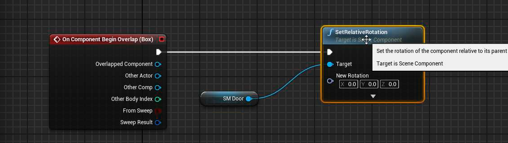	

生涩的开关门：

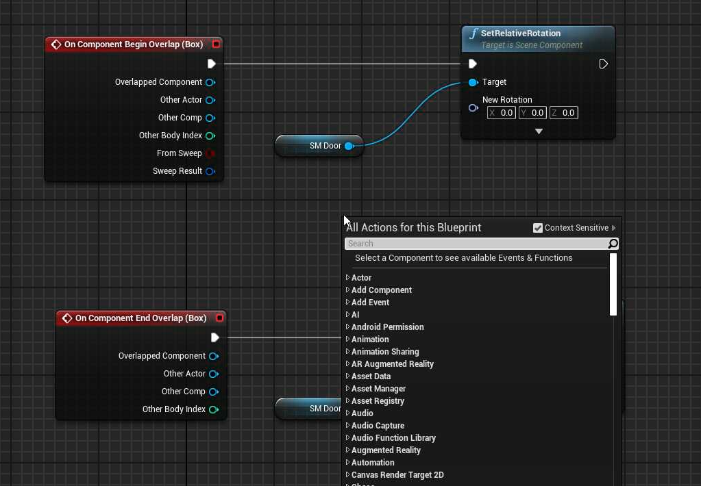

时间轴的length必须和范围一样：

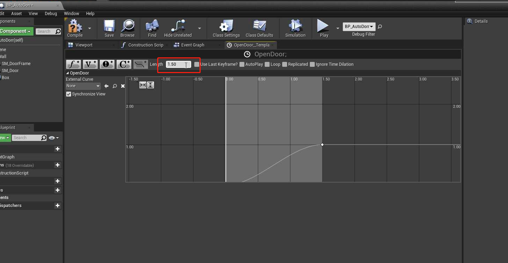

make rotation:将角度旋转

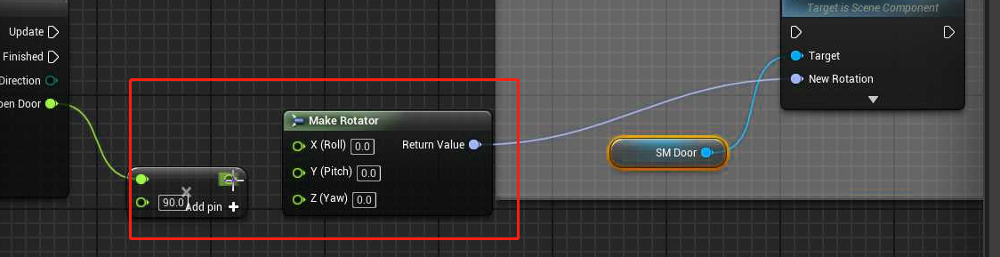

完整的实现：

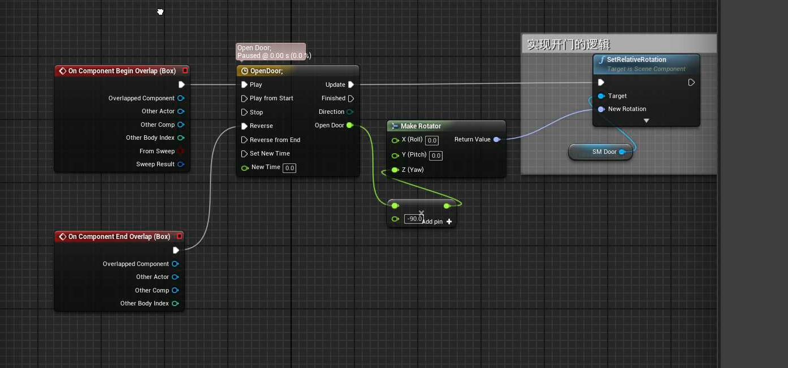

### 1.2 提示按键信息然后开关门

1. 单开门（90度）

2. 靠近时自动打开
3. 离开时自动关闭
4. 靠近门 A 条件
5. A 条件达成

允许玩家输入：

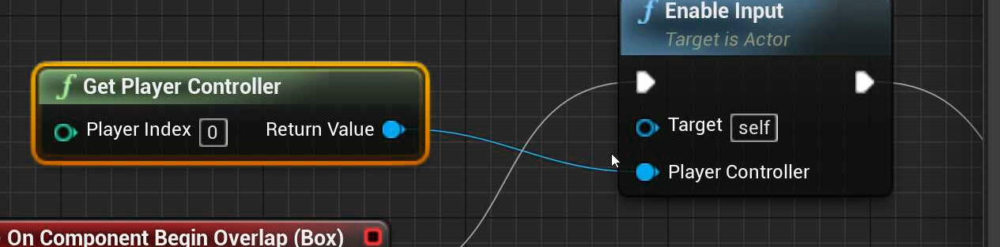

按键绑定：

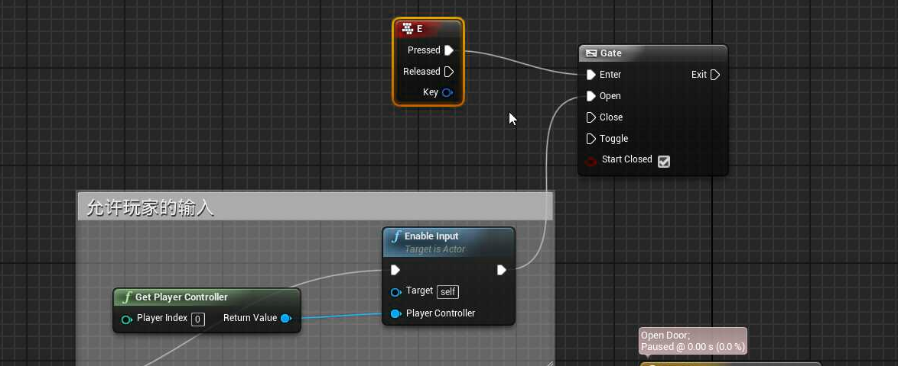

但是不建议直接将按键和事件直接绑定，需要先定义按键：

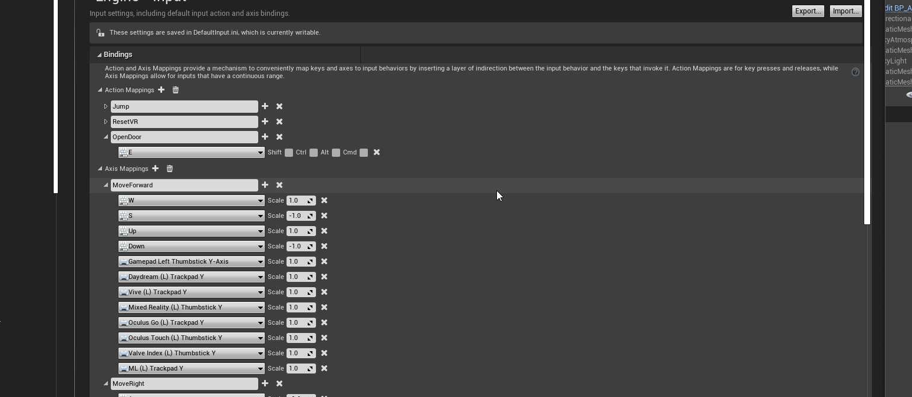

将自定义的按键和事件绑定：

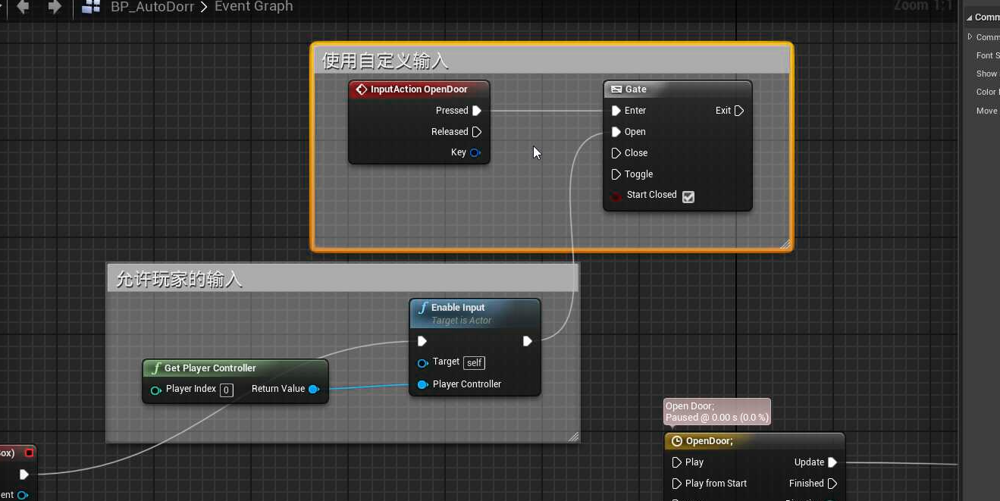

注意：CollisionBox 不能为Door的子类，否则会产生死循环，具体的原因可以去调查一下：

当 cillionBox 成为Door的子物体的时候， CollisionBox 会随着 door 移动，当触碰 `CollisionBox`的时候，`overlap` 触发，门打开，此时CollisionBox 就会跟着移动，就会触发 `overlap end`, 门又会关闭，CollisionBox 又会被玩家碰到，触发`overlap begin` 事件，造成死循环。

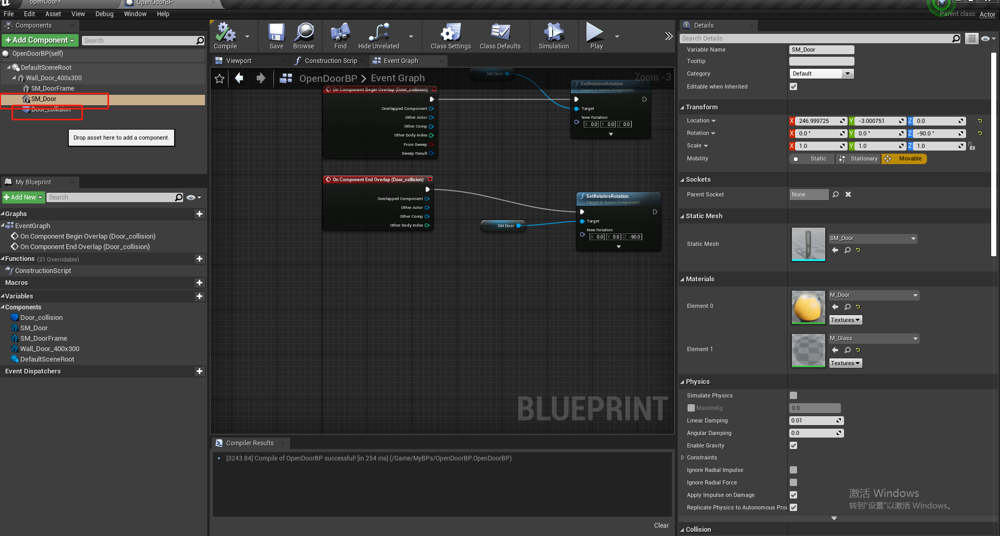

## 2 项目精简

使用迁移的方式：

ue4 默认打开的地图：

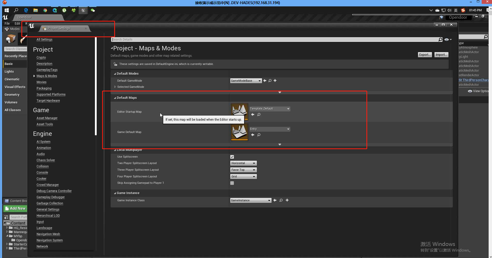

自己实现用E开关门的蓝图:

http://blueprintue.cn/blueprint/gy1sqx84/

有个不优雅的地方，就是快速按两次E的时候，门会被重置一下，如果时间轴可以自定义关闭门的初始化位置，就不会有这个问题了。（待解决）