# 捡肥皂项目拆解报告

## 1 游戏模式和地图

### 1.1 游戏模式

从工程设置中可以看到，游戏是第三人称的游戏

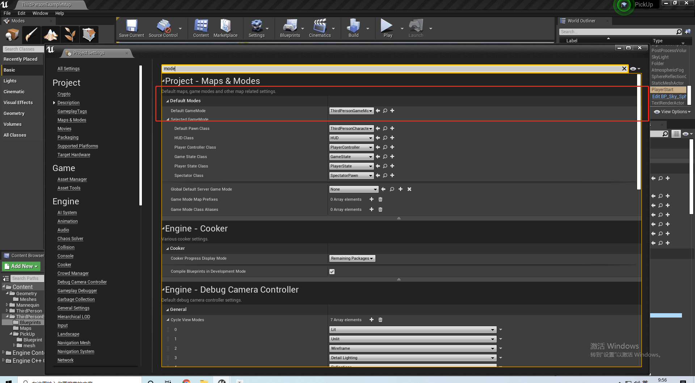

### 1.2 地图

游戏的默认地图为：ThirdPersonExampleMap

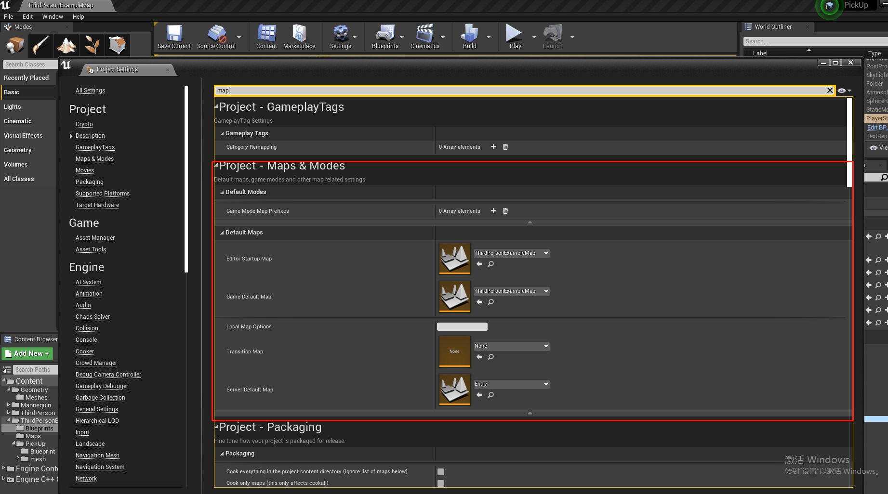

可以在在Content 的目录如下：

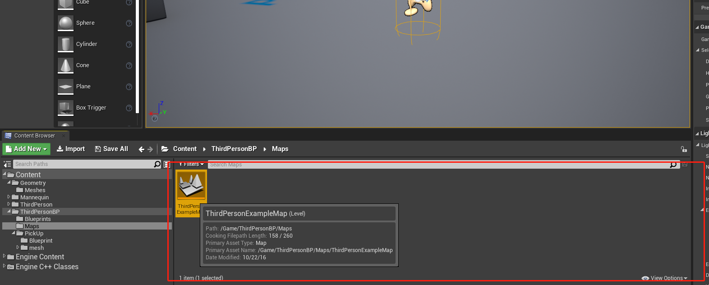

## 2 角色设计

### 2.1 捡肥皂和扔肥皂的模型动画

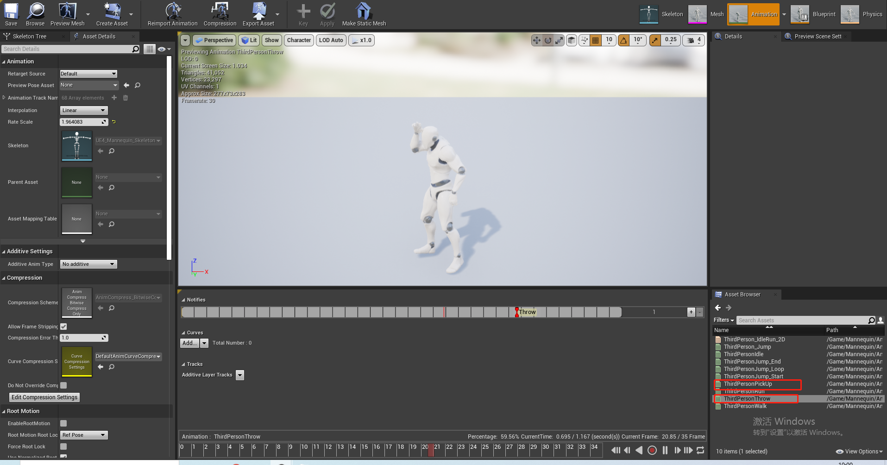

### 2.2 将动画和角色进行绑定的蓝图

* 绑定捡肥皂的动作

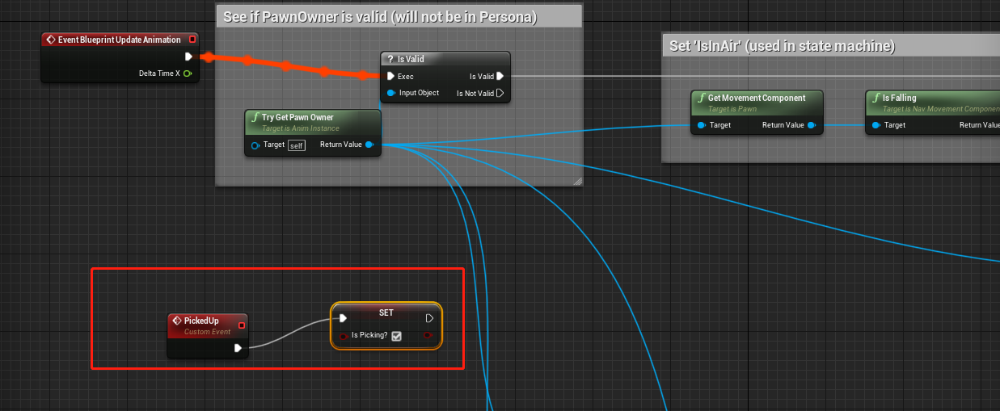

* 绑定扔肥皂的动作

  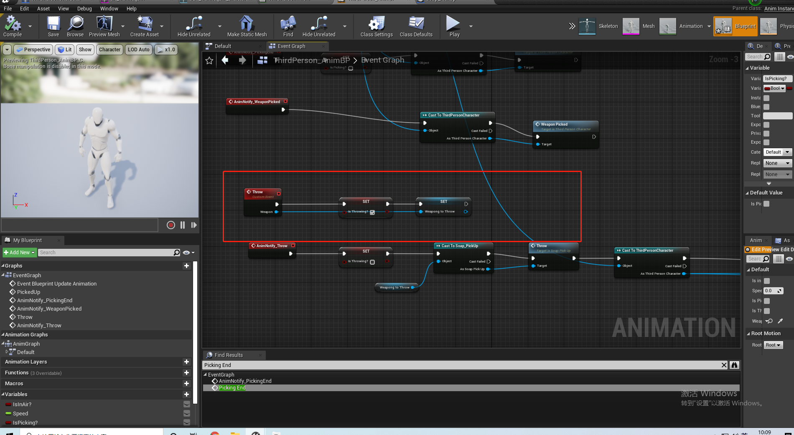

## 3 角色蓝图

角色蓝图主要负责将角色的行为和外界发生联系。

### 3.1 按E捡肥皂

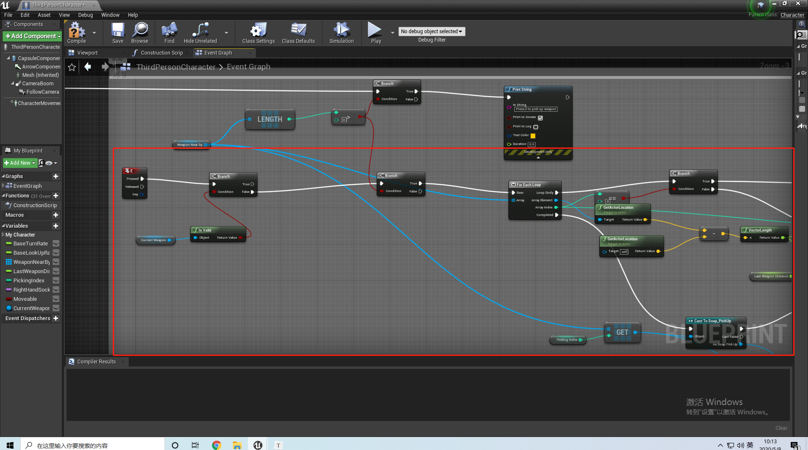

### 3.2 按鼠标左键丢肥皂

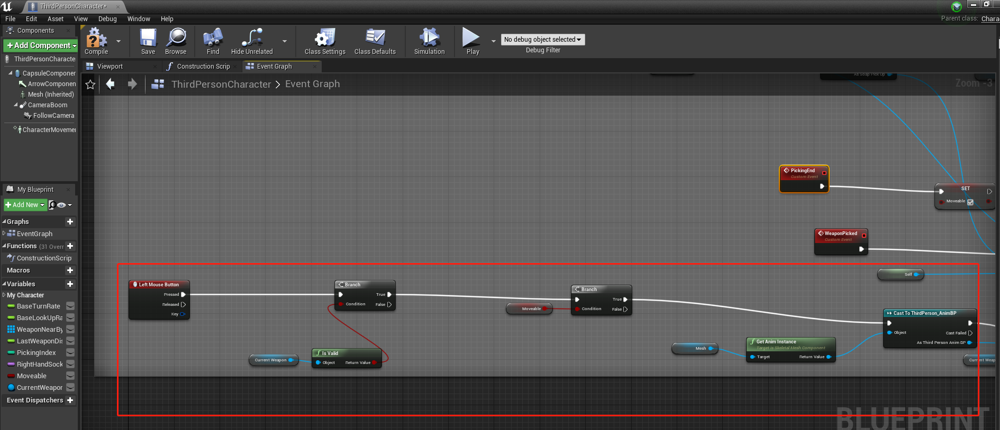

这个蓝图里面调用了肥皂蓝图的里面的捡肥皂和丢肥皂的方法：

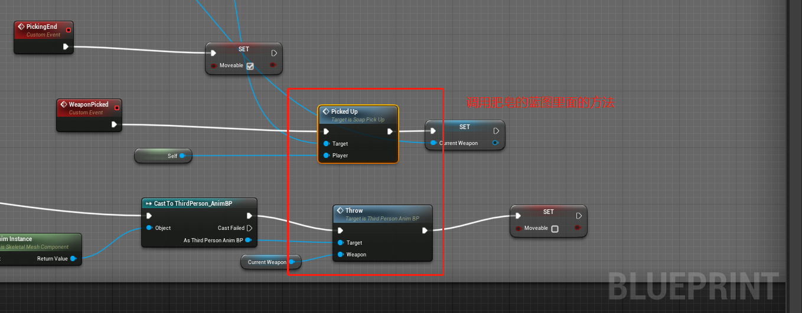

## 4 肥皂的静态模型和材质

### 4.1 肥皂的静态模型

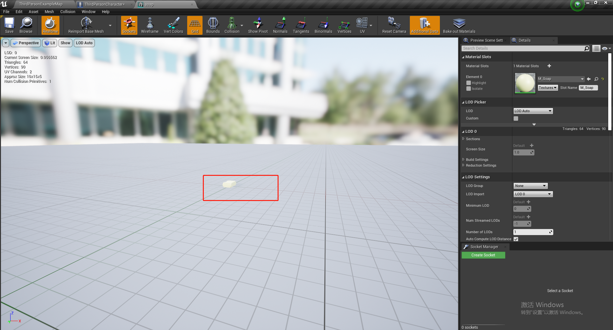

### 4.2 肥皂的材质

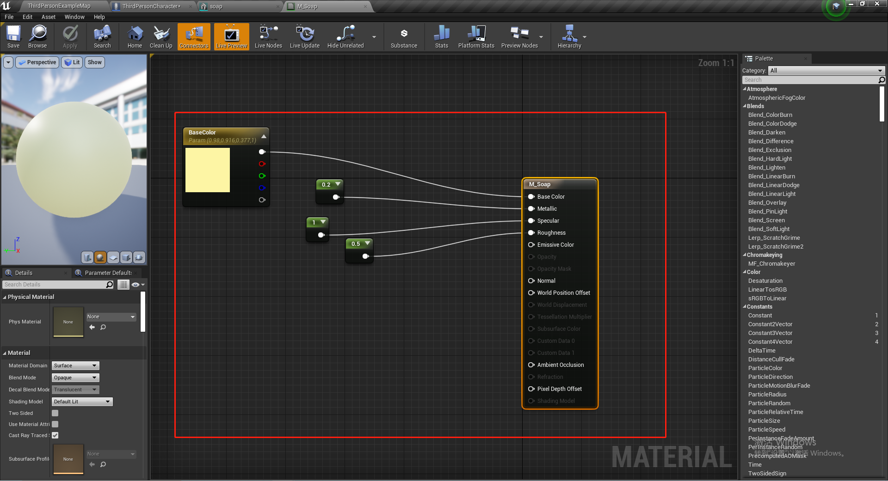

## 5 肥皂的蓝图设计

### 5.1  定义肥皂的BeginOverlap和EndOverlap

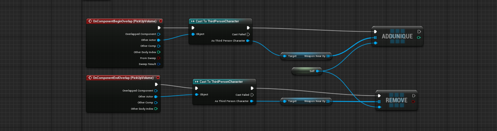

### 5.2 定义捡肥皂事件

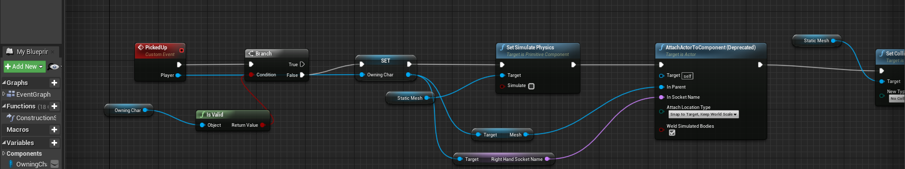

### 5.3 定义扔肥皂事件

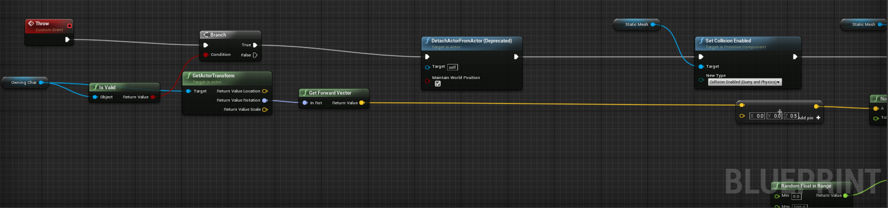