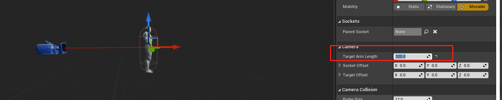
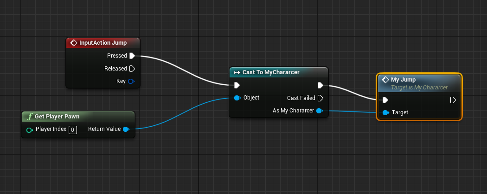

# Day 09

## 1 GameMode

他是一个Actor，但是拖到场景中，没有反应，他与关卡进行绑定，每切换一个关卡，GameMode就会被销毁，因此不能使用它来持久保存玩家数据。下面是GameMode所配置的各种子类。用来定义游戏玩法和游戏规则。

### 1.1 属性介绍

#### 1.1.1 GameSession

游戏会话

#### 1.1.2 GameState

游戏状态，表示游戏中的玩家的状态

#### 1.1.3 PlayerController

玩家控制器，用于接收玩家的各种输入。

#### 1.1.4 PlayerState

玩家状态，血量等

#### 1.1.5 HUD(抬头显示器)

#### 1.1.6 Default Pawn

默认的玩家载体，对于可移动的四脚动物来说，推荐使用 `Character`,他是 `Pawn`的一个子类。

#### 1.1.7 Spectator 

观战系统

### 1.2 配置全局的GameMode

### 1.3 手动指定某一个关卡的GameMode

### 1.4 运行游戏自动产生 GameMode

GameMode是无法拖进场景中的，他和关卡绑定，当运行游戏时，会自动的创建GameMode和其配置的各种属性的Class。

初始化顺序：

先初始化一个GameInstance --> 初始化一个World --> 初始化一个 GameMode --> GameMode 初始化各种类:

## 2 GameInstance

### 2.1 新建 GameInstance

将玩家在每个关卡(gameMode)中的分数存档进GameInstance，每个客户端只有一个GameInstance,但是一个服务器可以有多个GameInstance.

### 2.2 引用GameInstance

gameInstance 只有当游戏关闭的时候，才会释放。但是如果结束进程、游戏崩溃，是来不及调用 EventShutDown，此时的游戏是无法保存的。

**补：使用 GameIntance 和 GameSave 实现游戏存档。**

### 2.3 模拟使用GameInstance和SaveGame实现游戏存档

## 3 SaveGame

### 3.1 创建

## 4 PlayController

玩家控制器，可以识别玩家的一些输入。

玩家控制器(玩家输入)

## 5 Pawn

玩家的载体，他的一个子类是`Chararter`,用于创建可行走的玩家。

### 5.1 Chararter

角色胶囊体

给胶囊体添加模型。

要让角色的正面和蓝色的箭头朝向一致。

## 6 角色模型和动画

角色模型用于显示角色的骨骼、物理、动画等信息。

### 6.1 创建一个角色动画

### 6.2 动画蓝图（AnimBlueprint）

这种动画可以控制上面创建的角色动画，在不同的状态播放不同的动画。

#### 6.2.1 创建

#### 6.2.2 根据角色动画来自定义动画

#### 6.2.3 创建状态机来实现各种动作的切换

#### 6.2.4 状态机中的状态转换实例

#### 6.2.5 在Chararter 中绑定动画蓝图

#### 6.2.6 在Character 使用动画蓝图

#### 4.2.5 定义角色动画通知

#### 4.2.6 接收动画通知

修改对应的状态

#### 4.2.7 在弹簧臂下面添加摄像机

这样摄像机在遇到物体的时候，会像弹簧一样，自动伸缩。

调节弹簧臂的 arm 长度，摄像机为弹簧臂的子组件，因此不能直接移动摄像机，需要移动弹簧臂，带着摄像机移动，而且只能条件弹簧臂的角度和高度，距离需要使用 target arm length 调节：

## 7 用户输入

### 7.1 定义用户输入

### 7.2 实现玩家旋转

接收用户的输入都在 `PlayerController` 里面定义，而因为 `PlayerController` 自带旋转功能，因此旋转可以直接在 `PlayController` 完成

在有弹簧臂的情况下，将弹簧臂的控制交给Play Controller

### 7.3 实现玩家移动

由于移动需要有坐标和偏移量的概念，我们只能在`Pawn`实现移动的行为，而在`PlayController`中接收玩家输入，调用`Pawn`中的方法来完成移动。

#### 7.3.1 Pawn 中定义移动的行为

#### 7.3.2 在PlayerController中定义输入事件并调用 Pawn中的方法

其中需要使用`GetActorForward` 和`getActorRightRight` 来获得玩家向前(向后)、向右(向左)的移动方向。

可以理解为`PlayerController`是灵魂，而`Pawn`是肉体，灵魂是动作的发出者，而最终行动的是肉体。

将当前`Pawn` 转换为`GameMode`中具体的配置的`Pawn`：

调用实际`pawn`中的`MyMove` 方法来移动角色：

此时我们可以让玩家移动，但是并没有将移动和玩家的动作绑定到一起，此时我们需要绑定动作。

#### 7.3.3 定义玩家跑步的动画一维动画(MyRun)

暴露一个参数`speed` 给外面，用于控制玩家的速度。

#### 7.3.4 在MyAnimBluePrint 中定义一个状态，来控制这个动画

#### 7.3.5 每帧追踪玩家速率，设置给 speed

`Event Blueprint Update Animation` 和`Event Tick` 作用差不多。

这样就会有跑起来的动作了。

### 7.4 玩家跳跃

#### 7.4.1 在Character 中定义跳跃事件

#### 7.4.2 在 PlayerController 中捕获跳跃行为，并调用Character中的跳跃事件

在完成上面的两个操作，此时的玩家可以实现跳跃的距离，但是没有跳跃的动画，因此我们需要使用动画蓝图来将角色的行为和动画做一个绑定。

#### 7.4.3 定义一个动画蓝图

#### 7.4.4 使用状态机来控制动作动画

* 当`isJump` 为 true 时，切换到 JumpStart 状态
* 当 `isJumpStartEnd` 为 true 时，进入跳跃中的动画。
* 当 `isJump` 为 false 时，进入结束跳跃的动画。
* 当 `isJumpStartEnd` 为 false 的时候，进入地面状态 

那我们何时知道起跳动作播放完成呢，我们可以在起跳动作结束时添加一个提醒事件，在`AnimBlueprint`中捕获这个事件。

#### 7.4.5 如何判断角色腾空

现在我们已经完成了起跳-->跳跃中的动作转换，那我们何时知道角色起跳呢？

我们角色蓝图中可以使用`isFalling` 来表示角色是否腾空，如果是，把AnimBluePrint中的`isJump`修改为true。如果角色不在腾空，我们除了把`isJump` 设为`false`以外，还需要将`isJumpStartEnd` 也设为`false`，让角色结束跳跃的动作，恢复到站立状态。

### 7. 5  总结——让角色动作和橘色动画绑定的两种方式

每帧每秒监测角色的行为(是否腾空或者当前速率)，然后修改状态机对应的参数，实现角色动作和动画的绑定。

## 8 让物体沿着固定曲线运动

### 8.1 获取时间戳

### 8.2 使用贝塞尔曲线实现物体移动

#### 8.2.1 建立蓝图

#### 7.2.2 实现移动

对于二维的贝塞尔曲线，0就是初始位置，1就是结束位置，我们定义一个变量`time`,取值在`0~1`之间，用来控制物体的移动。

这样我们可以在场景中修改`time`的值来测试物体的移动。

#### 7.2.3 使用时间来做

然后我们只需要均匀的将`time`从`0`变换到`1`,然后在均匀的从`1` 变化到`0`即可，我们可以时候`event Tick` 和`now` 来实现。

使用样条曲线来实现移动的关键在于找到一个递增的函数从`0~1` 以及找到一条递减函数从`1~0`

#### 7.2.4 新增样条线

#### 7.2.5 样条线的段数

### 8.3 实现电梯来回移动

先设置Box的碰撞为`BlockAll`，让物体碰到时，设置物理为`over`

## 8 实现关卡切换

在管卡蓝图中，定义一个碰撞盒，当碰撞的时候，使用 OpenLevel 打开下个关卡，此时的 Level1 的数据就会全部丢失。(GameMode以及下面依附的子类都会被销毁掉)

