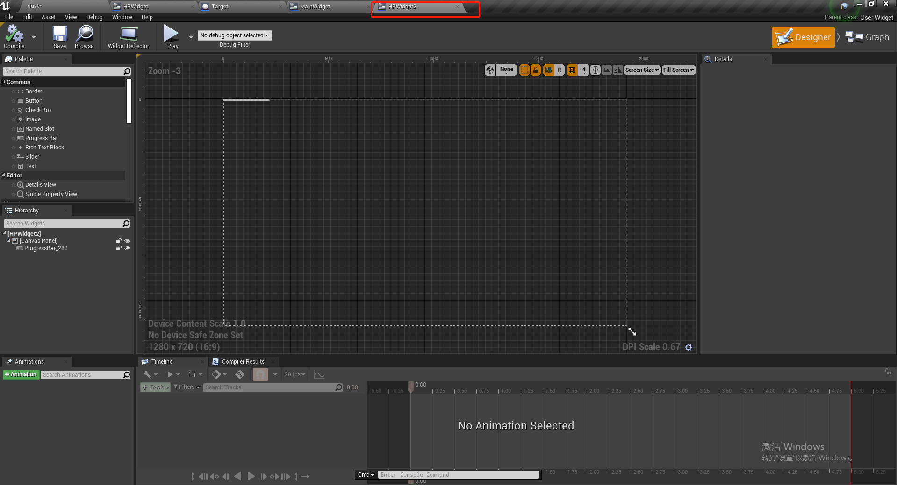
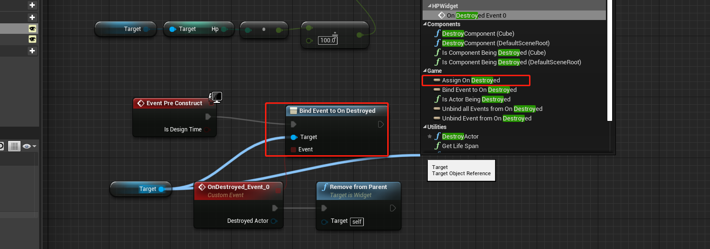

# Day12——血条和捡子弹

## 1 Slot

插槽，用于控制UI的布局。

九宫格模型下和锚点的距离表示：

垂直模式下：

四分模式：

居中对齐的方法：

添加子组件：

获取父类slot的两种方式：

渲染变换：

## 2 使用2D 控件来制作血条

### 2.1 制作一个靶子(Actor)

该Actor中有一个HP的变量，用于存储靶子的血量。

### 2.2 创建一个主UI(Main Widget)

### 2.3 创建一个血条的UI(HP Widegt)

用进度条表示血量，在这个Widget中，我们创建一个对象，用来存储靶子。

### 2.4 在主控件中，为每个靶子绑定一个血条

并且绑定靶子的销毁事件，如果场景中所有的靶子都被销毁，就播放动画，关于动画，请看第五节。

### 2.5 在血条Widget中，每帧都刷新进度

## 3 3D 控件制作血条

### 3.1 创建一个被Actor 绑定的血条(Widget)

在里面用一个整型的变量`HPValue`来和血条做绑定：

### 3.2 创建一个 Actor 来绑定血条

我们可以在一个 Actor 的上方添加一个 Widget，这样我们就可以让 Widget 和 Actor 移动。

在3D 控件中，我们需要让Widiget 中的 `sizeX`和`sizeY`和具体Actor中的Draw Size 的 `X`和`Y`保持一致，这样可以控制他的大小。

### 3.3 互相通信

### 3.4 让血条时时刻刻朝向自己

### 3.5 血条设计的一点感想

对于小怪太多的场景，不应该设置血条，否则场景中慢慢的都是血条，影响游戏体验，对于BOSS，可以像鬼泣五那样，把血条放在游戏下方。

对于玩家本身的血条和能量条，可以设置一个水平一个竖直，和鬼泣五的差不多。

## 3 实现UI 动画

### 3.1 让图片全铺

### 3.2 实现文字居中

### 3.3 创建动画

 

### 3.4 添加动画轨道

### 3.5 选择起点关键帧

### 3.6 将初始的参数添加到起点

### 3.7 修改结束的关键帧参数

 

除了文本，背景图片的透明度(Render opacity) 也需要设置轨道动画。

### 3.8 点击预览

### 3.9 将初始的文字和背景设为不显示

### 3.10 添加播放事件

### 3.11 关于 Bind Destroy

对于每个 Actor,都有一个Destory 事件，我们只要拥有这个对象，就可以监听这个destroy 事件，我们可以使用该事件来做一些操作。

## 4 实现捡子弹的功能

首先一个水平的列表和竖直的列表用来模拟背包和地上的物品。

### 4.1 创建一个水平的列表

### 4.2 创建一个竖直的列表

### 4.3 创建一个色块用来模拟子弹

其中让文本水平和竖直居中的方法如下：

先选择分散的模板：

做如下勾选：

然后在选择居中的模板：

最后的看到的样子是这样：

在子弹中，设置两个变量，color(类型为liner color) 和 number,用来表示子弹的类型和数量，并且给他们设置初值。然后我们可以在构造函数里面，给我们的控件(Image和Text)设置默认的值，对于Text 控件，默认不是变量类型，我们需要将他设置为变量类型：

 预览的效果如下：

### 4.4 给水平列表和竖直列表分别初始化几颗子弹

这里初始化四颗子弹

最好在给这些列表一些浅浅的背景颜色：

游戏中的预览效果如下：

### 4.5 添加碰撞盒用来模拟捡子弹

在关卡蓝图中，注册overlapBegin 事件和 overlapEnd 事件，并在`MainWidget` 中定义 `BeginPickUp` 和 `EndPickUp`事件。

### 4.6 开启鼠标

在游戏中，是无法使用鼠标的，但是需要使用鼠标来捡东西，因此需要在游戏中开启鼠标。

此蓝图在`MainWidget`中实现

### 4.7 重载鼠标按下事件(On Mouse Button Down)

在子弹的Widget的重写识别鼠标左键按下事件，该事件的重写是为了监测鼠标拖拽事件。

### 4.8 重载鼠标拖拽侦测(On Drag Detected)

在子弹的Widget的重写鼠标拖拽事件

### 4.9 新建DragDropOperation

当我们的鼠标将一个Widget 拖拽出来后，他就已经不是一个Widget，此时我们我们需要使用一个新的类型来接收它——DragDropOperation

而此时我们需要创建三个变量(color, number 和 widget ) 来保持之前的 Widget 的信息：

### 4.10 在拖拽时创建DragDropOperation 事件

在子弹的Widget 中 重新鼠标的拖拽事件， 重新创建一个 DrapDropOperation 事件，并且传入对于的构造值。

运行游戏预览如下：

记住，要设置子弹的可见性：

### 4.11 继续完善上一步的代码

在创建新的DragDropOperation 事件之前，先移除当前的子弹

### 4.12 重写水平列表和竖直列表的丢下事件(On Drop)

在水平和竖直的列表中，OnDrop 事件的实现逻辑相同，只是父控件的对象需要替换一下。

最终的预览效果：

可以实现竖直和水平列表之间互相捡子弹，模型吃鸡拣装备的过程。

### 4.13 存在的BUG和问题

由于当我们在设置`SetInput UI Only`的时候，此时无法对玩家进行操作，会产生BUG。

解决方案：只屏蔽鼠标对玩家的输入。