# Day13

## 1 创造动态材质实例

### 1.1 新建材质，并将参数暴露出去

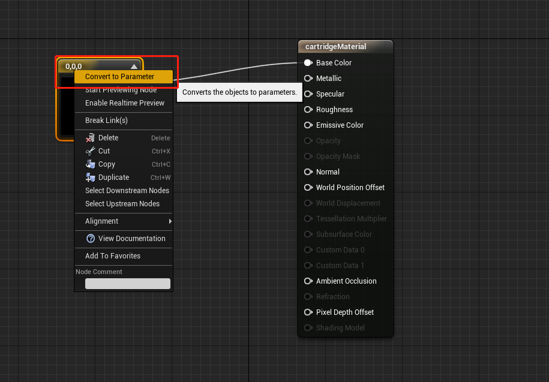

### 1.2 创建一个子弹包的Actor

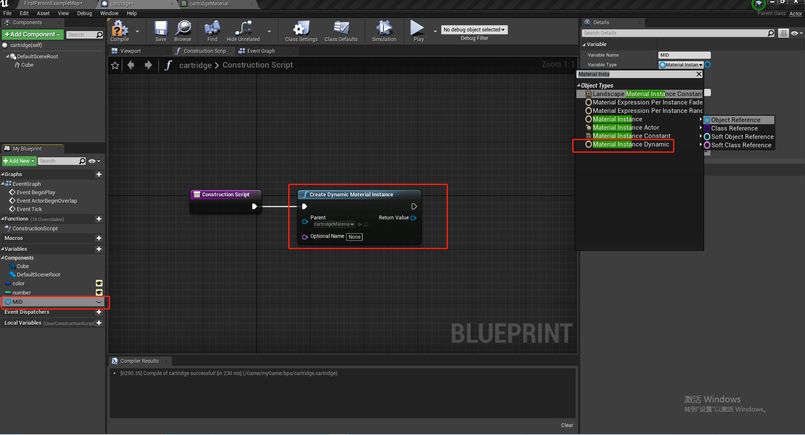

MID的类型为`MaterialInstanceDynamic`,用来保存创建的材质。

### 1.3 创建材质并赋值

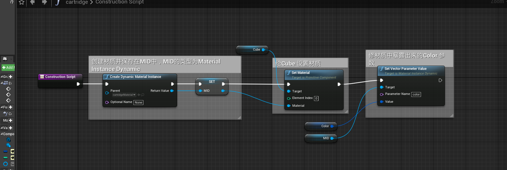

## 2 蓝图接口

### 2.1 创建蓝图接口

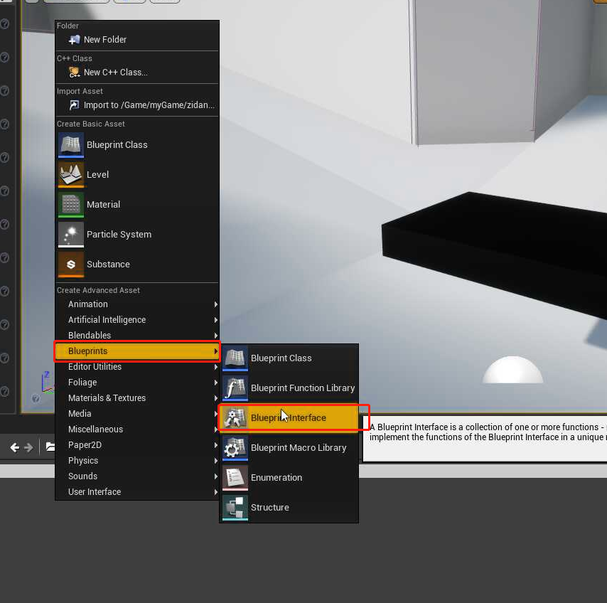

### 2.2 在接口中定义方法

接口中的函数只能定义，无法实现。

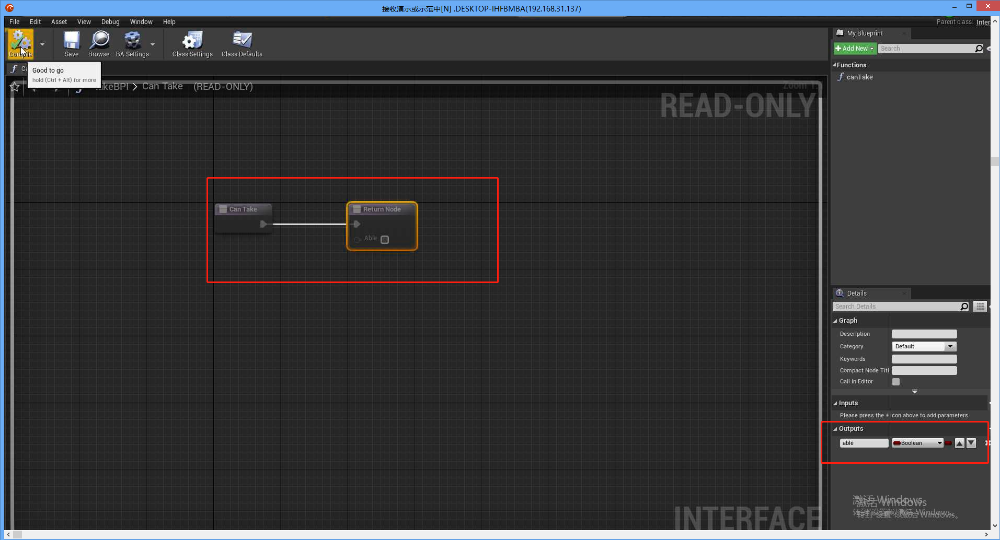

### 2.3 在 Actor 中使用实现接口

首先实现接口：

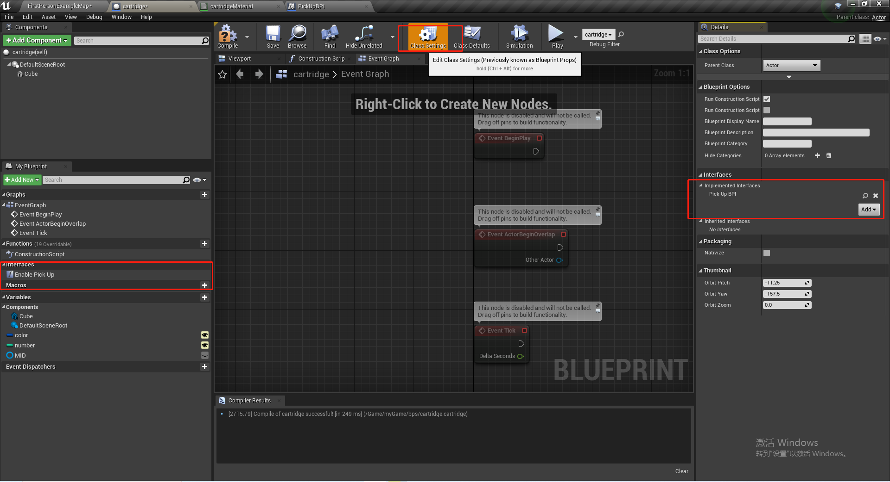

实现接口里面的方法：

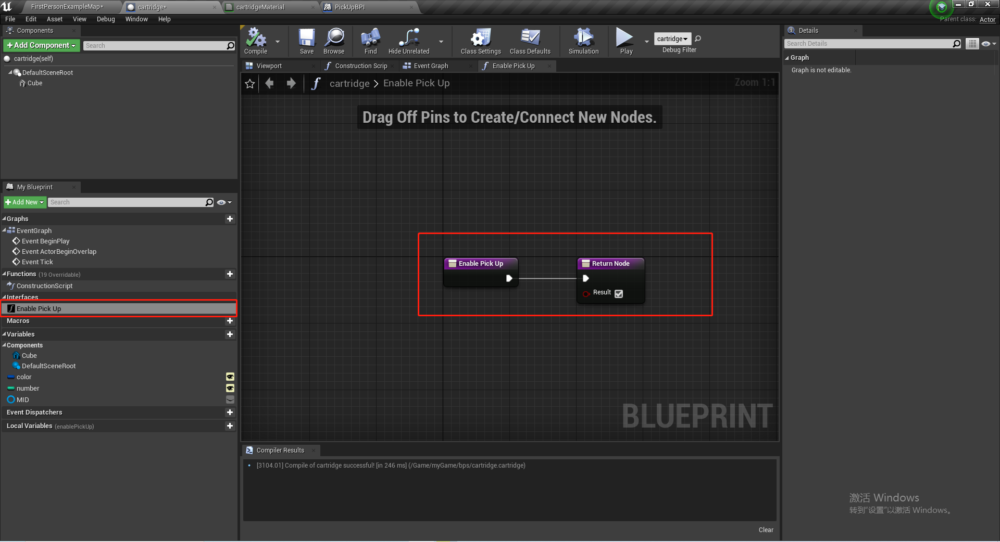

### 2.4 获取实现某些接口的 Actor

在玩家的蓝图中，获取指定接口的所有Actor

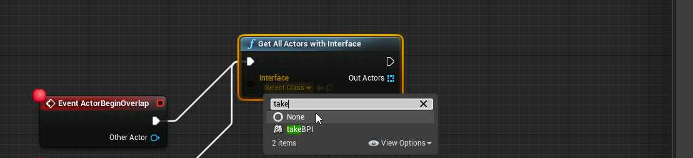

### 2.5 新建蓝图子类

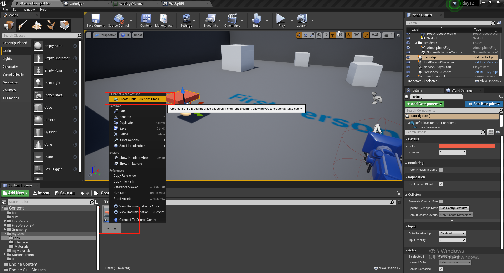

### 2.6 是否实现接口

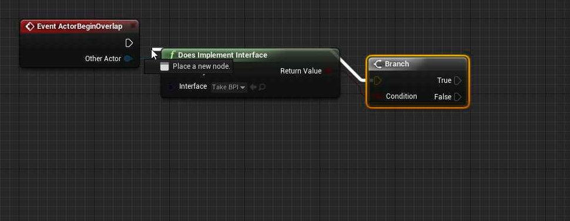

## 3 在屏幕上显示可以的拣东西

### 3.1 子弹盒的BeginOverlap 事件和 EndOverlap 事件

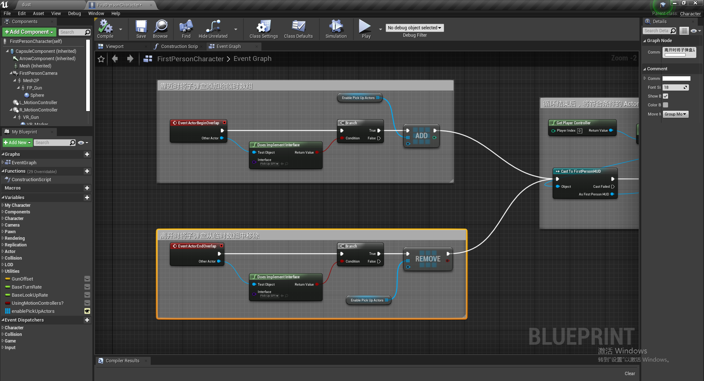

### 3.2 发送给主UI(Main Widget)

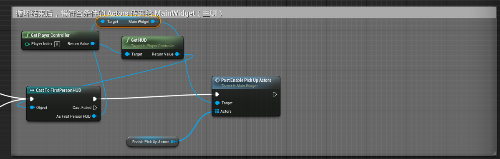

### 3.4 创建Text 来提示按键捡取

如何让文字平铺？

* 选定此种模式：

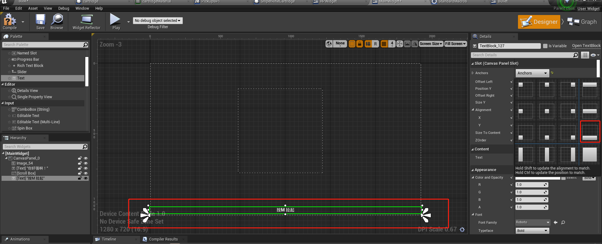

* 设置`OffsetLeft`和`offsetRight`为0

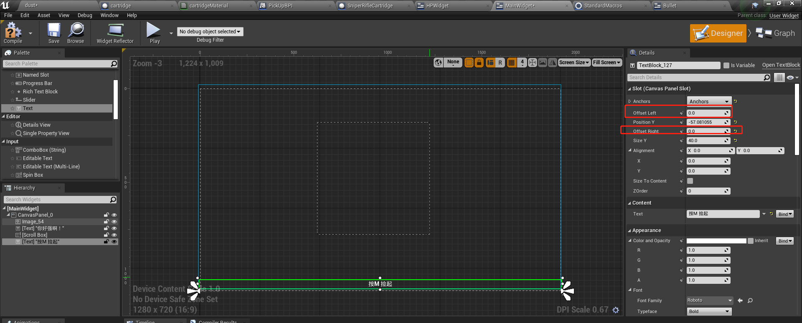

根据数组的空或者非空来显示按键提示：

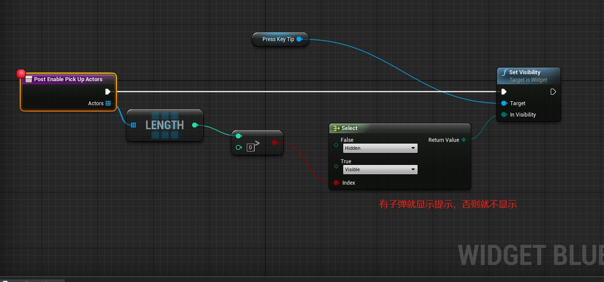

### 3.5 修改之前显示子弹的UI

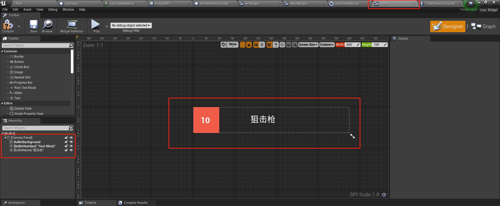

并且在里面加入子弹袋的变量：

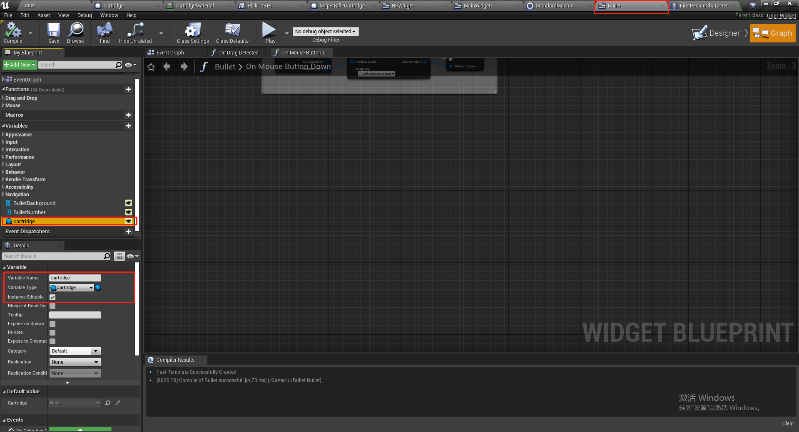

在构造函数中，初始化子弹的显示信息：

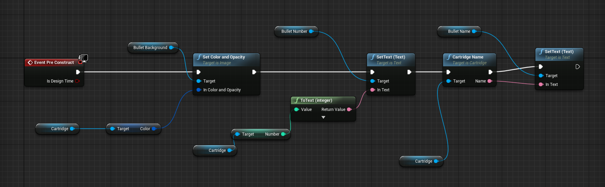

### 3.6 创建滚动框来显示附件可以拣的子弹

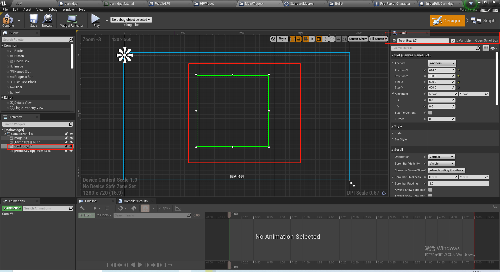

### 3.7 在收到事件的时候将子弹加入滚动框

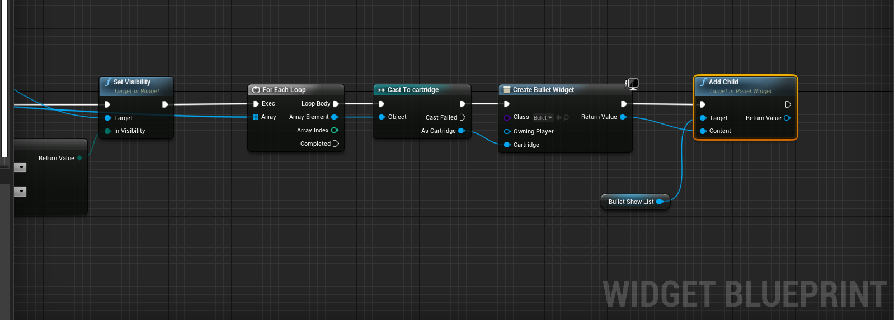

具体的项目参考day12工程代码

## 4 UI

### 4.1 滚动框

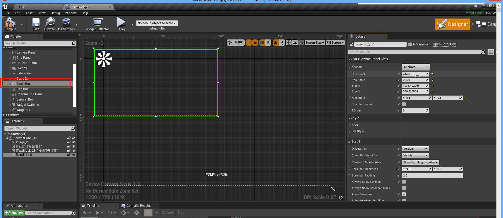

### 4.2 布局

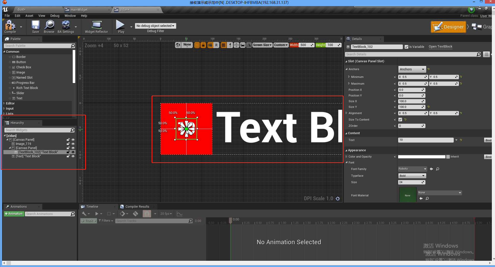