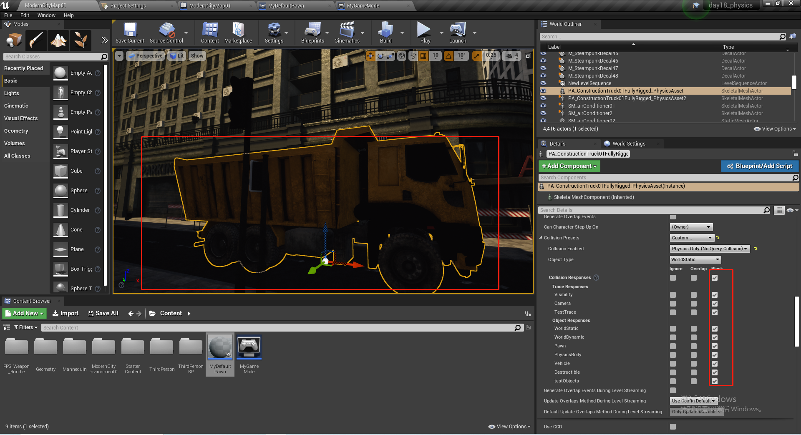
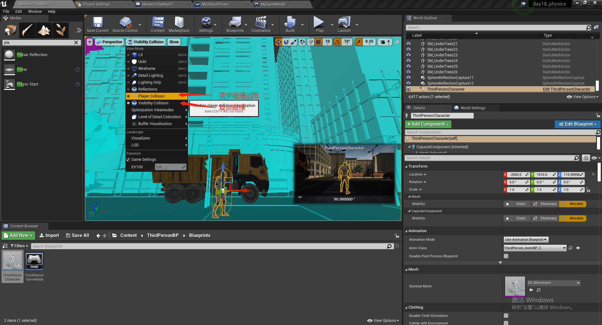
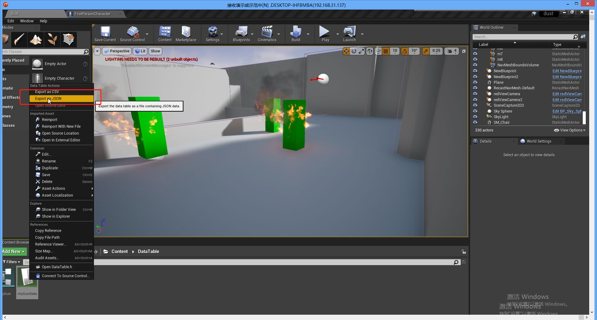

# Day18-物理模型

## 1 游戏中的物理现象

### 1.1 阻挡(Block)

会在两个或者多个 Actor 之间自然发生,但是需要启用**模拟生成命中事件（Simulation Generates Hit Events）**才能执行**命中事件(Hit)**,该功能可以在蓝图，可破坏物体、触发器等场景下使用。

对于彼此阻挡的两个或者更多的对象类型，他们都需要设置阻挡对应的**对象类型**

### 1.2 交叠(Overlap)

将 Actor 生成为重叠(Overlap),往往看起来像忽略(Ignore)一样，如果没有勾选**生成重叠事件(Generate Overlap Events)**，则重叠和忽略基本相同。

对于更多的对象，如果一个设置为阻挡，另一个设置为重叠，则发生的是重叠事件，而不是阻挡事件。

不建议一个对象同时拥有阻挡和重叠事件。

对于两个或者更多的Actor 对象，如果一个为重叠，另一个为忽略，则不会触发任何事件。

### 1.3 Play in Editer

默认情况下，PIE的摄像机是一个 Pawn,因此设置阻挡任何Pawn的摄像机都会阻挡Pawn。如图，这个墙过不去：

### 1.4 模拟(Simulate)

在编辑器中模拟，只为查看物理现象和Tick算法，此时摄像机还是编辑模式的摄像机，所以可以穿过任何 Actor。

竟然可以穿墙：

## 2 碰撞预设(Collision Presets)

### 2.1 Collision Enable（启用碰撞）

#### 2.1.1 No Collision(无碰撞)

没有碰撞

#### 2.1.2 Query Only(仅查询)

当一个射线打到一个物体时，判断该物体是否存在，是否发生了碰撞，但是不会引发物理碰撞，只是**判断该物体在不在**。

目的是为了让下面的这些这些蓝图节点(Line Trace For Objects)获取物体的位置：

#### 2.1.3 Physics Only（仅物理）

会产生物理现象，例如碰撞，反弹

#### 2.1.4 Collision Enabled(Query And Physics)

查询和物理都会生效。

### 2.2  Object Type

碰撞对象的分类，里面可以自定义。

#### 2.2.1 World Static

给所有的静态物体。

#### 2.2.2 World Dynamic

动态物体

#### 2.2.3 Pawn

角色

#### 2.2.4 PhysicsBody

受到物理引擎控制，不受代码控制的对象。

#### 2.2.5 Vehicle(载具)

对于载具性质的 Actor ,设置为 Vehicle

#### 2.2.6 Destructible（可破坏物）

### 2.3 Collision Responses(碰撞响应)

#### 2.3.1 Trace Responses (追踪响应)

#### 2.3.2 Object Responses(对象响应)

#### 2.3.3 Ignore(忽略)

忽略对象的所有物理事件

#### 2.3.4 Overlap(重叠)

触发重叠事件

#### 2.3.5 Block(阻挡)

触发Hit 事件

#### 2.3.6 新增碰撞响应

Project Setting --> Engine --> Collision：

查询或者编辑已经设计的预设：

新建自定义的映射：

追踪响应和对象响应统称为**碰撞通道**，在一个项目中，碰撞通道不能超过18个。

新建通道：

然后就可以使用了：

### 2.4 实战

将 Pawn 的物理通道和新建的碰撞通道`testObject`关联起来

 

修改物体被碰撞的物体的碰撞信息：

查看碰撞视图：

在 Play 模式下，按`F11` 全屏， 按`~` 键输入`show Collision` 查看碰撞

其他的命令：

`stat FPS`:统计FPS

`stat Unit`: 统计帧速率

`Slomo + 数字` 调整帧速率

`r.ScreenPrecent` 调整屏幕的百分比：

## 3 碰撞重构

### 3.1 自动凸包工具

凸包数量：

### 3.2 简单碰撞

### 3.3 K-DOP

## 4 物理约束

	

根据名称将物理约束(PysiscsConstraint) 绑定到两个立方体：

设置旋转角度：

设置摆线长度：

预览效果：

## 5 添加子 Actor

### 5.1 添加子 Actor

### 5.2 绑定需要的子 Actor

### 5.3 在蓝图中使用

### 5.4 在游戏中显示

## 6 DataTable（数据表格）

可以理解为 ue4 中出现了一个 Excel.

新建一个dataTable:

dataTable 数据导出：

在蓝图中使用：

## 7 曲线资源

创建一个曲线：

曲线类型：

将变量绑定到曲线上：

在蓝图中使用：

## 8 纹理

在一个贴图中，我们可以设置纹理信息：

纹理信息：

如果要保留所有通道(RGBA),选择Default 将会损失部分细节，将储存容量压缩到一半：

如果一个纹理总是用在材质的法线通道，可以选择丢弃B和A通道，这个时候，DTX 格式只会存储 RG 通道，这样存储容量也是原始文件的一半。

sRGB(真彩色)：A 通道精度更高一点，如果不选择 sRGB，需要使用蒙版的话，将纹理的类型设置为Mask.

R8：灰度图 GrayScale,压缩率：25%。

RGBA8(R8G8B8A8):

RGBA16：UE4 不支持

RGBA32：UserInterface2D: 完整保留图像所有信息，仅限于32位通道图片(推荐使用)

### 8.1 纹理分组

对于移动设备尤为重要

### 8.2 Mips Map(缩略图等级)

缩略图等级：

