# Day24-Cpp实现无人机

## 1 按键设置

无人机操作：

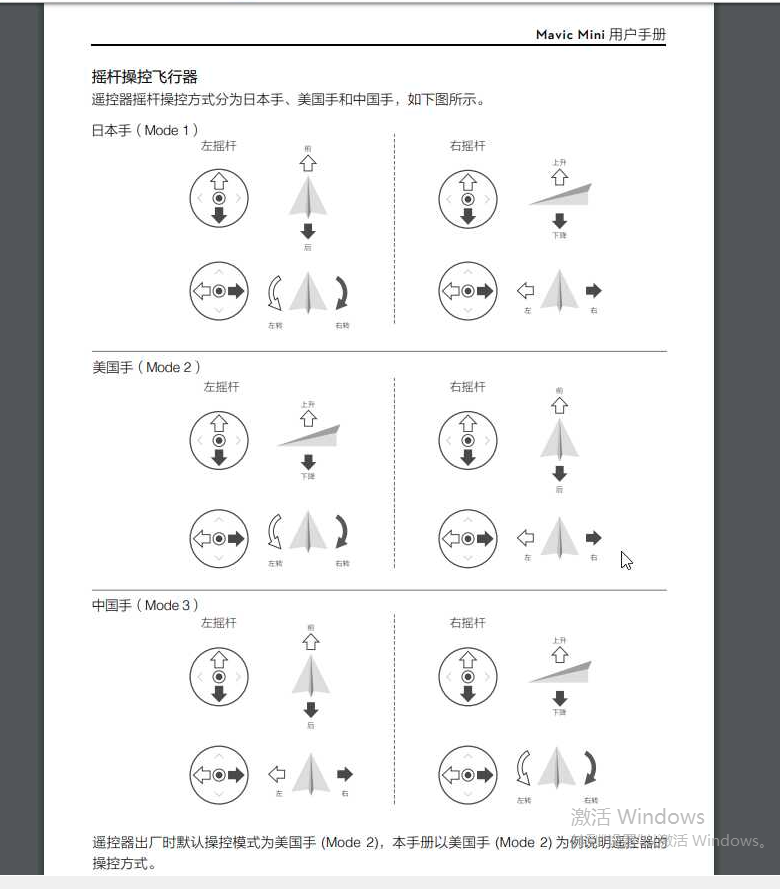

参照美国手的设置，做如下按键输入：

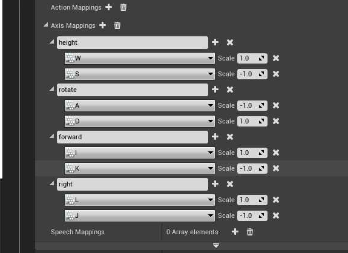

云台：

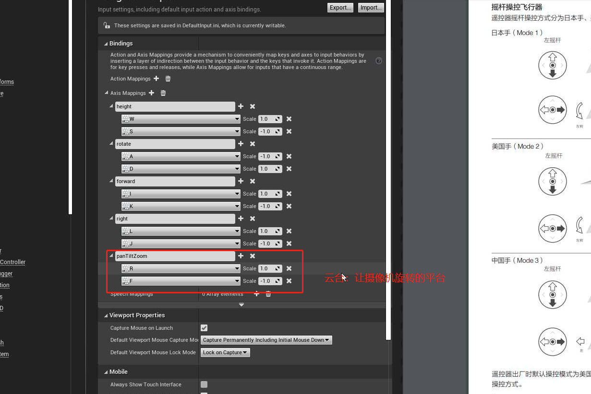

紧急停浆：

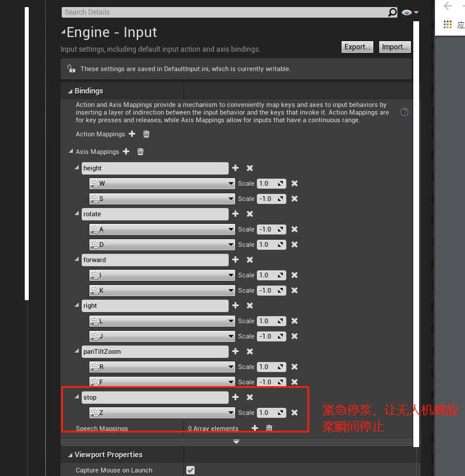

## 2 在 C++ 一些操作

### 2.1 绑定轴输入事件

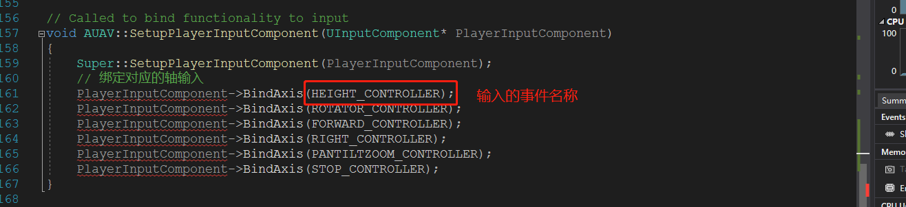

### 2.2 获取轴输入

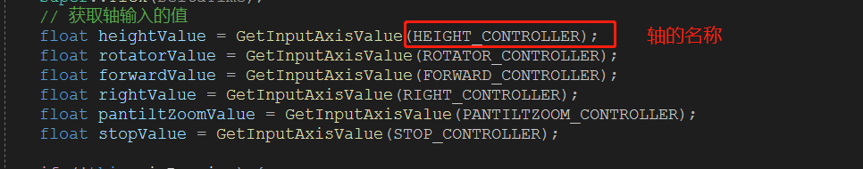

### 2.3 C++  预声明

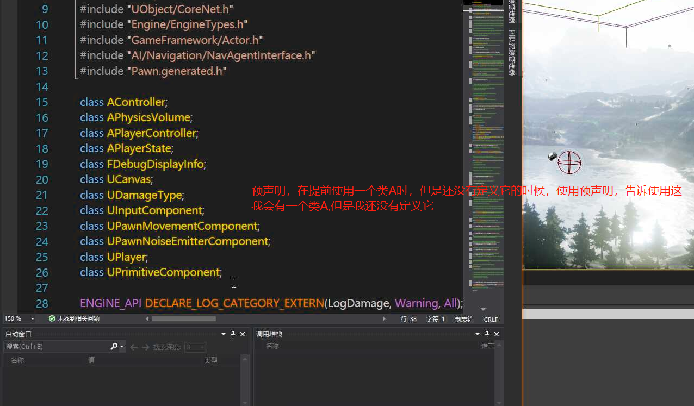

### 2.4 修改GameMode

修改GameMode为`雪地景观`的GameMode

### 2.5 修改 Pawn 为自己 C++ 新建的 Pawn

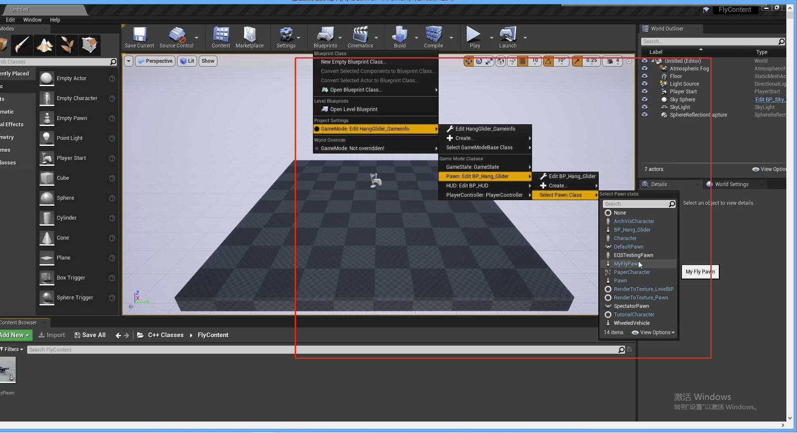

### 2.6 在 C++ 中使用射线追踪

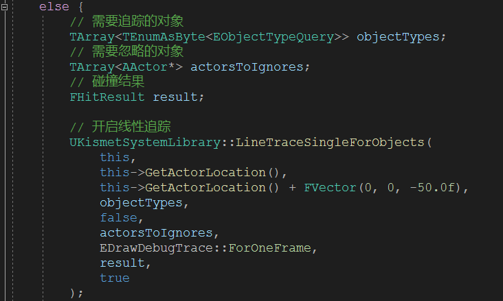

### 2.7 WorldContextObject

事件上下文对象，可以用来创建 Actor,搜索 Actor.

### 2.8 获取向量长度

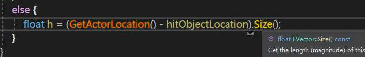

和蓝图中的`VectorLength`一样

### 2.9 位置偏移

获取和设置位置偏移

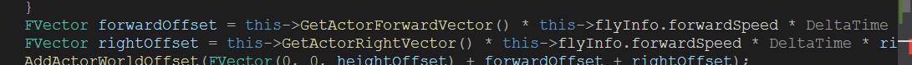

### 2.10 设置旋转

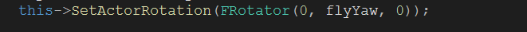

### 2.11 建立结构体

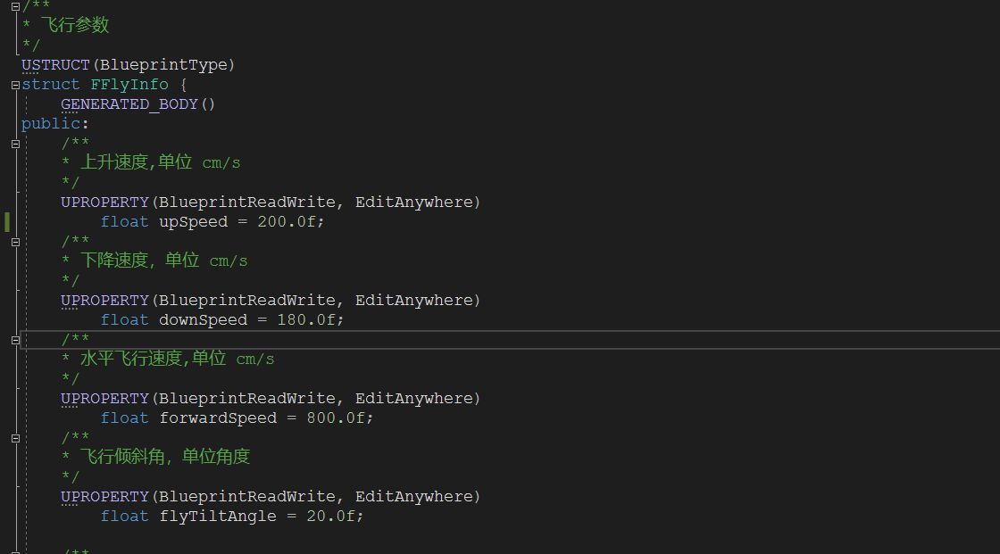

### 2.12 静态变量的声明和初始化

在头文件中声明：

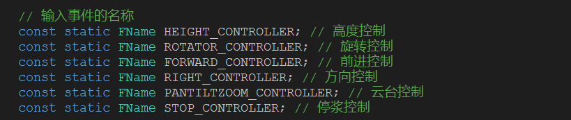

在cpp文件中初始化：

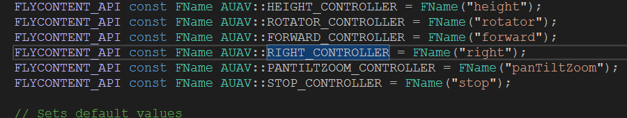