# Day25 继续实现无人机

## 1 C++ 语法

### 1.1 运算符重载

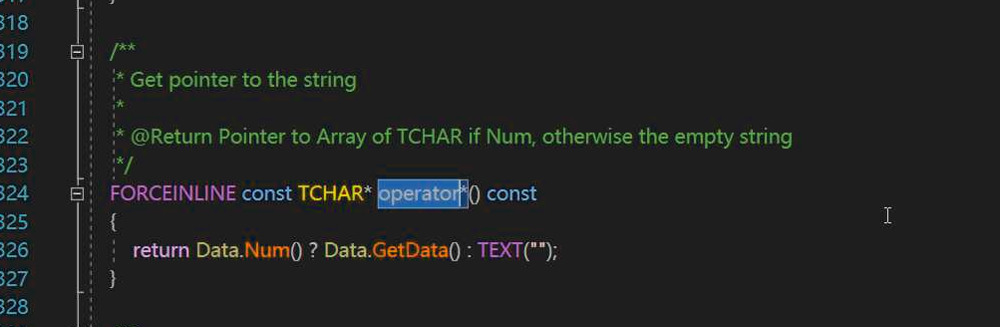

在 `FString`中，重载`*`运算符:

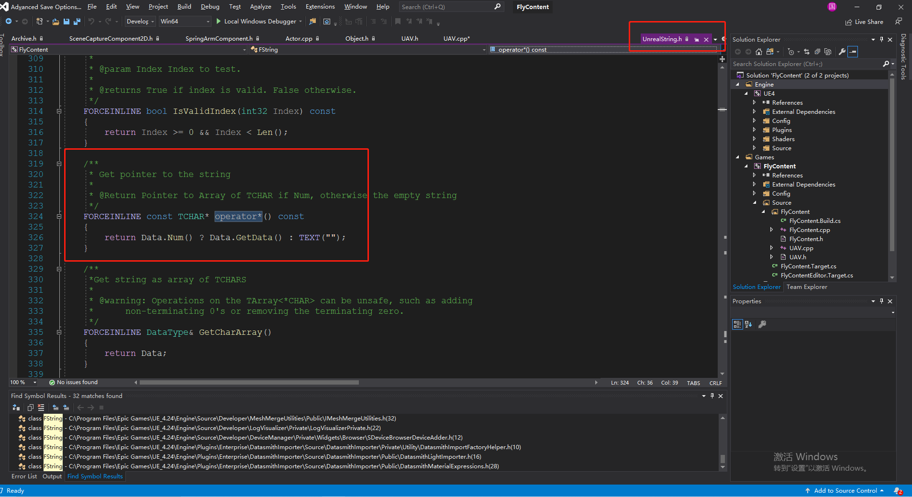

## 2 UE4 导入视频

### 2.1 新建 Movies

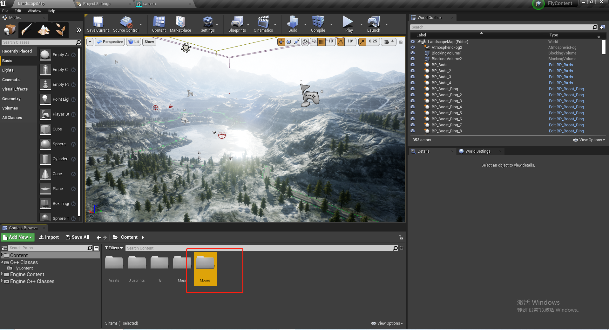

### 2.2 Show in Explore

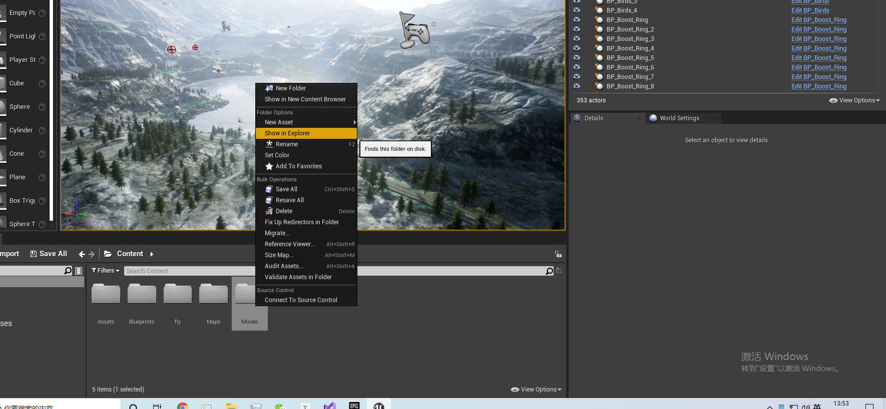

### 2.3 将文件复制到打开的目录

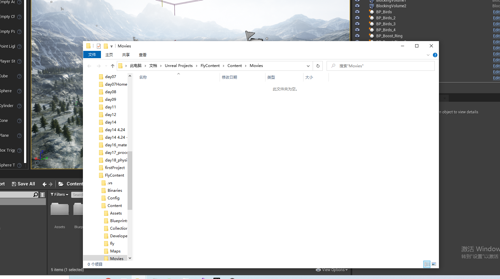

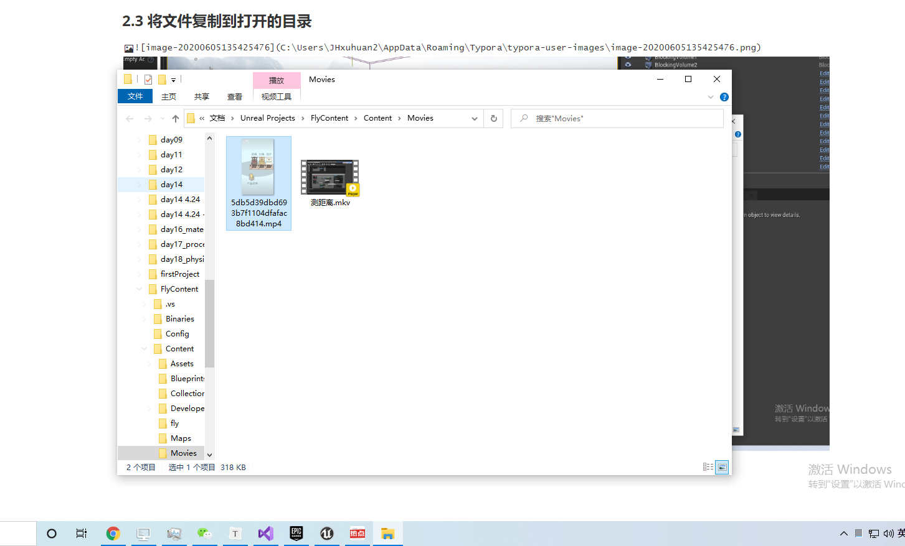

### 2.4 将文件拖入UE4 Movies

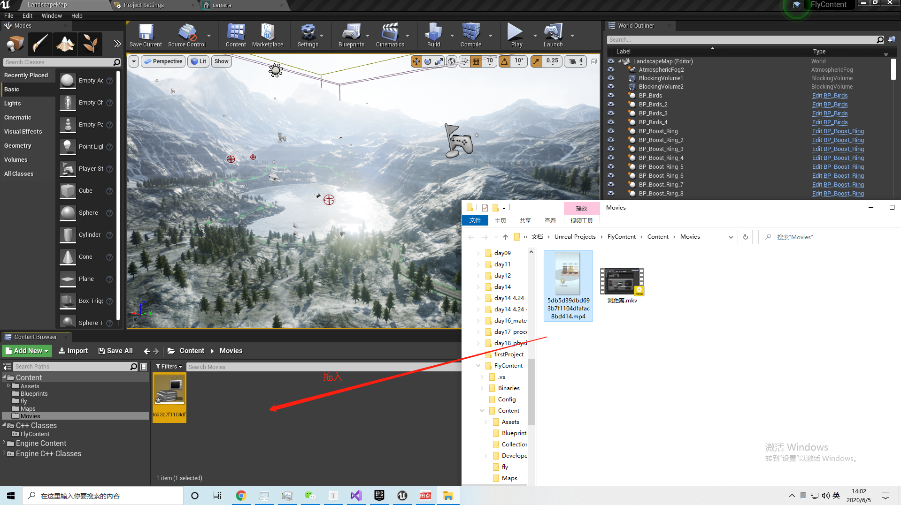

### 2.5 找到媒体文件对应的头文件

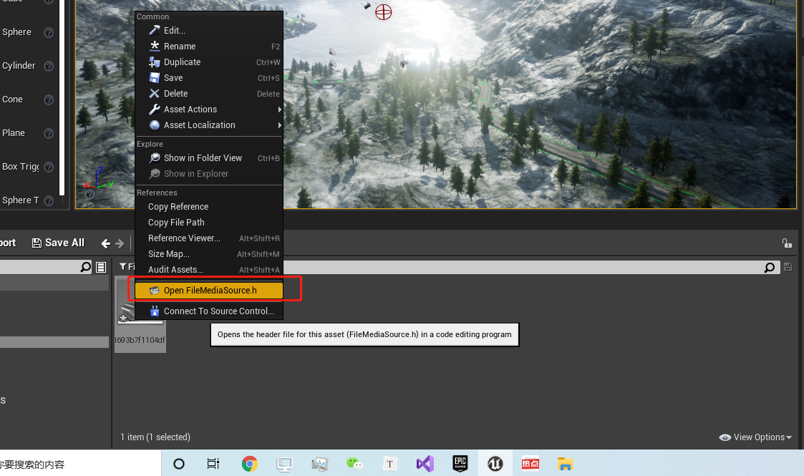

### 2.7 FileMediaSource.h

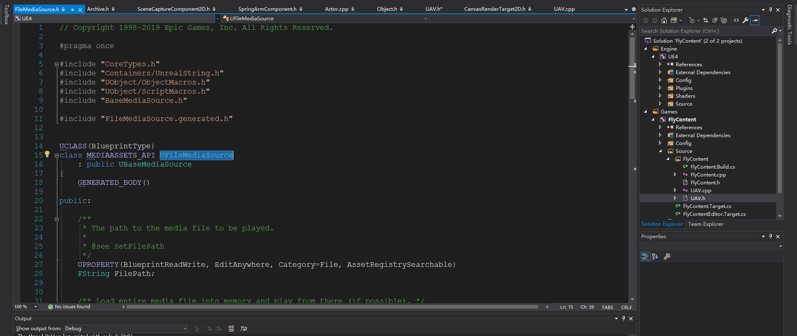

### 2.8 在当前工程引入该头文件类型

此时我们发现无法引入此文件，为什么？

我们找到`FileMediaSource.h`的完整目录：

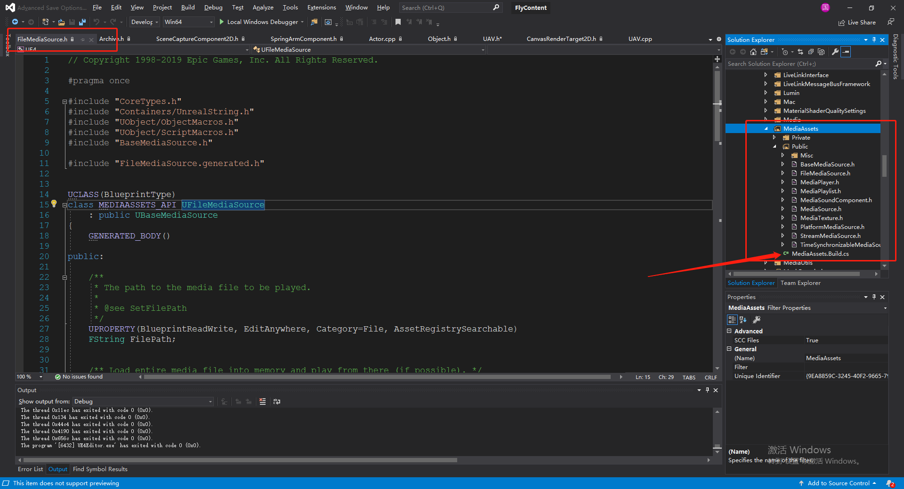

我们发现它下面有个`Build.cs` 文件，我们查看我们的工程目录：

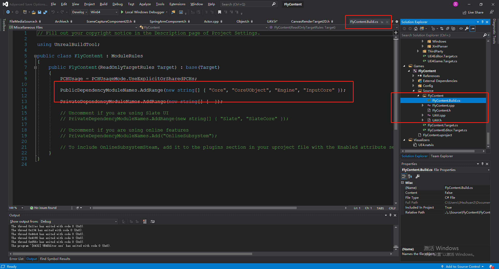

发现我们没有这个模块，我们需要把这个模块引入到我们的工程模块中：输入`.Build`的前面的名称即可。

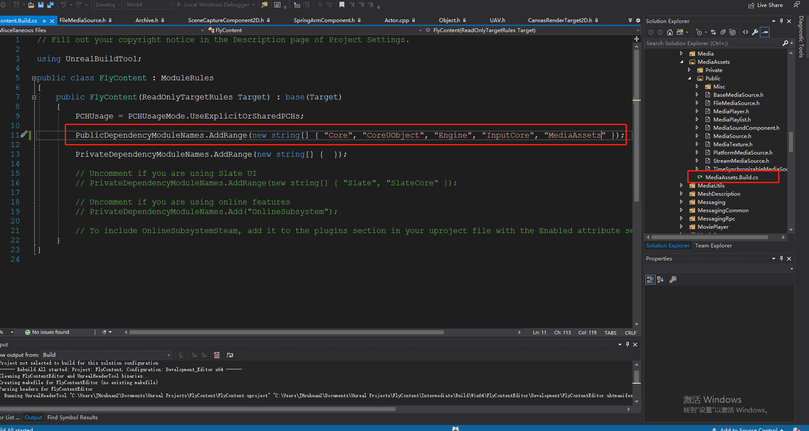

然后输入头文件重写编译后即可。

### 2.6 查看当前的模块

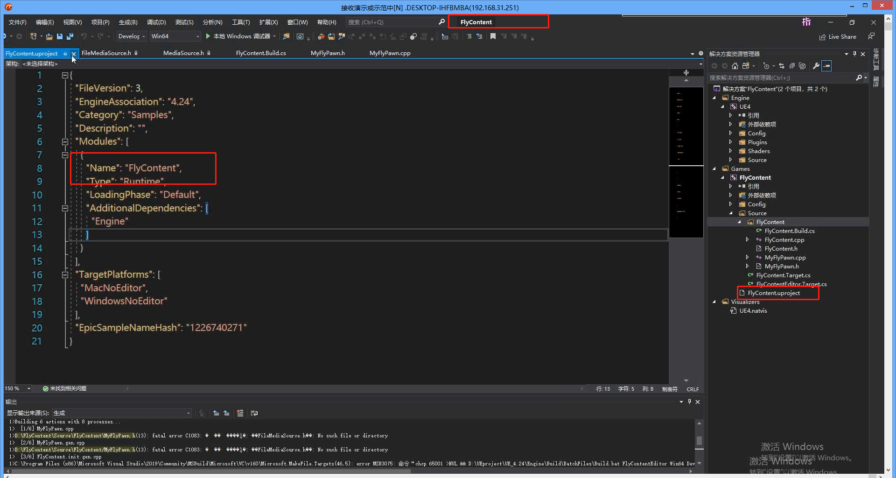