# Day22

## 1 注释

### 1.1 版权信息

在文件首行，写上版权信息：

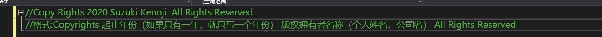

### 1.2 文档注释

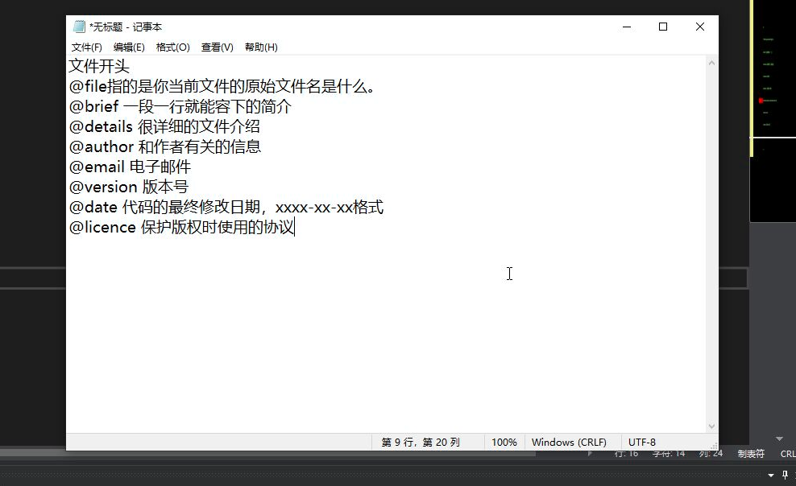

### 1.3 Blueprintable/NotBlueprintable

让一个C++的类在蓝图中可用/不可用:

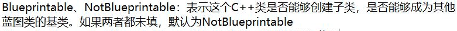

### 1.4 BlueprintType 和 NotBlueprintType

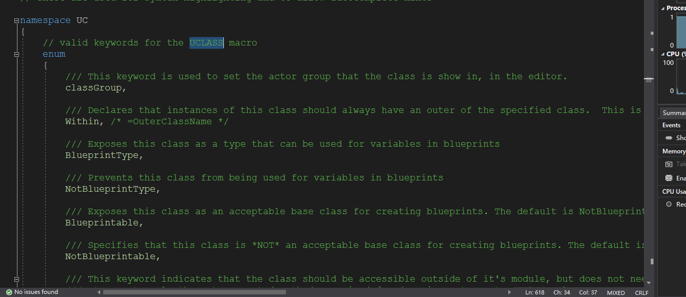

可以参考宏

### 1.5 编码格式

安装utf-8插件，这样会让c++代码中的中文文档注释在UE4蓝图中显示出正确的内容，而不是乱码。

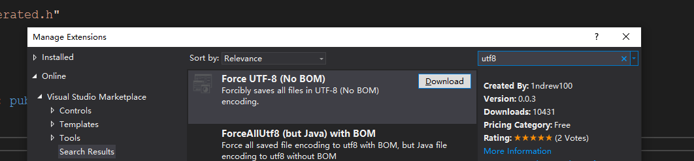

### 1.6 Meta

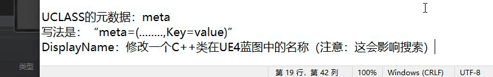

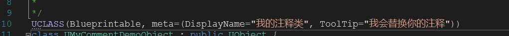

## 2 UFUNCTION

### 2.1 BlueprintCallable

让函数在蓝图中可调用。

### 2.2 BlueprintImplementableEvent

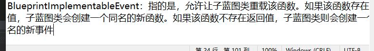

但是使用此声明时，该函数无法进行默认实现，系统的代码生成会自动产生生成代码

### 2.3 BlueprintNativeEvent

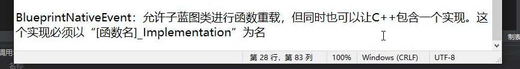

在.h 中声明：

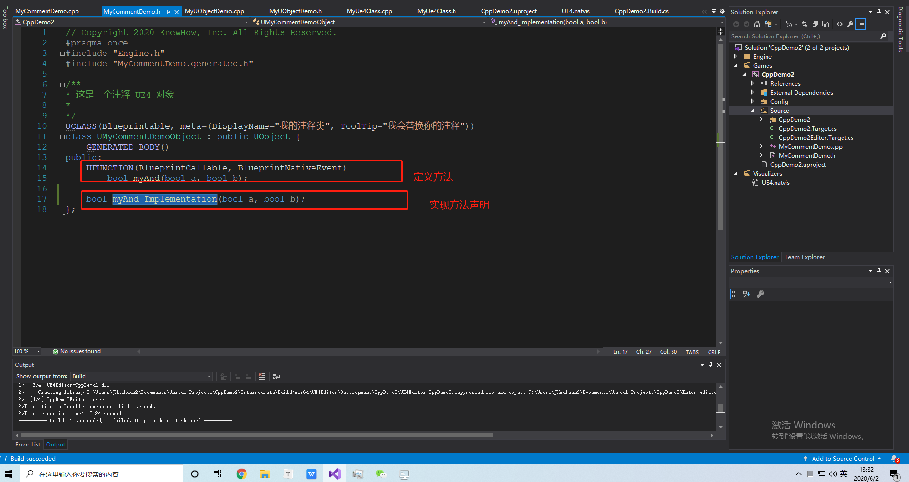

在.cpp 中 实现：

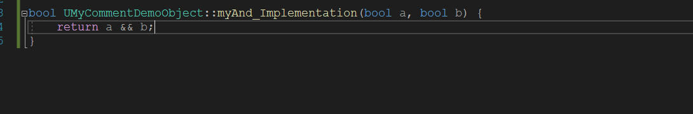

点击名称可以直接查看：

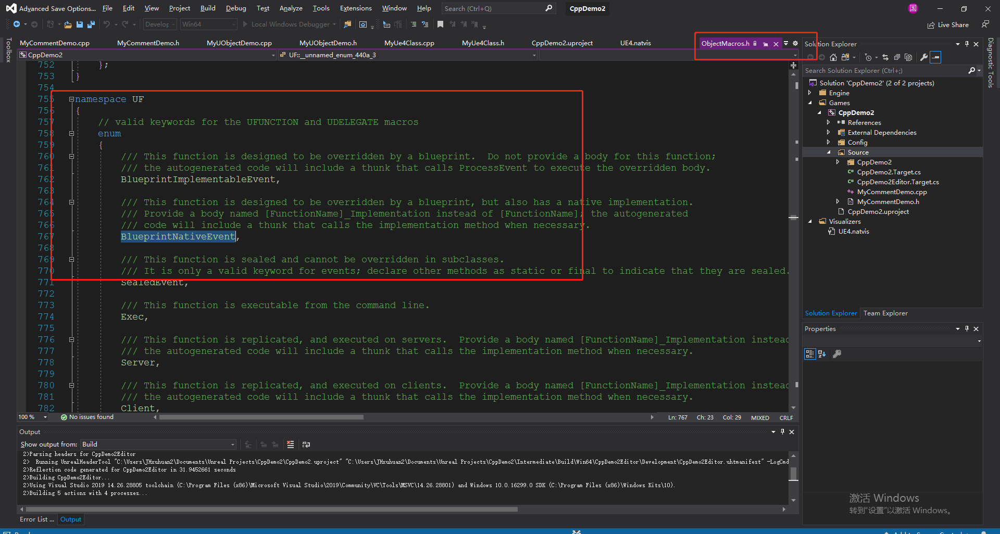

创建一个该对象的子类，他就可以重写此方法：

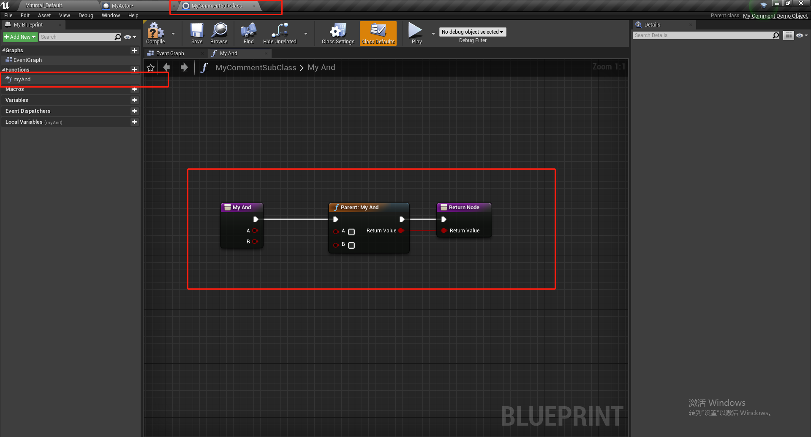

### 2.4 BlueprintPure

让当前的 C++ 函数变为纯函数

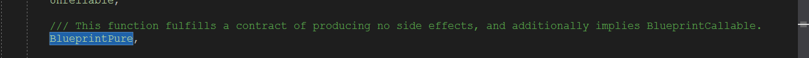

### 2.5 Category

 在蓝图上使用分类：

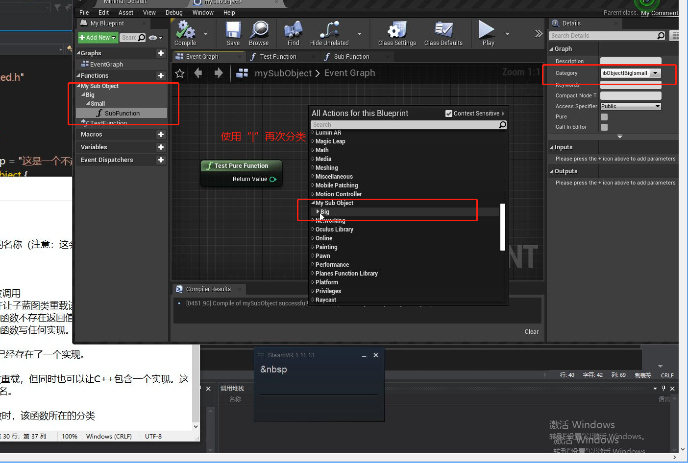

在c++ 中使用分类：

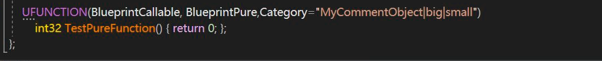

此功能也可以在类中进行分类：

### 2.6 Meta(元数据)

* DisplayName
* ToolTip
* Keywords: 可以通过该关键字搜索到该函数

在蓝图中的对应功能

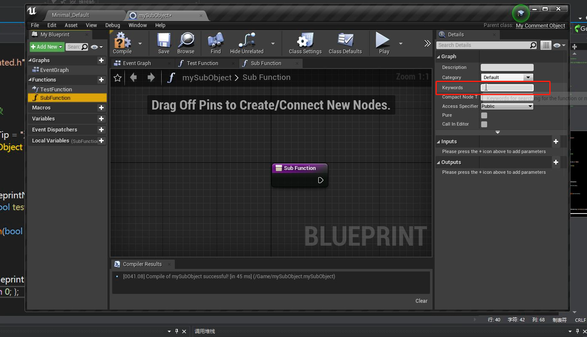

## 3 UPROPERTY

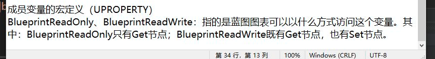

### 3.1 BlueprintReadOnly/BlueprintReadWrite

设置属性读写性质

### 3.2 AdvanceDisplay

### 3.3 EditAnyWhere, VisibleAnyWhere,EditDefaultsOnly, VisonleDefaultOnly

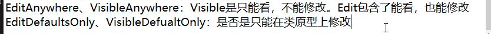

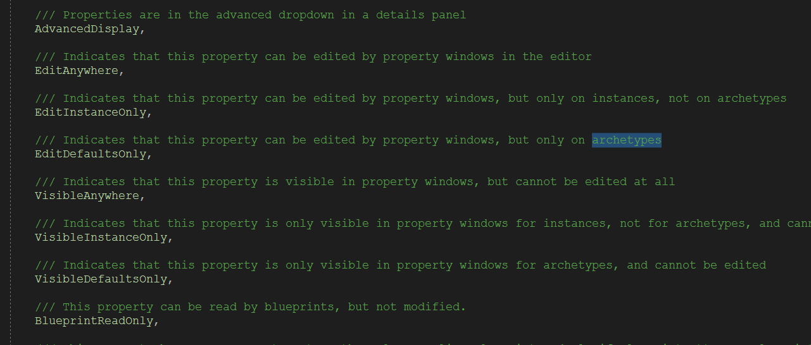

### 3.5 Getter 和 Setter

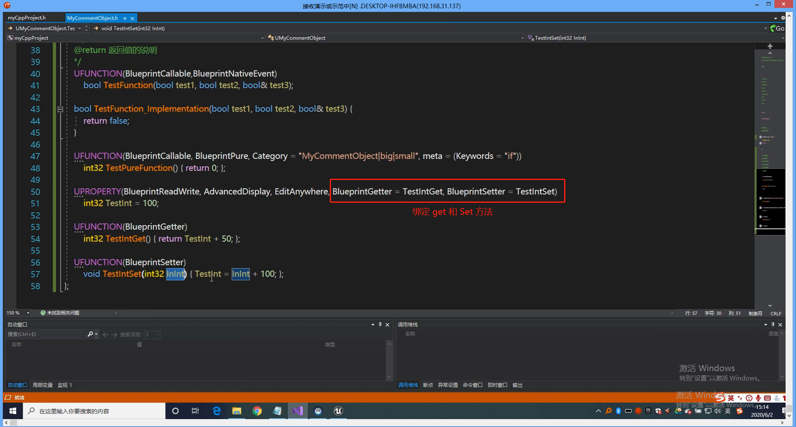

## 4 反射

### 4.1 获取Class 和 所有的属性

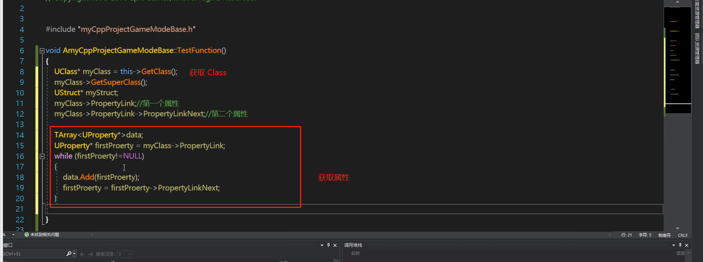

和 Java的反射差不多，有时间去看看。