# Day21-Cpp 基础

## 1 新建 C++ 类

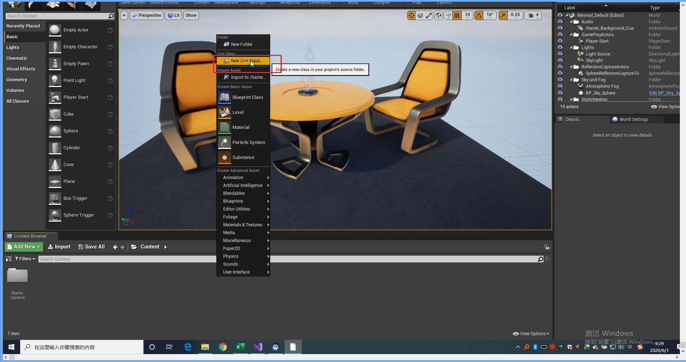

### 1.1 分模块

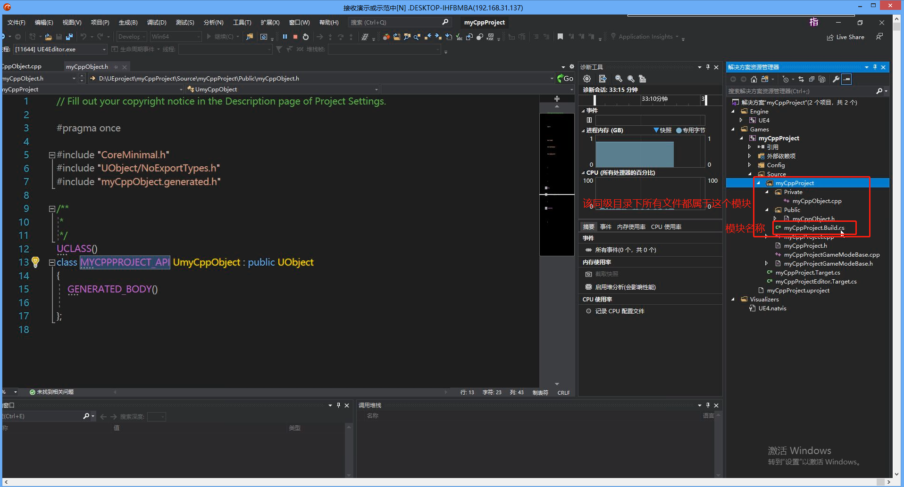

### 1.2 GENERATED_BODY() 和 GENERAATED_UCLASS_BODY()

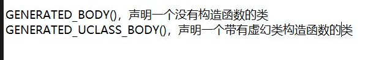

### 1.3 BlueprintType 

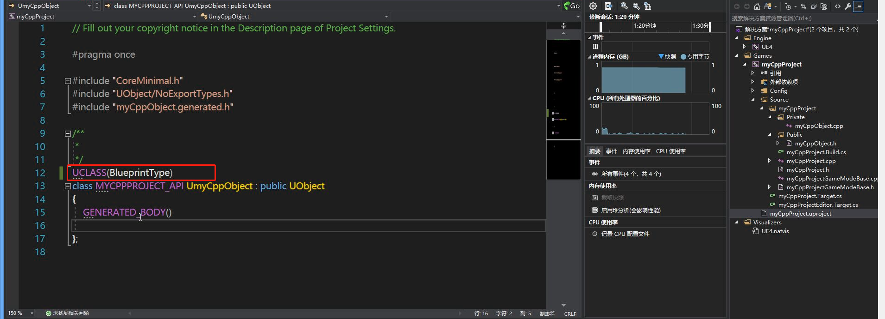

### 1.4 UPROPERTY(BlueprintReadWrite)——属性设置

BlueprintReadWrite: 蓝图可以读写

BlueprintReadOnly: 蓝图只读

设置变量的读写性质。

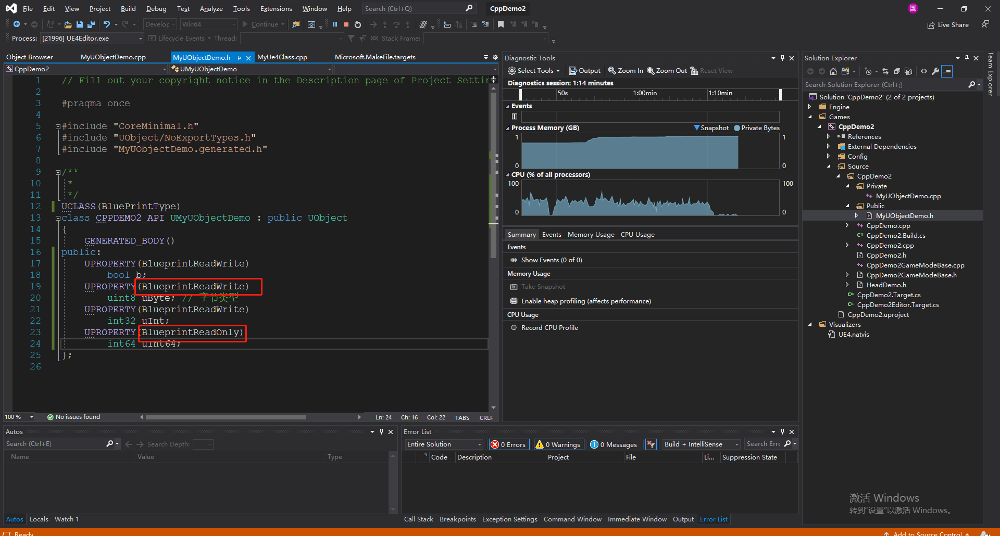

### 1.5 Unreal Header Tool 扫描规则

这些规则的处理只是针对蓝图做处理，真正的c++代码是不管这些的规则的。

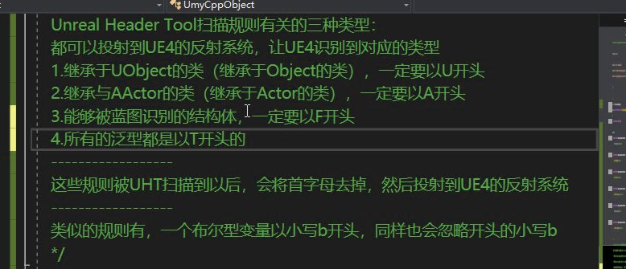

### 1.6 数据类型

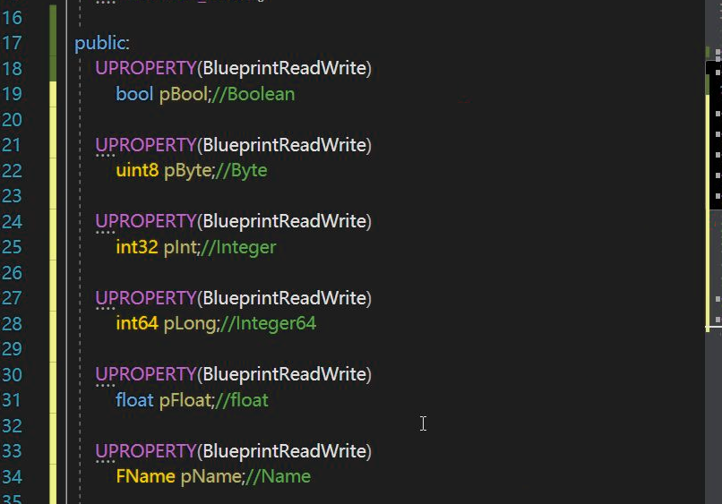

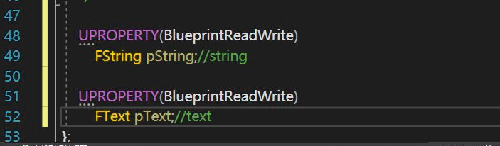

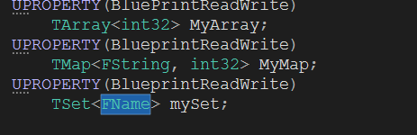

因此 对于 Name,String 以及 Text,Vector 等类型，都是结构体变量

### 1.7 函数声明和实现

1. 函数声明

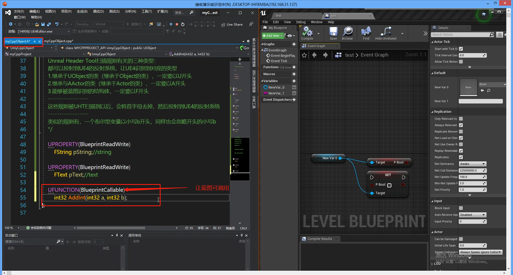

函数实现：

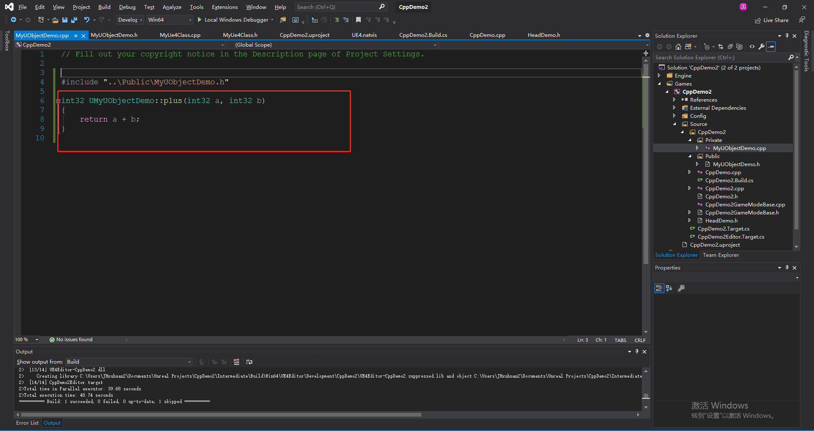

当然，我们可以快捷方式实现：

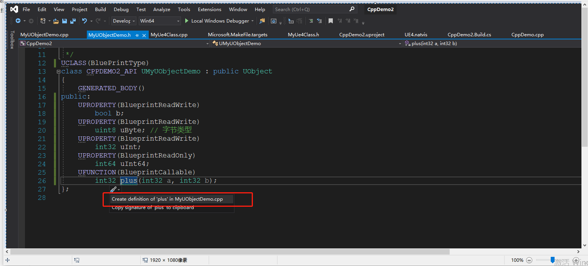

### 1.8 创建一个类

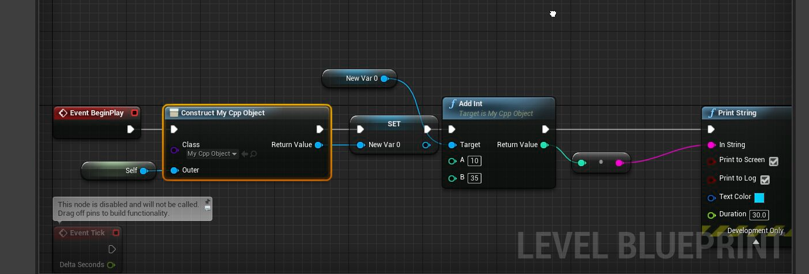

### 1.9 遍历数组

### 1.10 蓝图使用引用实现多返回

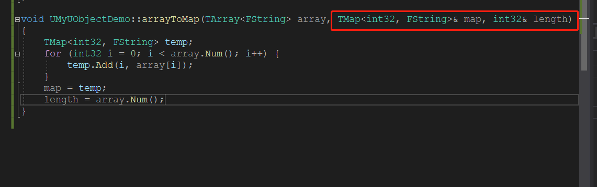

在蓝图中使用，你会发现传递引用的参数变成了返回值。

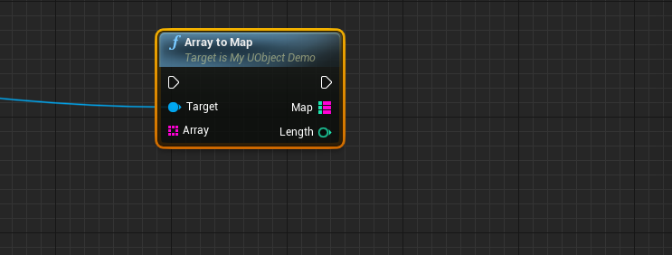

### 1.11 定义结构体

结构体在 UE4 中相对于类来说，是一种较为轻量的数据结构。

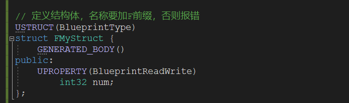

### 1.12 枚举定义

枚举需要以E开头

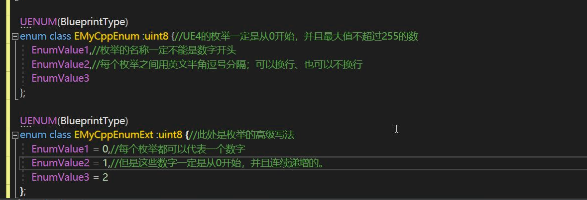

### 1.13 创建Actor

1. 定义Actor

   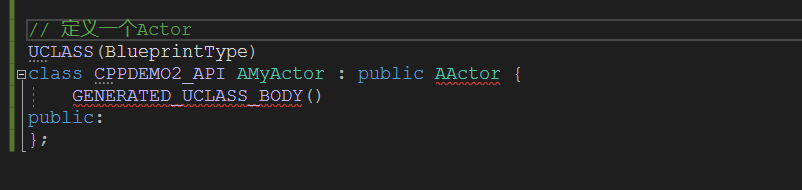

2. 在.cpp 的文件中，实现构造函数

   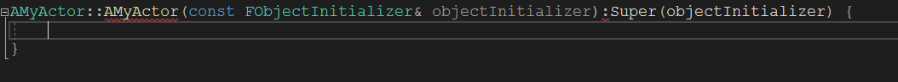

   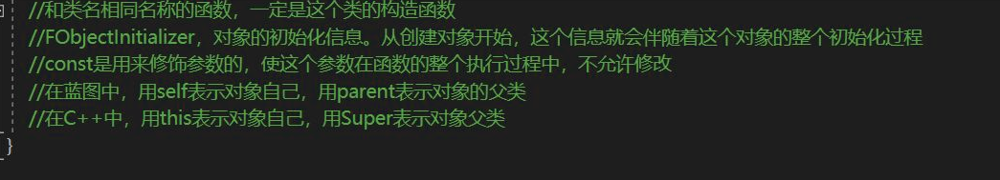

### 1.14 DEPRECATED

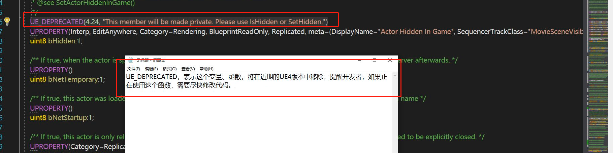

### 1.15 Root Component

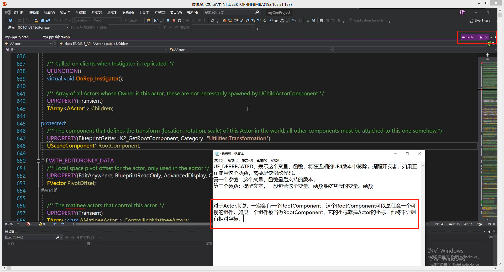

### 1.16 在 Acotor 中添加静态物体

1. 在.h 文件中定义一个静态类型变量

   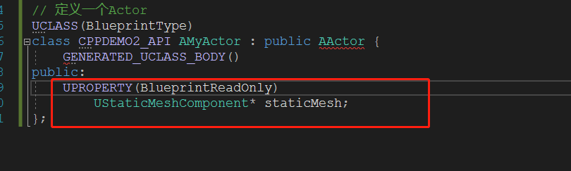

2. 在构造函数中绑定具体的模型

   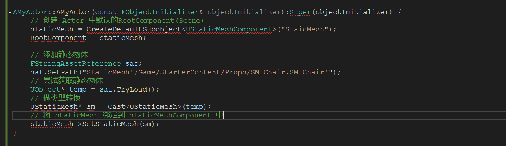

   其中静态的模型`Path` 做如下获取：

   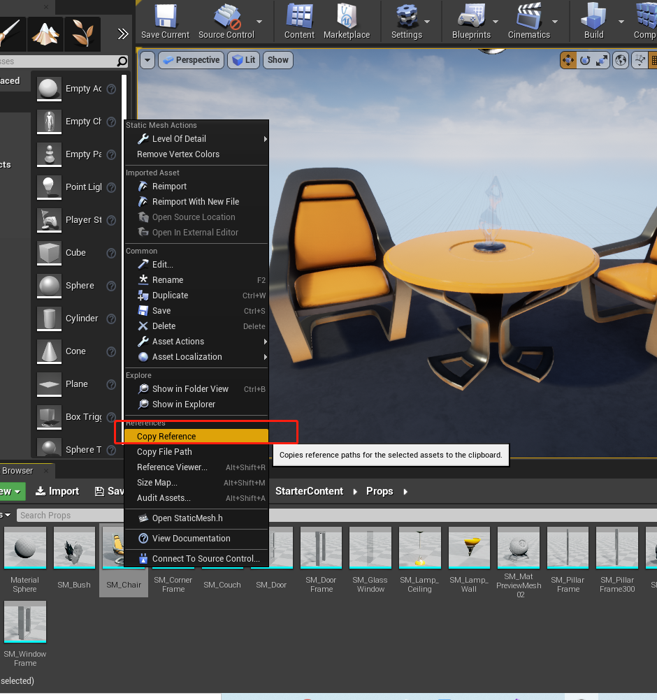

### 1.17 Class、Object、SoftClass、SoftObject

在资源浏览器中，所有的`Actor`、贴图、材质都是资源，他们都是类（Class），而当他们拖入场景就实例化为对象(Object)。

但是有些资源依赖其他的资源，如果在游戏开始的时候，就加载对于的资源，会很耗性能，但是我们可以使用软引用(SoftObject 或者 SoftObject)，这样