# World Context

## 1 日志输出和一些细节

### 1.1 在蓝图使用日志

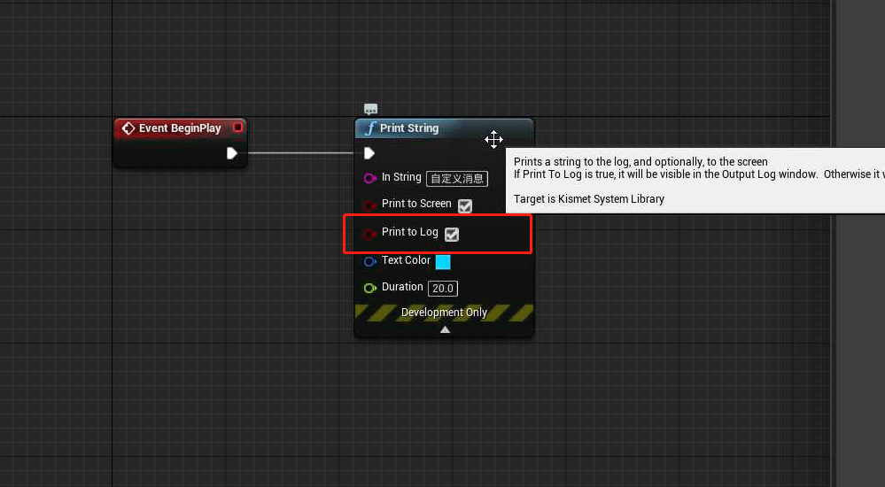

在蓝图中，使用 Output Log 可以查看：

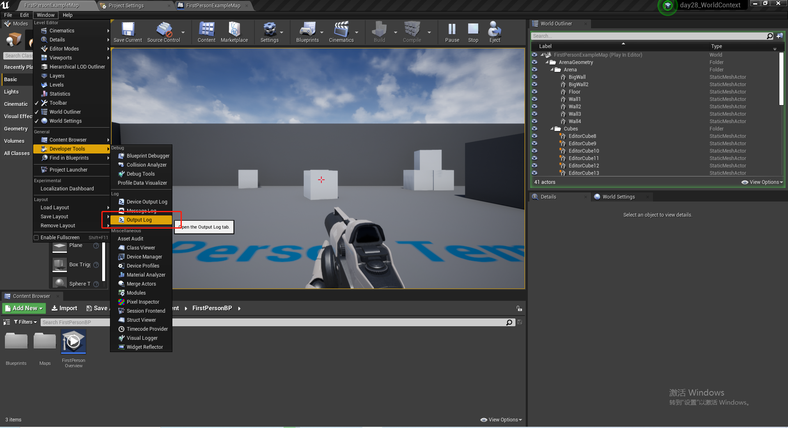

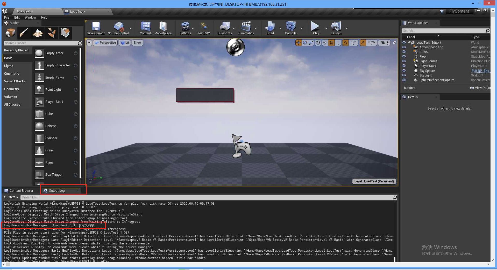

在C++项目中，可以使用控制台查看

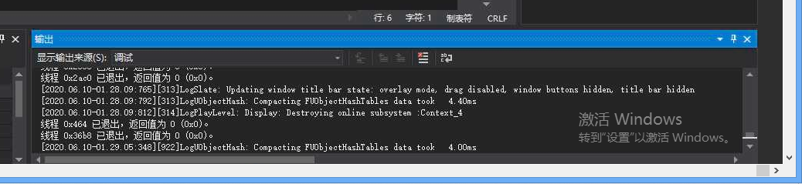

在日志文件中查找：

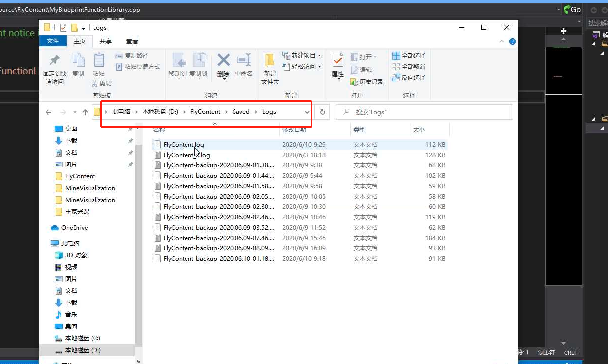

### 1.2 日志级别

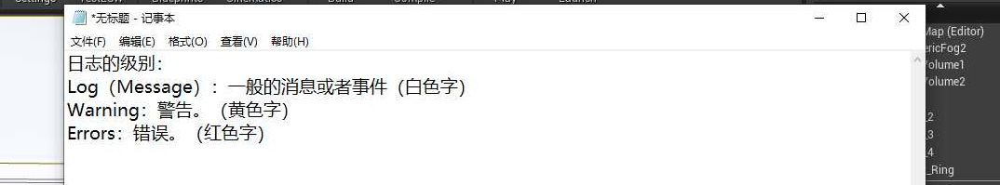


### 1.3 打印日志

#### 1.3.0 创建 C++ 蓝图函数库

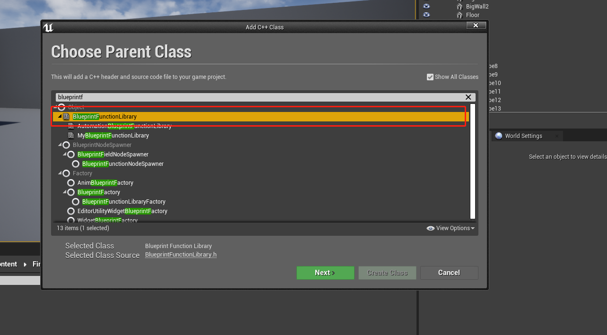

#### 1.3.1 定义LogTest 函数

在蓝图函数库中，所有的函数必须为`static`

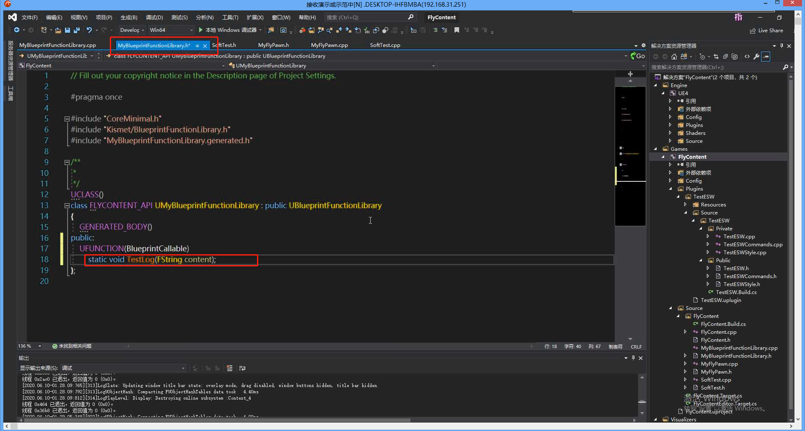


#### 1.3.2 C++ 可变参数

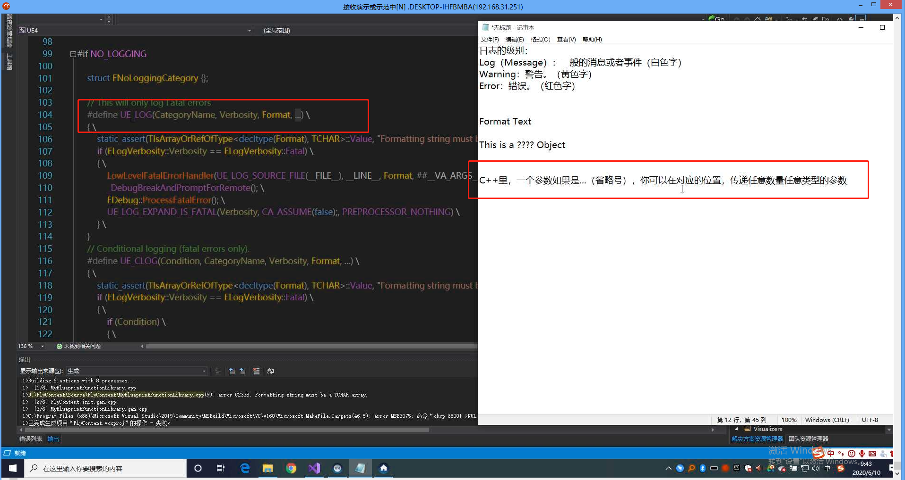


#### 1.3.3 格式化日志输出

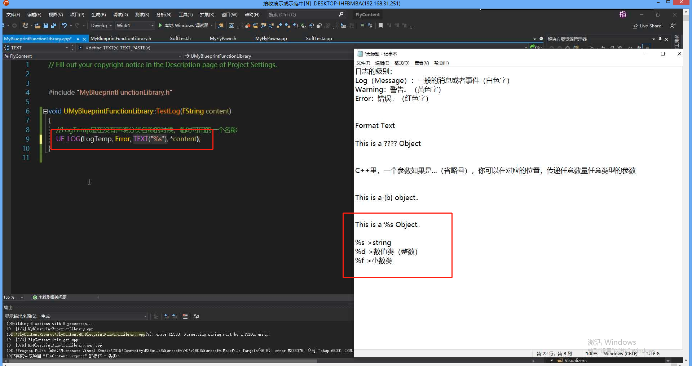


#### 1.3.4 UE4 支持的日志级别

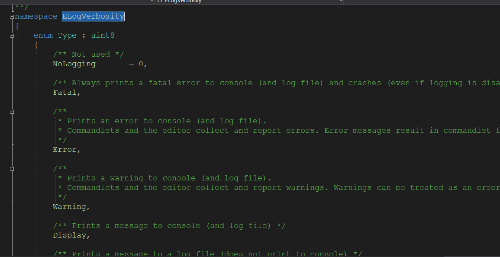

#### 1.3.5 自定义日志分类

先在头文件声明`MyLog`


再在.cpp 文件定义`MyLog`

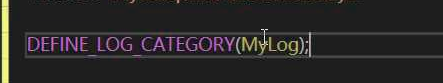

在UE4编辑中使用日志分类：

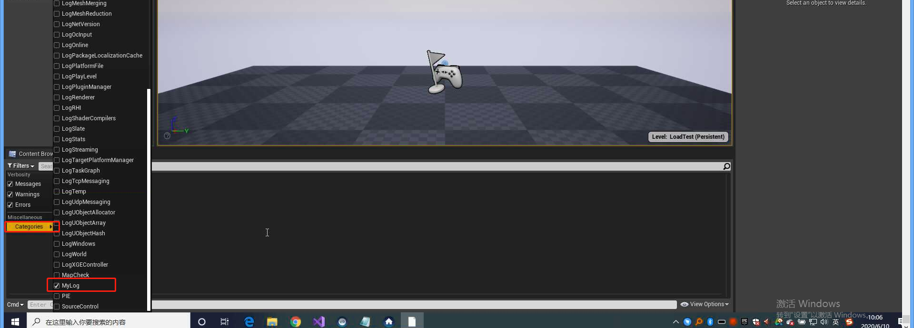


### 1. 4 UE4 蓝图函数按引用传参

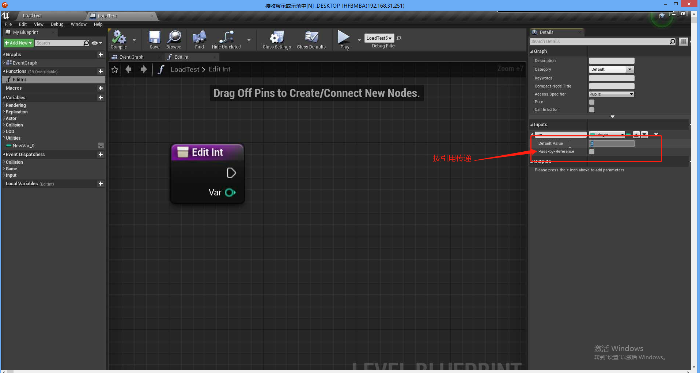

修改引用参数：

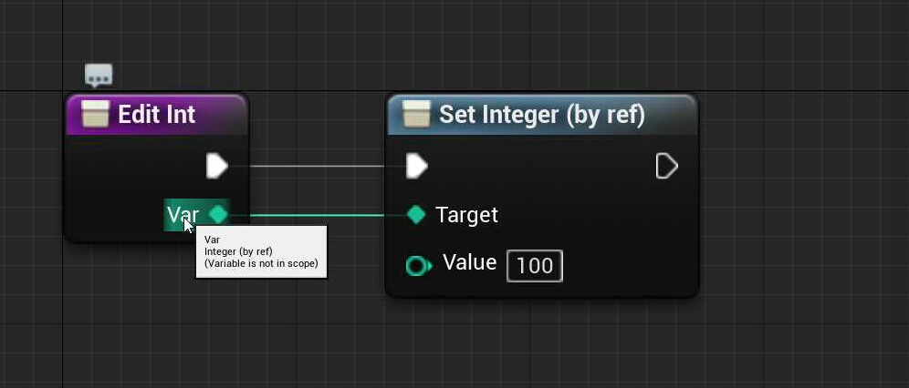

测试调用，此时需要传递一个变量，因为引用需要指向一段内存地址。

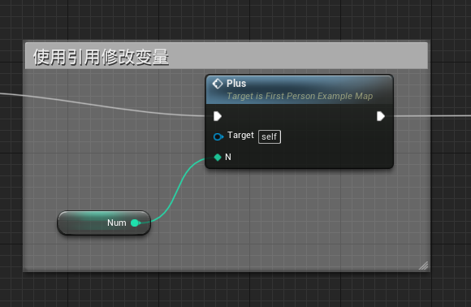

#### 1.4.1 使用 C++ 实现上述功能

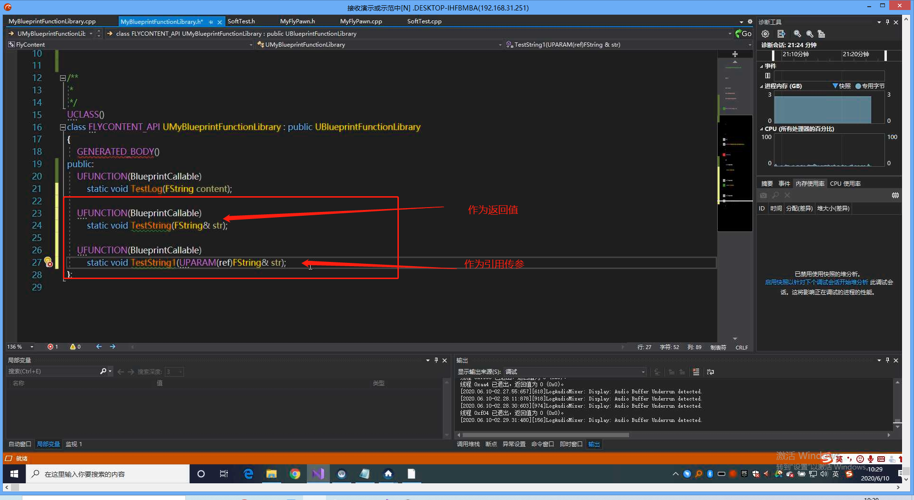

在蓝图中的效果：

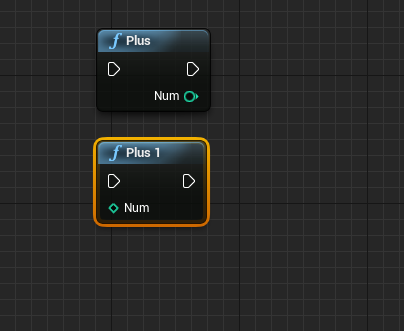

### 1.5 const 修饰符

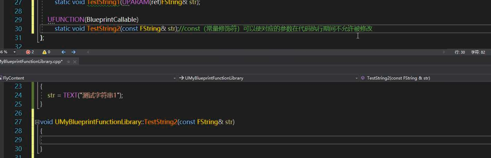

### 1.6 可添加引脚

在.h 文件中声明一个可添加引脚函数：

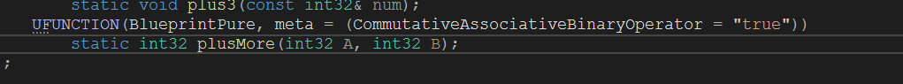

在 .cpp 文件中实现：

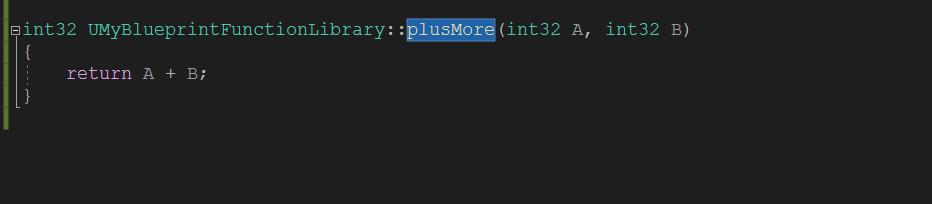

添加断点，并且将调试模式改为`Debug Game` 模式，阻止编译器优化代码：

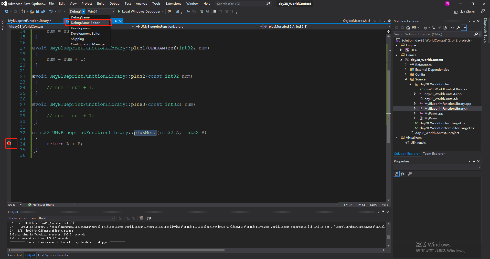

然后调用我们的函数：

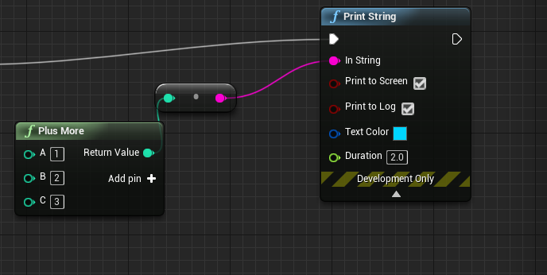


然后我们发现在C++ 函数中，`plusMore` 被调用了两次，此时我们可以知道`add pin` 这类函数执行的原理：**多次调用被执行函数**

### 1.7  关于visual stdio 的调试模式

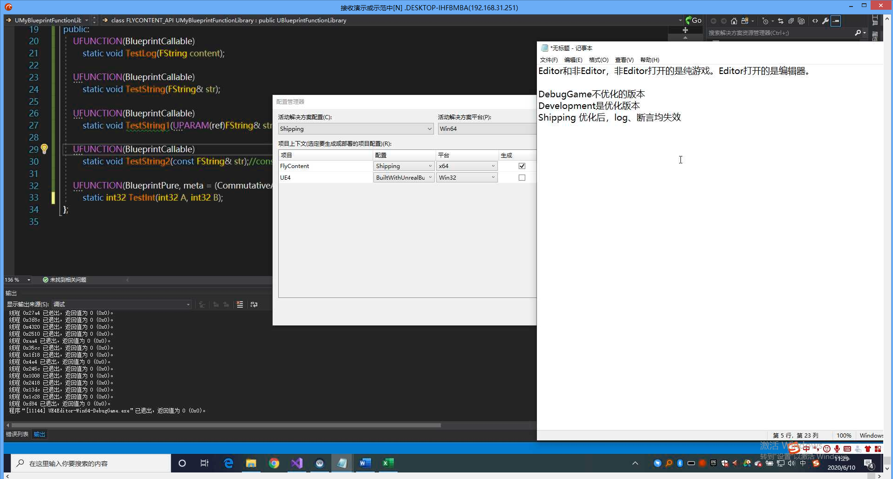


使用不带Editor 模式的时候，需要进行烘培：

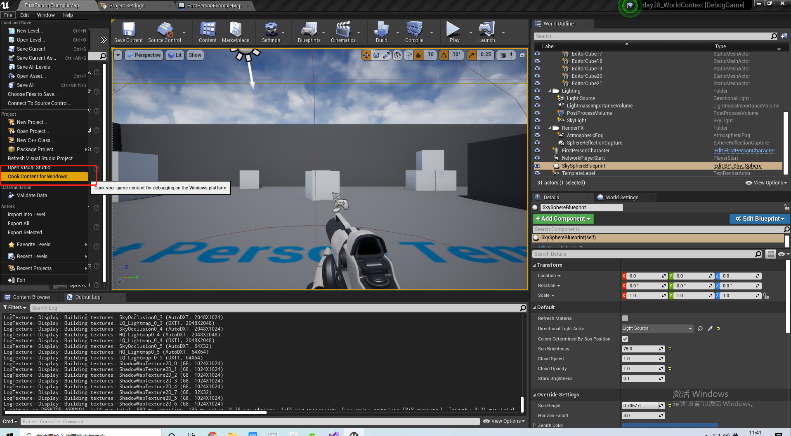


## 2 World Context

world context 可以是代表当前关卡中的任何对象，它可以通过下面的方法来获取`UWorld(游戏世界)`

```c++
// 获取世界对象
	UWorld* world = worldContext->GetWorld();
```

### 2.1 获取场景指定类型的`Class`

我们可以通过这样的方向来获取场景中指定类型`Actors`

```c++
/**
	* 获取世界中所有的subClass 的集合
	* @param 世界上下文对象，可以是世界场景中的任何一个物体，用它来获取 UWorld
	* @param subClass 需要查找 Actors 的类型
	* @results 返回的结果
	*/
void UMyBlueprintFunctionLibrary::MyGetAllActorsOfClass(const UObject* worldContext, TSubclassOf<AActor> subClass, TArray<AActor*> &results)
{
	if (worldContext == nullptr) {
		return;
	}
	// 获取世界对象
	UWorld* world = worldContext->GetWorld();
	if (subClass == nullptr) {
		return;
	}
	if (world == nullptr) {
		return;
	}
	// 获取世界对象中 subClass 迭代器
	for (TActorIterator<AActor> itr (world, subClass); itr; ++itr) {
		AActor* act = *itr;
		results.Add(act);
	}

}
```

在蓝图中调用的方式：

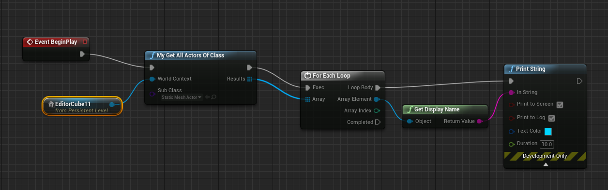


### 2.2 优化上面的代码，将worldContext 作为隐式传递

```c++
/**
	* 获取世界中所有的subClass 的集合，这里把 worldContex 使用 meta 做动态注入，在世界场景的蓝图可以不需要传递 `worldContext` 对象.
	* 上述的功能只在蓝图中生效，在 C++ 中不生效。
	* @param 世界上下文对象，可以是世界场景中的任何一个物体，用它来获取 UWorld。
	* @param subClass 需要查找 Actors 的类型
	* @results 返回的结果
	*/
	UFUNCTION(BlueprintCallable, meta = (WorldContext = "worldContext"))
		static void MyGetAllActorsOfClass2(const UObject* worldContext, TSubclassOf<AActor> subClass, TArray<AActor*>& results);

void UMyBlueprintFunctionLibrary::MyGetAllActorsOfClass2(const UObject* worldContext, TSubclassOf<AActor> subClass, TArray<AActor*>& results)
{
	MyGetAllActorsOfClass(worldContext, subClass, results);
}
```

在蓝图调用，此时我们发现，不需要显示的传递`worldContext`,通过 `meta = (WorldContext = "worldContext")` 做隐式传递。

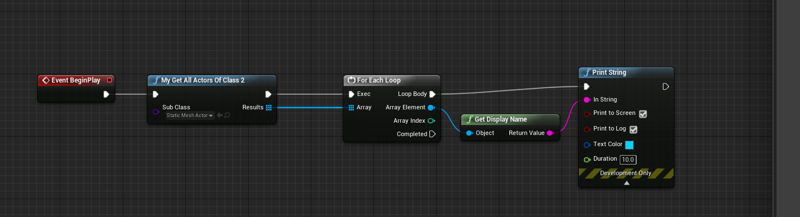

### 2.3 进一步优化，然后返回值具有类型

```c++
/**
	* 获取世界中所有的subClass 的集合，这里把 worldContex 使用 meta 做动态注入，在世界场景的蓝图可以不需要传递 `worldContext` 对象。
	* 并且对返回类型做了处理，让返回值的类型作为 `subClass` 类型。
	* 上述的操作只在蓝图中生效，在 C++ 中不生效
	* @param 世界上下文对象，可以是世界场景中的任何一个物体，用它来获取 UWorld
	* @param subClass 需要查找 Actors 的类型
	* @results 返回的结果
	*/
	UFUNCTION(BlueprintCallable, meta = (WorldContext = "worldContext", DeterminesOutputType="subClass", DynamicOutputParam="results"))
		static void MyGetAllActorsOfClass3(const UObject* worldContext, TSubclassOf<AActor> subClass, TArray<AActor*>& results);

void UMyBlueprintFunctionLibrary::MyGetAllActorsOfClass3(const UObject* worldContext, TSubclassOf<AActor> subClass, TArray<AActor*>& results)
{
	MyGetAllActorsOfClass(worldContext, subClass, results);
}

```

在蓝图中调用，此时会给出`results`的类型为`staticMesh 类型`：

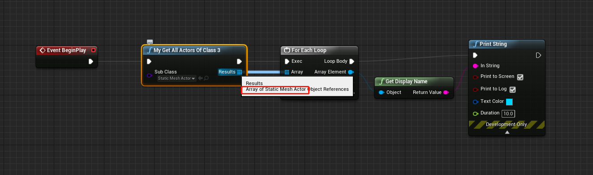


### 2.4 根据类型获取所有对象

```c++
/**
	* 根据类型获取 UE4 中所有的类
	* @param objectClass 对应的类型
	* @param results 对应的返回值
	*/
	UFUNCTION(BlueprintCallable, meta = (DeterminesOutputType="objectClass", DynamicOutputParam="results"))
		static void getAllObjectOfClass(TSubclassOf<UObject> objectClass, TArray<UObject*> &results);


void UMyBlueprintFunctionLibrary::getAllObjectOfClass(TSubclassOf<UObject> objectClass, TArray<UObject*> &results)
{
	for (TObjectIterator<UObject> itera; itera; ++itera) {
		// 如果类型相等或者是 `objectClass` 的子类时，添加到 results 中
		if (itera->GetClass() == objectClass || itera->GetClass()->IsChildOf(objectClass)) {
			results.Add(*itera);
		}
	}
}
```


## 3 断言

### 3.1 check 

check 里面的值为false 时,中断程序

### 3.2 verify

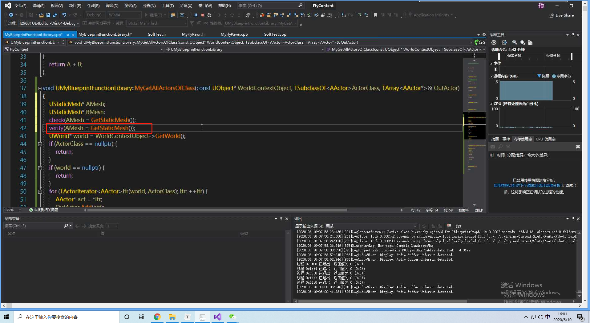


### 3.3 ensure

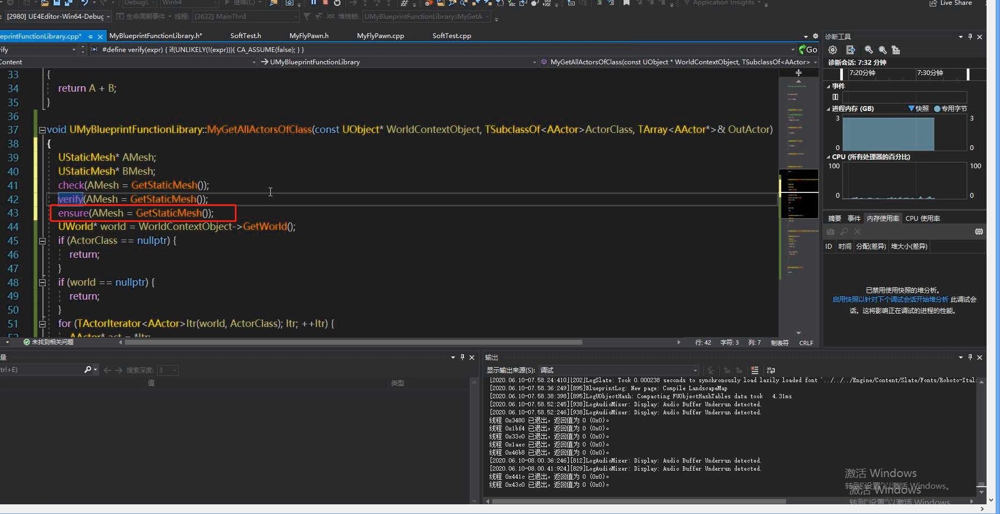


具体可以参考：https://docs.unrealengine.com/zh-CN/Programming/Assertions/index.html 的文档，实际的应用如下：

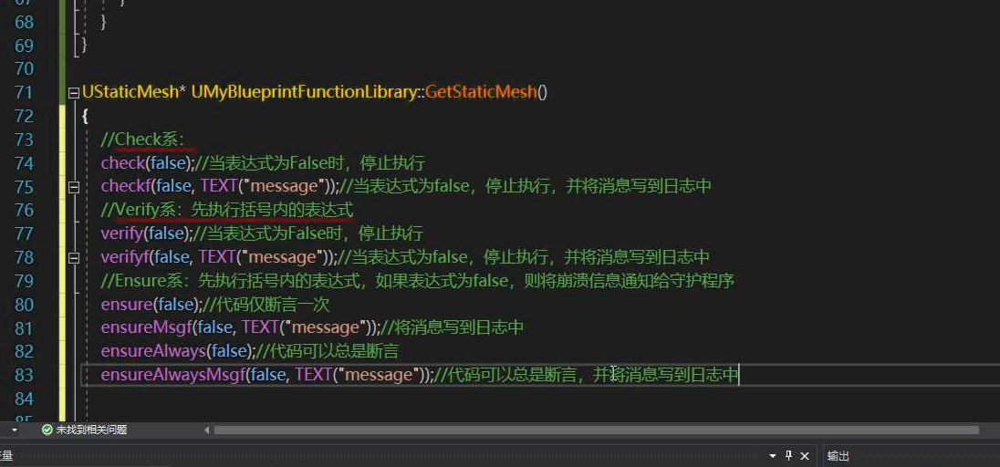

