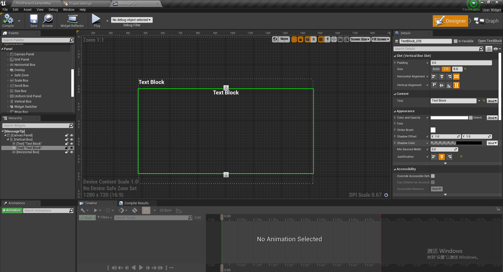
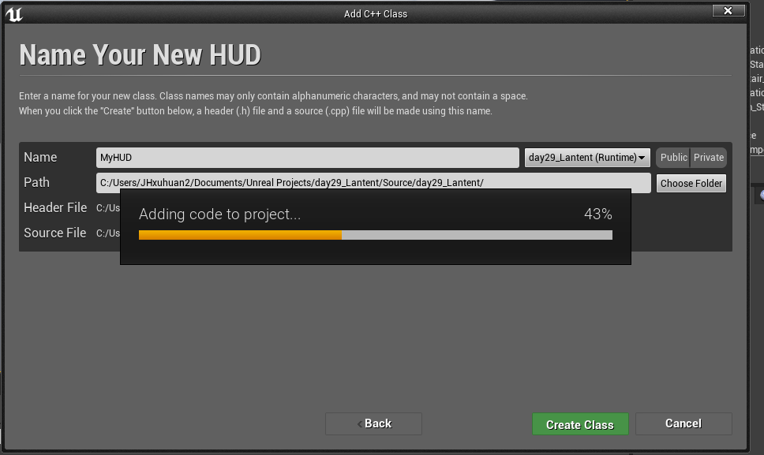
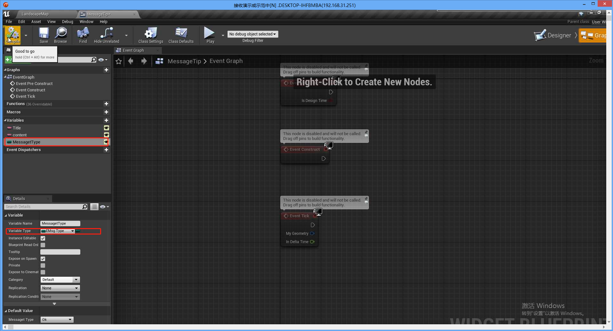
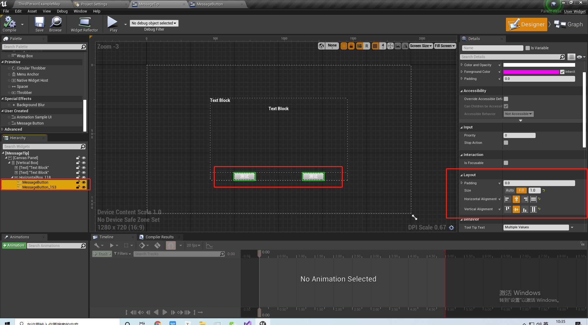
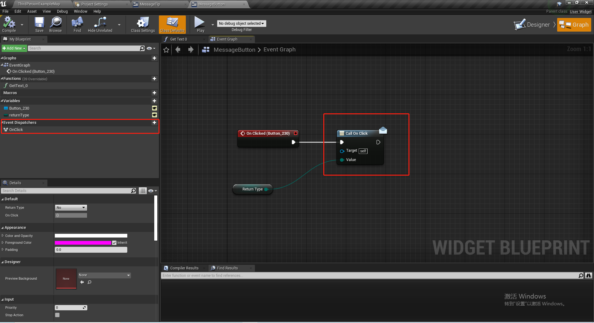
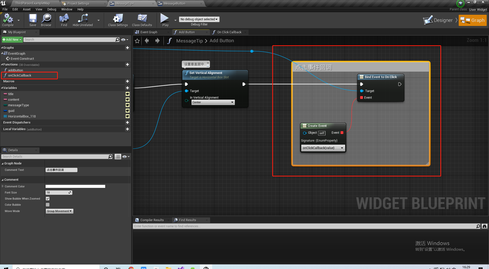
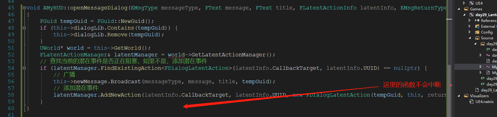
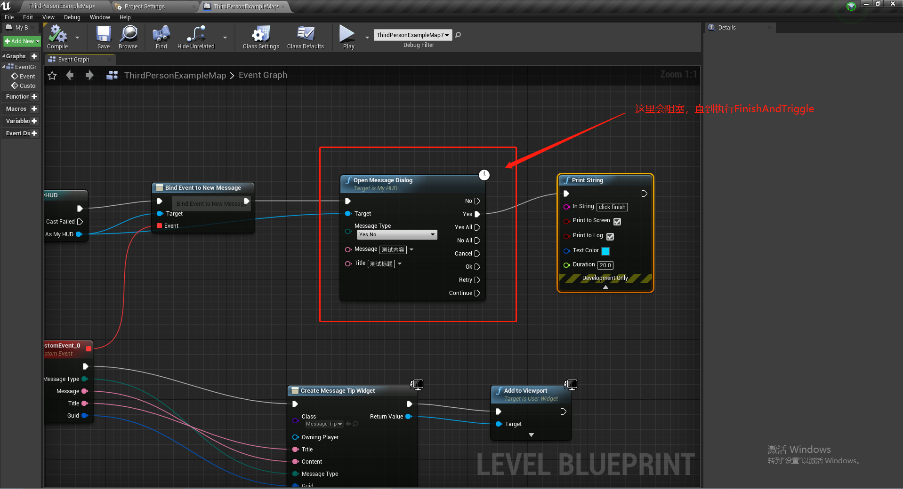

# Lantend——潜在事件

## 1 搭建一个弹框

### 1.1 准备一个 UI



### 1.2 场景一个 HUD 的 C++ 类



### 1.3 创建按钮的枚举

```c++
/**
* 定义所有的按钮形式
*/
UENUM(BlueprintType)
enum class EMsgType: uint8 {
	Ok,
	YesNo,
	OkCancel,
	YesNoCancel,
	CancelRetryContinue,
	YesNoYesAllNoAll,
	YesNoYesAllNoAllCancel,
	YesNoYesAll
};

/**
* 单独的按钮类型
*/
UENUM(BlueprintType)
enum class EMsgReturnType :uint8 {
	No,
	Yes,
	YesAll,
	NoAll,
	Cancel,
	Ok,
	Retry,
	Continue
};
```


### 1.4 在 UMG 中定义标题、按钮等信息




### 1.5 实现居中




### 1.6 在子控件中实现事件回调

#### 1.6.1 在子控件中添加事件调度器



#### 1.6.2 在父控件中绑定事件并且创建回调函数




## 2 使用 C++ 实现线性中断并恢复

### 2.1 FPendingLatentAction

一个等待的潜在事件，用于将等待的线程从休眠中恢复过来

```c++
// A pending latent action
class ENGINE_API FPendingLatentAction
{
public:
	FPendingLatentAction()
	{
	}

	virtual ~FPendingLatentAction()
	{
	}

	// Return true when the action is completed
    // 重写此方法来实现线程的恢复
	virtual void UpdateOperation(FLatentResponse& Response)
	{
		Response.DoneIf(true);
	}

	// Lets the latent action know that the object which originated it has been garbage collected
	// and the action is going to be destroyed (no more UpdateOperation calls will occur and
	// CallbackTarget is already NULL)
	// This is only called when the object goes away before the action is finished; perform normal
	// cleanup when responding that the action is completed in UpdateOperation
	virtual void NotifyObjectDestroyed() {}

	virtual void NotifyActionAborted() {}
#if WITH_EDITOR
	// Returns a human readable description of the latent operation's current state
	virtual FString GetDescription() const;
#endif
};
```

### 2.2 FLatentResponse

一个响应去触发`Latent Action`

```c++
// Copyright 1998-2019 Epic Games, Inc. All Rights Reserved.

#pragma once

#include "CoreMinimal.h"
#include "UObject/WeakObjectPtr.h"

// The response to updating a latent action
struct FLatentResponse
{
private:
	struct FExecutionInfo
	{
	public:
		FName	ExecutionFunction;
		int32		LinkID;
		FWeakObjectPtr CallbackTarget;

		FExecutionInfo(FName InExecutionFunction, int32 InLinkID, FWeakObjectPtr InCallbackTarget)
			: ExecutionFunction(InExecutionFunction)
			, LinkID(InLinkID)
			, CallbackTarget(InCallbackTarget)
		{
		}

	private:
		FExecutionInfo()
		{
		}

	};

protected:
	TArray< FExecutionInfo, TInlineAllocator<4> > LinksToExecute;
	bool bRemoveAction;
	float DeltaTime;
	// 友元函数，这样可以让 FLatentActionManager 对 FLatentResponse 的 public 和 protected 的成员可见，用来管理 FLatentAction
	friend struct FLatentActionManager;
public:
	FLatentResponse(float InDeltaTime)
		: bRemoveAction(false)
		, DeltaTime(InDeltaTime)
	{
	}

    // 根据条件让线程是否继续
	FLatentResponse& DoneIf(bool Condition)
	{
		bRemoveAction = Condition;
		return *this;
	}
	
    // 触发后续蓝图节点
	FLatentResponse& TriggerLink(FName ExecutionFunction, int32 LinkID, FWeakObjectPtr InCallbackTarget)
	{
		LinksToExecute.Add(FExecutionInfo(ExecutionFunction, LinkID, InCallbackTarget));
		return *this;
	}

    // 根据[Condition] 结束线性休眠并且继续执行后面的操作
	FLatentResponse& FinishAndTriggerIf(bool Condition, FName ExecutionFunction, int32 LinkID, FWeakObjectPtr InCallbackTarget)
	{
		bRemoveAction = Condition;
		if (bRemoveAction)
		{
			LinksToExecute.Add(FExecutionInfo(ExecutionFunction, LinkID, InCallbackTarget));
		}
		return *this;
	}

	float ElapsedTime() const { return DeltaTime; }
};

// A pending latent action
class ENGINE_API FPendingLatentAction
{
public:
	FPendingLatentAction()
	{
	}

	virtual ~FPendingLatentAction()
	{
	}

	// Return true when the action is completed
	virtual void UpdateOperation(FLatentResponse& Response)
	{
		Response.DoneIf(true);
	}

	// Lets the latent action know that the object which originated it has been garbage collected
	// and the action is going to be destroyed (no more UpdateOperation calls will occur and
	// CallbackTarget is already NULL)
	// This is only called when the object goes away before the action is finished; perform normal
	// cleanup when responding that the action is completed in UpdateOperation
	virtual void NotifyObjectDestroyed() {}

	virtual void NotifyActionAborted() {}
#if WITH_EDITOR
	// Returns a human readable description of the latent operation's current state
	virtual FString GetDescription() const;
#endif
};
```

### 2.3 实现一个自己的FPendingLatentAction

```c++
class FDialogLatentAction : public FPendingLatentAction {
private:
	FGuid guid;
	AMyHUD* hud;
	EMsgReturnType& returnType;

	FName excutionFunction;
	// 表示 complete 连接的节点
	int32 lindID;

	FWeakObjectPtr callbackTarget;
	
	/**
	* 构造函数，初始化成员变量
	*/
public:
	FDialogLatentAction(FGuid g, AMyHUD* h, EMsgReturnType& rt, const FLatentActionInfo& info) :
		guid(g),
		hud(h),
		returnType(rt),
		excutionFunction(info.ExecutionFunction),
		lindID(info.Linkage),
		callbackTarget(info.CallbackTarget) {

	}

	/**
	* 执行并销毁监听器，每帧都在执行，当条件满足时，让结束等待并触发后续的逻辑。
	*/
	virtual void UpdateOperation(FLatentResponse& Response) override {
		if (this->hud->dialogLib.Contains(this->guid)) {
			this->returnType = this->hud->dialogLib[this->guid];
			Response.FinishAndTriggerIf(true, this->excutionFunction, this->lindID, this->callbackTarget);
		}
	}

};
```


### 2.4 声明一个动态多播代理

```c++
DECLARE_DYNAMIC_MULTICAST_DELEGATE_FourParams(FNewMessgaeDialogDelegate, EMsgType, messageType, FText, message, FText, title, FGuid, guid);
```

### 2.5 声明一个 HUD

```C++
UCLASS()
class DAY29_LANTENT_API AMyHUD : public AHUD
{
	GENERATED_BODY()

	
public:
	// 声明代理变量
	UPROPERTY(BlueprintAssignable)
		FNewMessgaeDialogDelegate newMessage;

	/**
	* 打开对话框
	*/
	UFUNCTION(BlueprintCallable, meta=(Latent="", LatentInfo="lantenInfo", ExpandEnumAsExecs="returnType"))
		void openMessageDialog(EMsgType messageType, 
			FText message, 
			FText title, 
			FLatentActionInfo lantenInfo, 
			EMsgReturnType &returnType
		);

	/**
	* 修改对话框状态，并且让线性继续
	*/
	UFUNCTION(BlueprintCallable)
		void sendDialogData(FGuid guid, EMsgReturnType result);

	TMap<FGuid, EMsgReturnType> dialogLib;
	
};

```

### 2.6 实现上面的 HUD

```c++
void AMyHUD::openMessageDialog(EMsgType messageType, FText message, FText title, FLatentActionInfo latentInfo, EMsgReturnType& returnType)
{
	FGuid tempGuid = FGuid::NewGuid();
	if (this->dialogLib.Contains(tempGuid)) {
		this->dialogLib.Remove(tempGuid);
	}
	UWorld* world = this->GetWorld();
	FLatentActionManager& latentManager = world->GetLatentActionManager();
	// 查找当前的潜在事件是否正在阻塞，如果不是，添加潜在事件
	if (latentManager.FindExistingAction<FDialogLatentAction>(latentInfo.CallbackTarget, latentInfo.UUID) == nullptr) {
		// 广播
		this->newMessage.Broadcast(messageType, message, title, tempGuid);
		// 添加潜在事件
		latentManager.AddNewAction(latentInfo.CallbackTarget, latentInfo.UUID, new FDialogLatentAction(tempGuid, this, returnType, latentInfo));
	}
}

void AMyHUD::sendDialogData(FGuid guid, EMsgReturnType result)
{
	if (this->dialogLib.Contains(guid)) {
		this->dialogLib[guid] = result;
	}
	else {
		this->dialogLib.Add(guid, result);
	}
}

```


## 3 看一下Delay的实现原理

### 3.1 使用 LatentActionManager 实现

```c++
void UKismetSystemLibrary::Delay(UObject* WorldContextObject, float Duration, FLatentActionInfo LatentInfo )
{
	if (UWorld* World = GEngine->GetWorldFromContextObject(WorldContextObject, EGetWorldErrorMode::LogAndReturnNull))
	{
		FLatentActionManager& LatentActionManager = World->GetLatentActionManager();
		if (LatentActionManager.FindExistingAction<FDelayAction>(LatentInfo.CallbackTarget, LatentInfo.UUID) == NULL)
		{
			LatentActionManager.AddNewAction(LatentInfo.CallbackTarget, LatentInfo.UUID, new FDelayAction(Duration, LatentInfo));
		}
	}
}
```


### 3.2 FDelayAction 管理

```c++
// Copyright 1998-2019 Epic Games, Inc. All Rights Reserved.
#pragma once

#include "CoreMinimal.h"
#include "UObject/WeakObjectPtr.h"
#include "Engine/LatentActionManager.h"
#include "LatentActions.h"

// FDelayAction
// A simple delay action; counts down and triggers it's output link when the time remaining falls to zero
class FDelayAction : public FPendingLatentAction
{
public:
	float TimeRemaining;
	FName ExecutionFunction;
	int32 OutputLink;
	FWeakObjectPtr CallbackTarget;

	FDelayAction(float Duration, const FLatentActionInfo& LatentInfo)
		: TimeRemaining(Duration)
		, ExecutionFunction(LatentInfo.ExecutionFunction)
		, OutputLink(LatentInfo.Linkage)
		, CallbackTarget(LatentInfo.CallbackTarget)
	{
	}

    // 每次较少 TimeRemaining 时间
	virtual void UpdateOperation(FLatentResponse& Response) override
	{
		TimeRemaining -= Response.ElapsedTime();
		Response.FinishAndTriggerIf(TimeRemaining <= 0.0f, ExecutionFunction, OutputLink, CallbackTarget);
	}

#if WITH_EDITOR
	// Returns a human readable description of the latent operation's current state
	virtual FString GetDescription() const override
	{
		static const FNumberFormattingOptions DelayTimeFormatOptions = FNumberFormattingOptions()
			.SetMinimumFractionalDigits(3)
			.SetMaximumFractionalDigits(3);
		return FText::Format(NSLOCTEXT("DelayAction", "DelayActionTimeFmt", "Delay ({0} seconds left)"), FText::AsNumber(TimeRemaining, &DelayTimeFormatOptions)).ToString();
	}
#endif
};
```

发现 `Delay`的实现原理就是通过`FPendingLatentAction` 和 `FLatentResponse` 实现的。

## 4 最后说几句

这些函数的延迟只针对**蓝图节点**，会延迟后续继续调用的蓝图节点，但是函数本身不会被延迟或中断。



但是蓝图节点会阻塞：



原理：蓝图会把最终调用的函数`openMessageDialog`封装一个`openMessageDialogExec`,在`openMessageDialogExec`中先调用原始的`openMessageDialog`,然后等待线程苏醒。