# Day16-代理

## 1 代理分类

### 1.1 概述

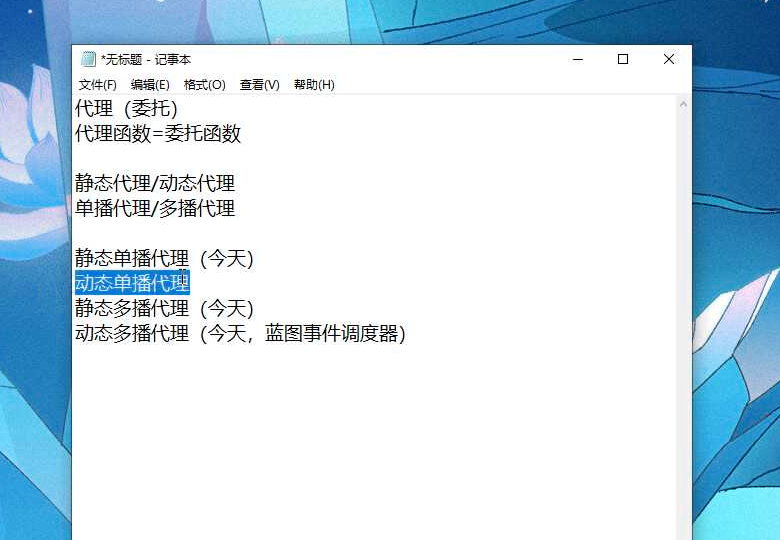

### 1.2 单播代理

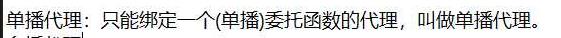

### 1.3 多播代理

### 1.4 代理在 C++中的定义

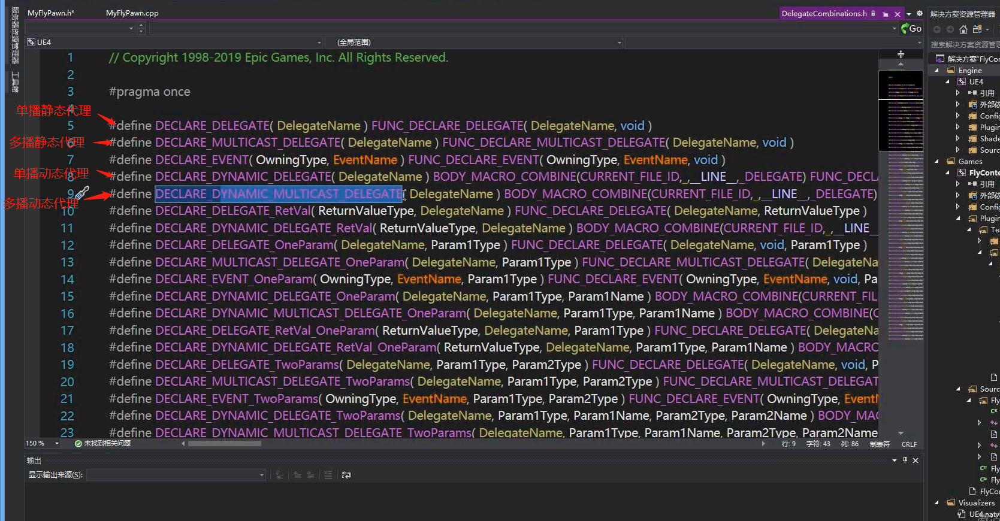

根据 `DYNAMIC`来判断动态还是静态，根据`MULTICAST` 来判断多播还是单播。

### 1.5 代理参数

代理支持参数，我们可以根据后面接的参数来声明我们需要的参数信息：

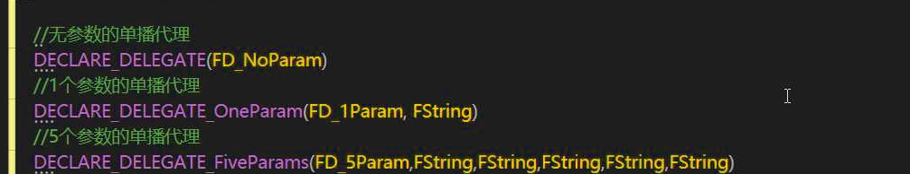

### 1.6 代理返回值

当然，代理也可以带返回值：

### 1.7 代理名称

### 1.8 定义代理变量

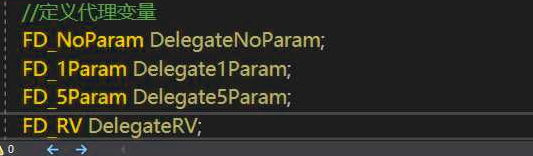

### 1.9 打印数据到屏幕和控制台

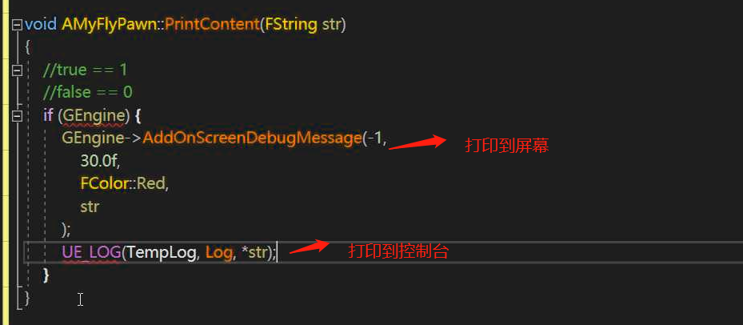

### 1.10 C++ 连接字符串方法

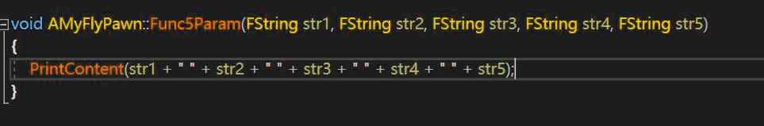

## 2 单播代理

### 2.1 声明

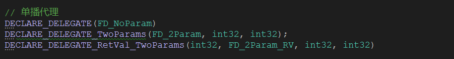

### 2.2 绑定并使用

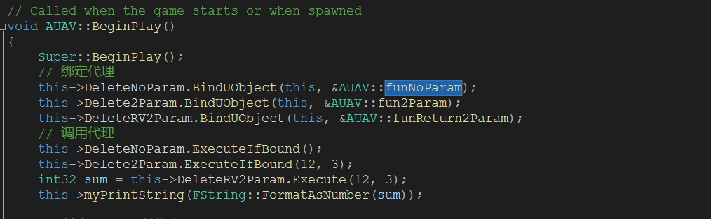

### 2.3 带参数的情况

### 2.4 带返回值的情况

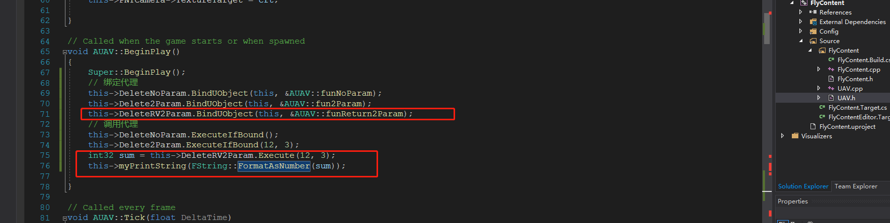

### 2.5 C++ Lambda 表达式

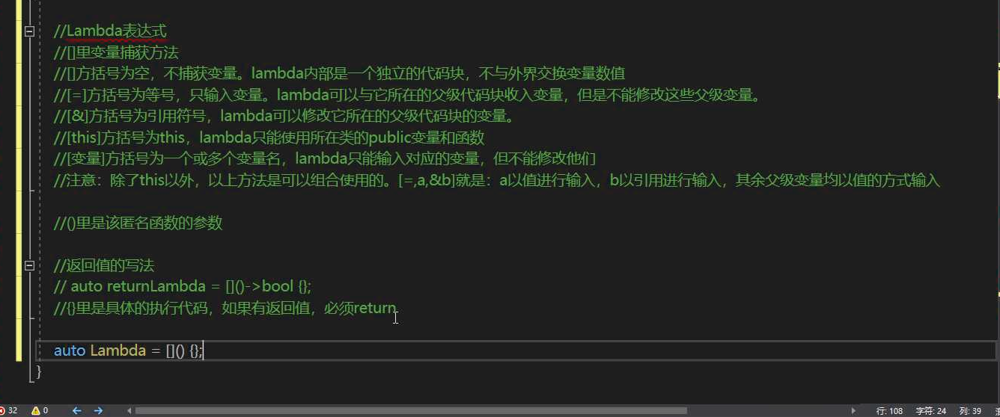

### 2.5 绑定方法

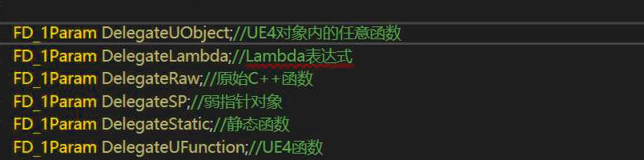

#### 2.5.1 Lambda 绑定

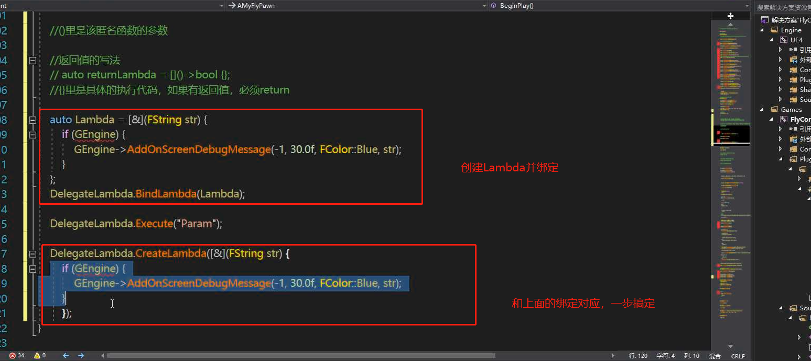

#### 2.5.2 UFunction绑定

UFunction 绑定一个类的成员函数

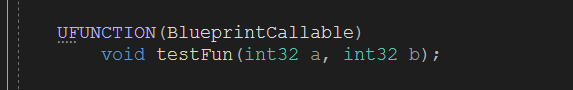

绑定到代理中：

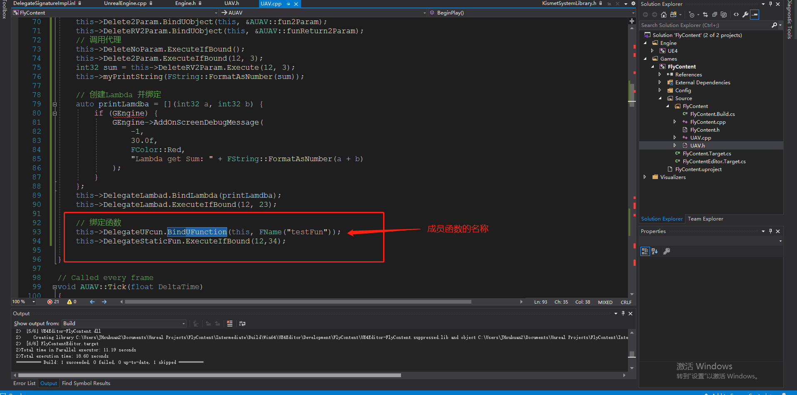

#### 2.5.3 Static 函数绑定

首先在头文件中声明一个静态函数：

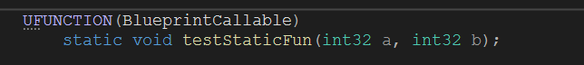

在.cpp文件中实现它：

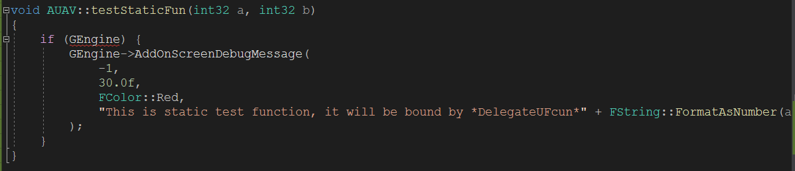

使用代理绑定：

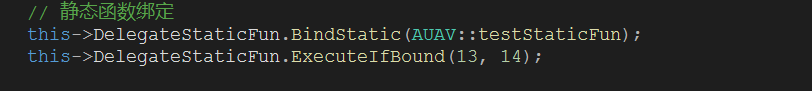

#### 2.5.4 标准 C++ 类

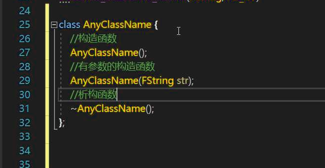

指针相关概念：

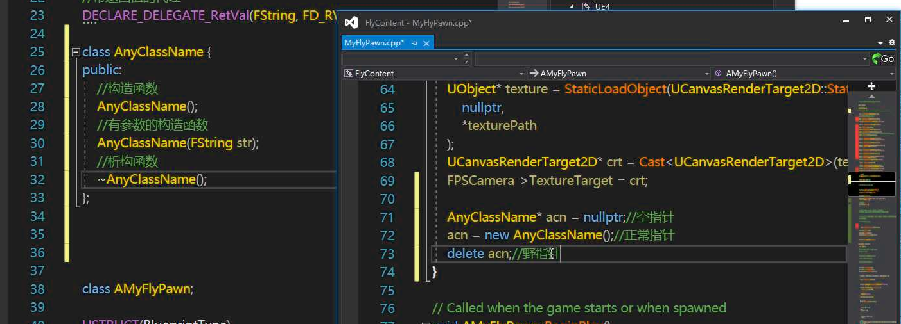

执行 delete 方法后，会自动执行析构函数。

#### 2.5.5 智能指针

又叫做：弱指针

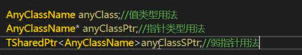

#### 2.5.6 UE4 new 对象

#### 2.5.7 弱指针和指针的绑定

1. 声明指针变量

   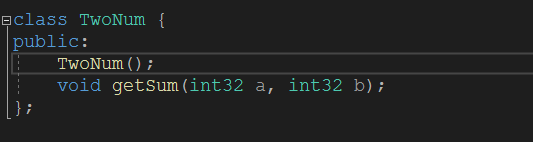

2. 实现构造函数和成员函数

   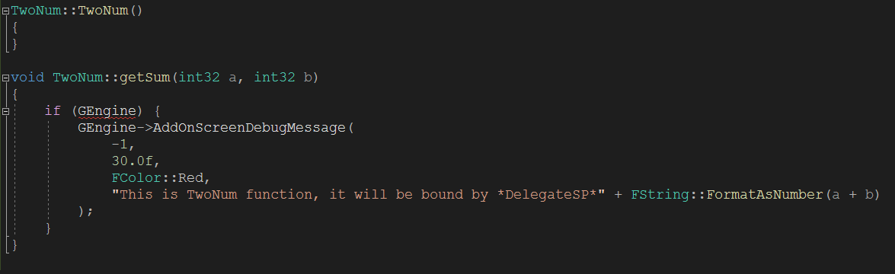

3. 声明指针类型和共享指针类型

   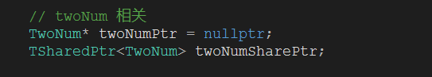

4. 绑定到对应的代理中

   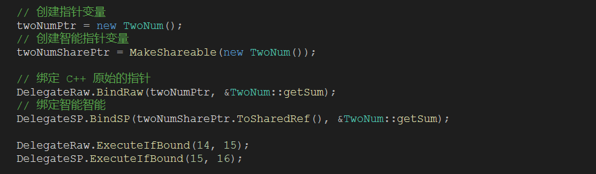

## 3 多播代理

### 3.1 声明多播代理

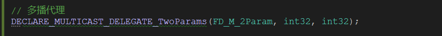

### 3.2 声明变量类型

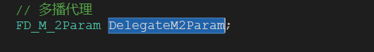

### 3.3 使用多播代理

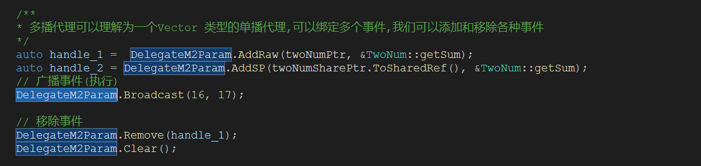

## 4 动态多播代理

### 4.1 代理声明

此时一定要使用分号。

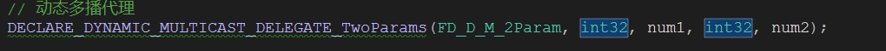

### 4.2 变量声明

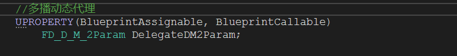

### 4.3 在蓝图中使用

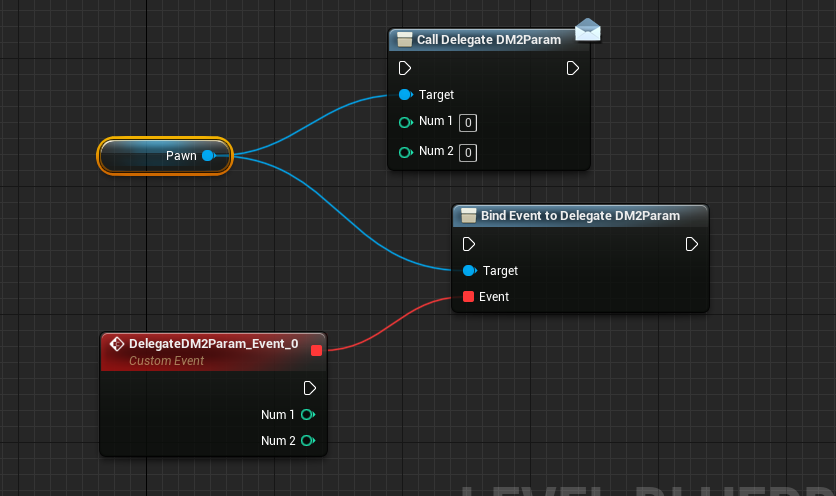

可以看见看到我们**事件调度器**就是使用这种方式来实现的。