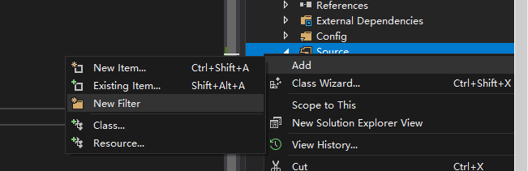
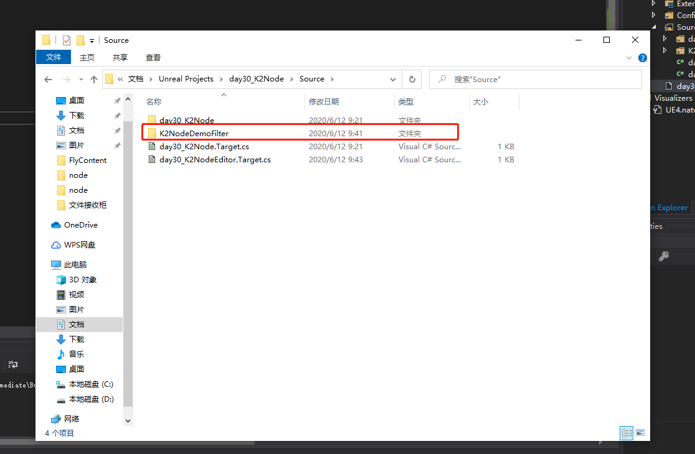
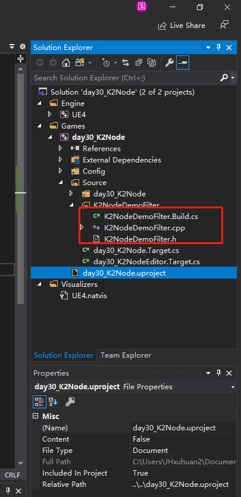
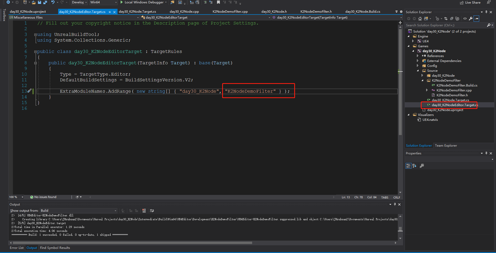
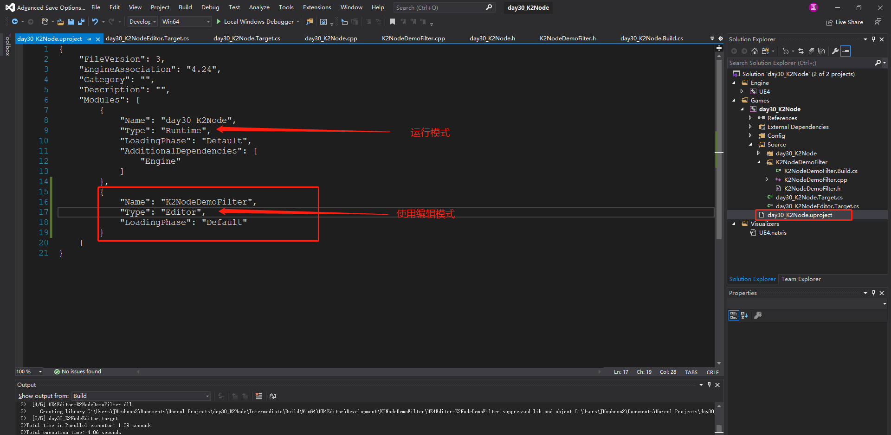
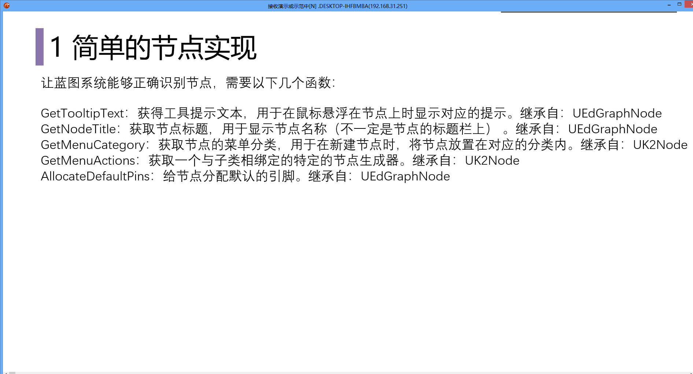
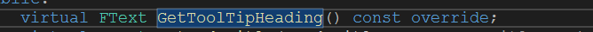
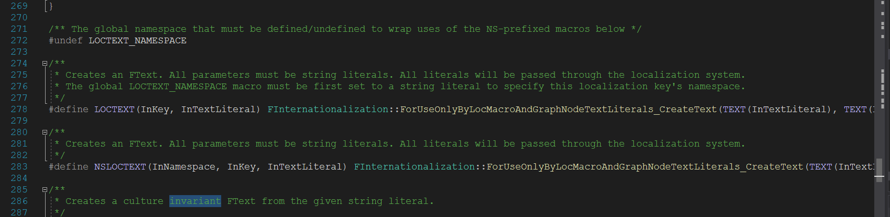
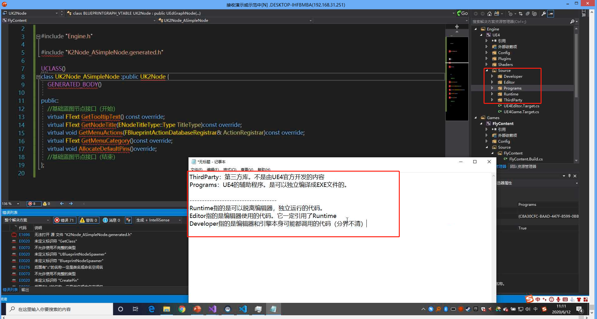

# Day30-K2Node

## 1  项目工程文件

### 1.1 添加新模块



如果项目下没有对应的文件夹，需要新建一个




### 1.2 创建对应的.h,cpp,和 Build.cs

我们可以复制之前的项目文件，然后修改对应的名称。




### 1.3 添加模块到项目中




### 1.4 添加到项目中




## 2 K2Node 节点

如果需要自定义一个蓝图节点，则需要创建一个类来实现 `K2Node`

```c++
#pragma once

#include "Engine.h"
#include "K2Node.h"
#include "BlueprintActionDatabaseRegistrar.h"
#include "BlueprintNodeSpawner.h"
#include "EdGraphSchema_K2.h"
#include "KismetCompiler.h"
#include "K2Node_CallFunction.h"
#include "day30_K2Node/MyBlueprintFunctionLib.h"
#include "Kismet2/CompilerResultsLog.h"
#include "K2Node_ASimpleNode.generated.h"


UCLASS()
class UK2Node_ASimpleNode :public UK2Node {
	GENERATED_BODY()
public:
	virtual FText GetTooltipText() const override;
	virtual FText GetNodeTitle(ENodeTitleType::Type TitleType) const override;
	/**
	* 右键点击菜单时， 显示蓝图节点信息
	*/
	virtual void GetMenuActions(FBlueprintActionDatabaseRegistrar& ActionRegistrar) const override;
	virtual FText GetMenuCategory() const override;
	virtual void AllocateDefaultPins() override;
	/**
	* 设置蓝图节点的颜色和标记
	*/
	virtual FSlateIcon GetIconAndTint(FLinearColor& OutColor) const;
	/**
	* 将引脚内置转移到函数
	*/
	virtual void ExpandNode(class FKismetCompilerContext& CompilerContext, UEdGraph* SourceGraph);
	/**
	* 通过名称获取引脚
	*/
	UEdGraphPin* getNamePin(FName pinName);
	UEdGraphPin* getNamePin(UK2Node* node, FName pinName);
};
```


### 2.1 蓝图识别




### 2.2 具体的实现

```c++
#include "K2Node_ASimpleNode.h"

#define LOCTEXT_NAMESPACE "ASimpleNode"

FText UK2Node_ASimpleNode::GetTooltipText() const
{
	// 简单方式 Text
	return LOCTEXT("Tooltip", "这是一个演示的自定义节点");
}


FText UK2Node_ASimpleNode::GetNodeTitle(ENodeTitleType::Type TitleType) const
{
	// 完整构建一个 Text
	return NSLOCTEXT("ASimpleNode", "Title", "简单自定义节点");
}

FText UK2Node_ASimpleNode::GetMenuCategory() const {
	return LOCTEXT("Category", "自定义节点");
}

void UK2Node_ASimpleNode::AllocateDefaultPins()
{
	// 输入执行引脚
	this->CreatePin(EGPD_Input, UEdGraphSchema_K2::PC_Exec, UEdGraphSchema_K2::PN_Execute);
	// 输入参数引脚
	this->CreatePin(EGPD_Input, UEdGraphSchema_K2::PC_Object, "anyObject");

	// 输出执行引脚
	this->CreatePin(EGPD_Output, UEdGraphSchema_K2::PC_Exec, UEdGraphSchema_K2::PN_Then);
	this->CreatePin(EGPD_Output, UEdGraphSchema_K2::PC_Boolean, "result");
}

FSlateIcon UK2Node_ASimpleNode::GetIconAndTint(FLinearColor& OutColor) const
{
	OutColor = FLinearColor::Red;
	return FSlateIcon("EditorStyle", "Kismet.AllClasses.FunctionIcon");
}

void UK2Node_ASimpleNode::GetMenuActions(FBlueprintActionDatabaseRegistrar& ActionRegistrar) const {
	UClass* actionKey = this->GetClass();
	if (ActionRegistrar.IsOpenForRegistration(actionKey)) {
		UBlueprintNodeSpawner* spawner = UBlueprintNodeSpawner::Create(actionKey);
		ActionRegistrar.AddBlueprintAction(actionKey, spawner);
	}
}

void  UK2Node_ASimpleNode::ExpandNode(class FKismetCompilerContext& CompilerContext, UEdGraph* SourceGraph) {
	Super::ExpandNode(CompilerContext, SourceGraph);
	// 创建一个可调用函数，并且绑定到自定义蓝图函数库，让这个函数来代理实现我们的蓝图节点
	UK2Node_CallFunction* selfFun = CompilerContext.SpawnIntermediateNode<UK2Node_CallFunction>(this, SourceGraph);
	selfFun->SetFromFunction(
		UMyBlueprintFunctionLib::StaticClass()->FindFunctionByName(
			GET_MEMBER_NAME_CHECKED(UMyBlueprintFunctionLib, ASimpleNodeFunction)
		));
	// 将函数引脚展开
	selfFun->AllocateDefaultPins();
	CompilerContext.MessageLog.NotifyIntermediateObjectCreation(selfFun,this);
	// 将默认执行引脚 move 到 selfFun 的执行引脚
	CompilerContext.MovePinLinksToIntermediate(*getNamePin(UEdGraphSchema_K2::PN_Execute), *selfFun->GetExecPin());
	//将默认输出执行引脚 move selfFun 的输出执行引脚
	CompilerContext.MovePinLinksToIntermediate(*getNamePin(UEdGraphSchema_K2::PN_Then), *getNamePin(selfFun, UEdGraphSchema_K2::PN_Then));
	//将默认的数据输入引脚[anyObject] move 到 selfFun 的 [anyObject]
	CompilerContext.MovePinLinksToIntermediate(*getNamePin("anyObject"), *getNamePin(selfFun, "anyObject"));
	// 同理，将默认数据的返回引脚[result] move 到 selfFun 的输出引脚
	CompilerContext.MovePinLinksToIntermediate(*getNamePin("result"), *getNamePin(selfFun, "result"));
}

UEdGraphPin* UK2Node_ASimpleNode::getNamePin(FName pinName)
{
	for (int32 i = 0; i < this->Pins.Num(); i++) {
		if (this->Pins[i]->PinName == pinName) {
			return this->Pins[i];
		}
	}
	return nullptr;
}

UEdGraphPin* UK2Node_ASimpleNode::getNamePin(UK2Node* node, FName pinName)
{
	for (int32 i = 0; i < node->Pins.Num(); i++) {
		if (node->Pins[i]->PinName == pinName) {
			return node->Pins[i];
		}
	}
	return nullptr;
}
```


## 3 C++ 小计

### 3.1 函数后面的 const

​	放在函数后面的 `const` 表示返回值不能修改



### 3.2 创建 FText的两种方法




### 3.3 ue4 c++ 模块

