# 插件

## 1 新建插件

### 1.1 新建插件

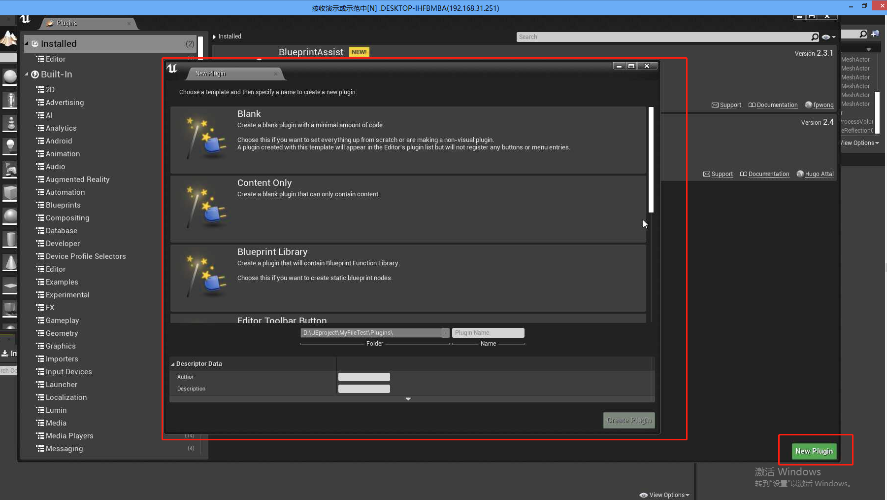


### 1.2 显示插件目录

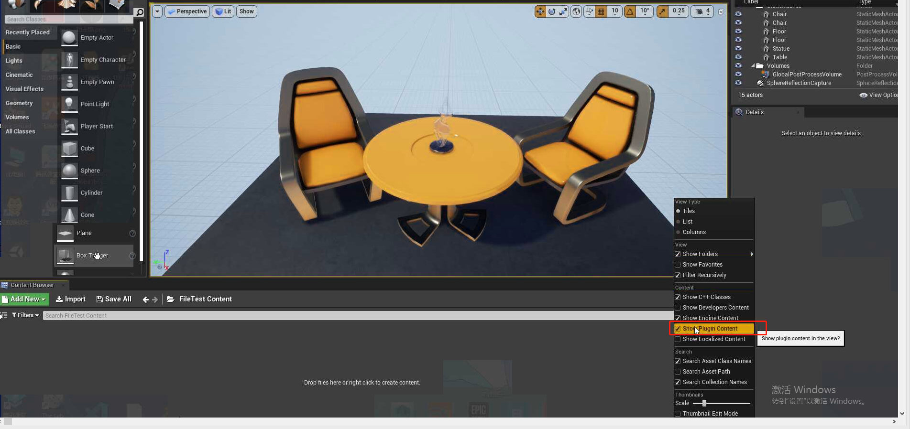


### 1.3 插件目录格式

public:.h文件，private:.cpp文件

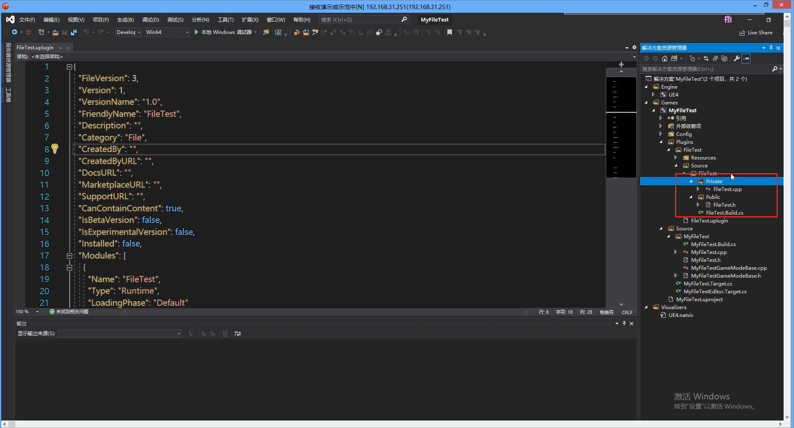


### 1.4 创建头文件

路径需要在插件下面的`public`目录

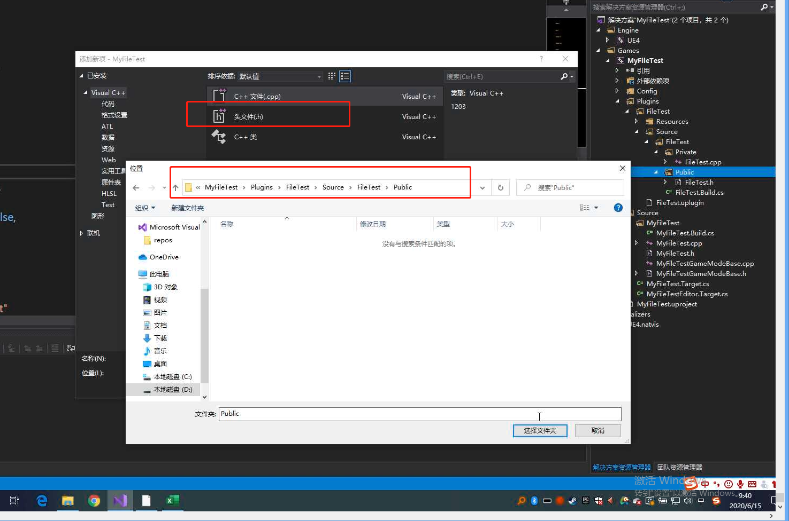


### 1.5 新建自定义资源

```c++
#pragma once
#include "Engine.h"
#include "MyAssert.generated.h"

UCLASS()
class UMyAssert :public UDataAsset {
	GENERATED_BODY()
public:
};
```


### 1.6 在 UE4 中查看资源

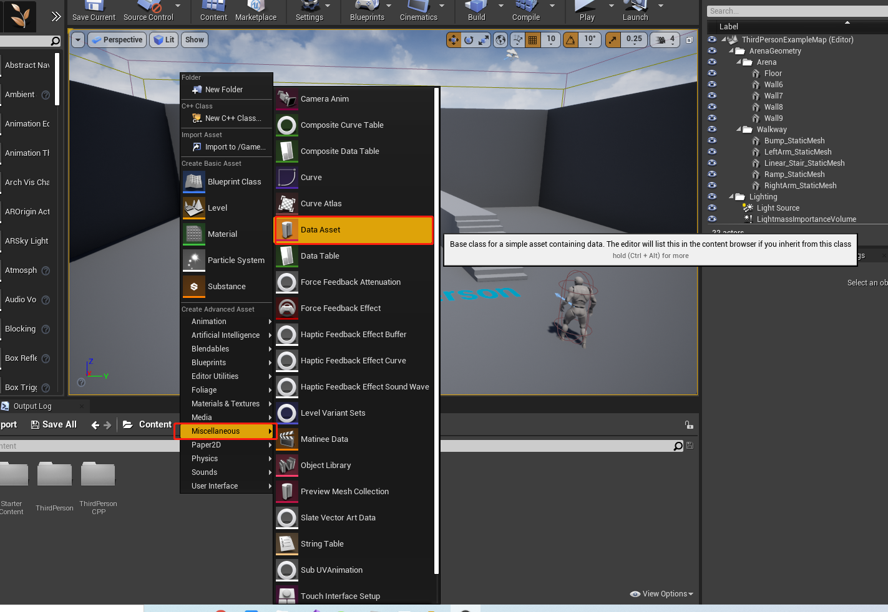 

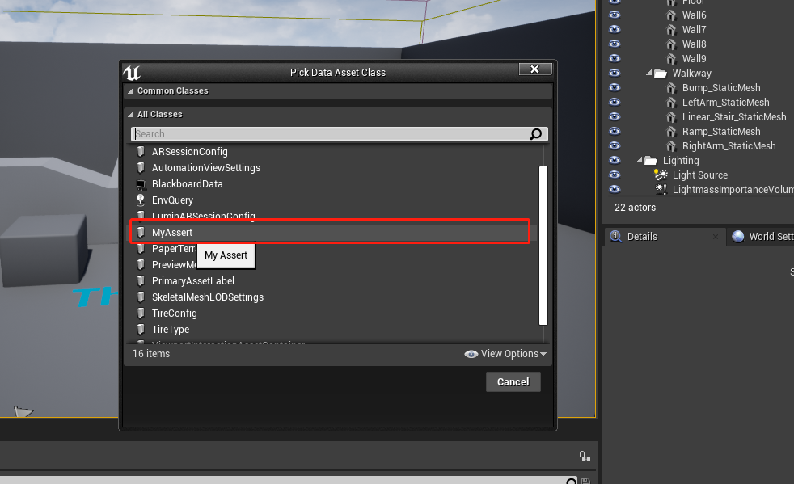

### 1.7 UICommand


### 1.8 宏定义和撤销

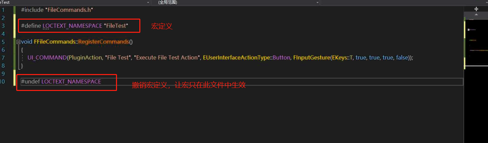

### 1.9 .dll 和 .lib

.dll 动态链接库，可以被复制使用

.lib 静态链接库，

参考链接：https://www.cnblogs.com/tenosdoit/p/3203137.html


### 1.10 控件反射器

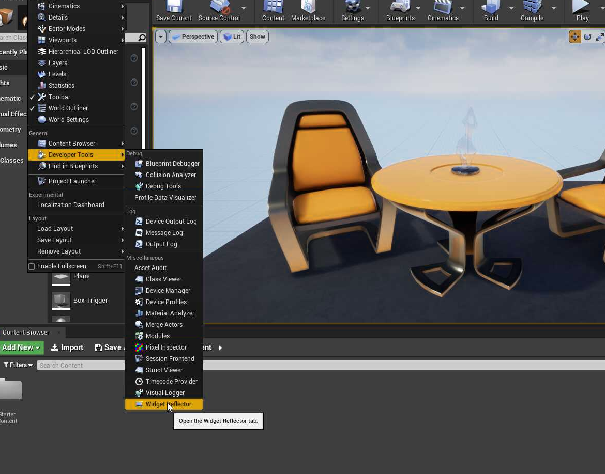

查看工具栏按钮在代码中的创建方式：点击`Pick Painted Widget`,然后点击任何一个UE4界面，按ESC退出，此时就会显示当前按钮(UI)所在的C++代码以及实现的行数。

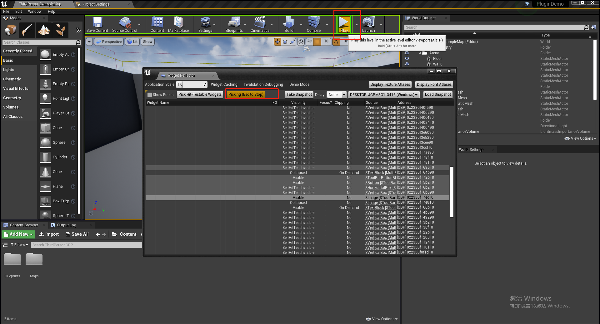


### 1.11 C++ 最简单添加 Text 方法

此方法不支持本地化，只是临时使用一下。

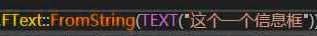

## 2 Slot

### 2.1 打开测试控件

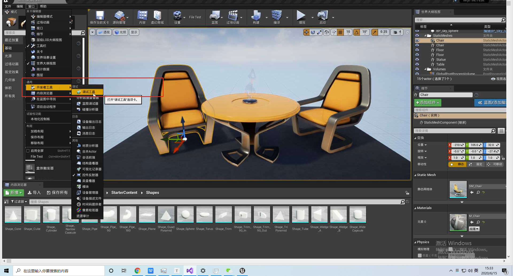

这里可以测试和显示UE4的一些控件：

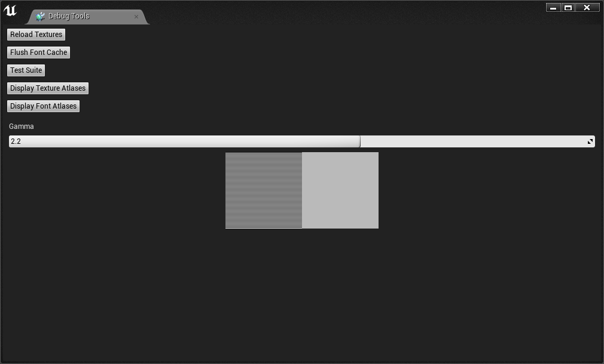

### 2.2 新建`FileCommands.h`

```c++
#pragma once
#include "CoreMinimal.h"
#include "Framework/Commands/Commands.h"

/**
* 自定义插件类，里面定义插件初始化的过程
*/
class FFileCommands :public TCommands<FFileCommands> {
public:
	// 调用父类构造函数
	FFileCommands() :TCommands<FFileCommands>(
		FName("FileTest"), 
		NSLOCTEXT("FileTestNameSpace", "Commands", "文件测试插件"),
		NAME_None,
		NAME_None) {

	}

	virtual void RegisterCommands() override;

	// 插件指针
	TSharedPtr<FUICommandInfo> plugAction;

};
```

### 2.3 实现 `FileCommands.cpp`

```c++
#include "FileCommands.h"

#define LOCTEXT_NAMESPACE "FileTest"

void FFileCommands::RegisterCommands()
{
	// 使用 UI_COMMAND 来控制菜单的快捷键和类型
	UI_COMMAND(
		this->plugAction,
		"FileTest",
		"ExecuteFileTestAction",
		EUserInterfaceActionType::Button,
		FInputGesture(EKeys::T, true, true, false, false)
	);
}

#undef LOCTEXT_NAMESPACE 

```

### 2.4 实现插件模块的`TestFile.h`

```c++
// Copyright 1998-2019 Epic Games, Inc. All Rights Reserved.

#pragma once

#include "CoreMinimal.h"
#include "Modules/ModuleManager.h"
#include "FileCommands.h"
#include "Framework/Commands/UICommandList.h"
#include "Framework/MultiBox/MultiBoxBuilder.h"
#include "Framework/Docking/TabManager.h"
#include "LevelEditor.h"
#include "Misc/MessageDialog.h"
#include "Widgets/DeclarativeSyntaxSupport.h"
#include "Widgets/Docking/SDockTab.h"

/**
* 插件模块，里面将插件添加到工具栏中，定义插件的点击事件以及点击后触发的操作
*/
class FTestFileModule : public IModuleInterface
{
public:

	/** IModuleInterface implementation */
	virtual void StartupModule() override;
	virtual void ShutdownModule() override;

	/**
	* 插件的点击触发事件
	*/
	void pluginButtionClicked();
	/**
	* 将插件添加到工具栏
	*/
	void addToolBarExtension(FToolBarBuilder& builder);
	/**
	* 将插件添加到 windows
	*/
	void addMenuExtension(FMenuBuilder& builder);

	/**
	* 创建标签窗口
	*/
	TSharedRef<SDockTab> spawnPluginTab(const FSpawnTabArgs& tab);

	TSharedPtr<FUICommandList> commandList;
};

```

### 2.5 实现`TestFile.cpp`

```c++
// Copyright 1998-2019 Epic Games, Inc. All Rights Reserved.

#include "TestFile.h"

#define LOCTEXT_NAMESPACE "FTestFileModule"

// 定义一个标签的名称，用于全局绑定
static const FName TAG_NAME("MyTagName");

void FTestFileModule::StartupModule()
{
	// This code will execute after your module is loaded into memory; the exact timing is specified in the .uplugin file per-module
	// 注册命令行,产生 FFileCommands 单例，这里面会调用 RegisterCommands 来初始化插件指针
	FFileCommands::Register();
	// 创建 commandList，并且绑定对应的点击事件
	this->commandList = MakeShareable(new FUICommandList);
	this->commandList->MapAction(
		// 获取 FFileCommands 单例对象
		FFileCommands::Get().plugAction,
		FExecuteAction::CreateRaw(this, &FTestFileModule::pluginButtionClicked),
		FCanExecuteAction()
	);

	
	// 获取关卡编辑器
	FLevelEditorModule& levelModule = FModuleManager::LoadModuleChecked<FLevelEditorModule>("LevelEditor");
	// 获取工具栏扩展，将插件按钮添加到工具栏`Settings`的后面
	TSharedPtr<FExtender> toolBarExtender = MakeShareable(new FExtender);
	toolBarExtender->AddToolBarExtension(
		"Settings",
		EExtensionHook::After,
		this->commandList,
		FToolBarExtensionDelegate::CreateRaw(
			this,
			&FTestFileModule::addToolBarExtension
		)
	);
	levelModule.GetToolBarExtensibilityManager()->AddExtender(toolBarExtender);

	// 将自定义插件添加到 Windows 窗口
	TSharedPtr<FExtender> menuExtender = MakeShareable(new FExtender);
	menuExtender->AddMenuExtension(
		"WindowLayout",
		EExtensionHook::After,
		this->commandList,
		FMenuExtensionDelegate::CreateRaw(this, &FTestFileModule::addMenuExtension)
	);
	levelModule.GetMenuExtensibilityManager()->AddExtender(menuExtender);

	// 创建标签窗口
	FGlobalTabmanager::Get()->RegisterNomadTabSpawner(
		TAG_NAME,
		FOnSpawnTab::CreateRaw(this, &FTestFileModule::spawnPluginTab)
	)
		.SetDisplayName(LOCTEXT("TagName", "My Test Tab")) // 设置标签的名称
		.SetMenuType(ETabSpawnerMenuType::Hidden);

}

void FTestFileModule::ShutdownModule()
{
	// This function may be called during shutdown to clean up your module.  For modules that support dynamic reloading,
	// we call this function before unloading the module.
}

void FTestFileModule::pluginButtionClicked()
{
	// FMessageDialog::Open(EAppMsgType::Ok, FText::FromString("This is message dialog"), new FText(FText::FromString("This is title")));
	FGlobalTabmanager::Get()->InvokeTab(TAG_NAME);
}

void FTestFileModule::addToolBarExtension(FToolBarBuilder& builder)
{
	// 将此对象添加到工具栏
	builder.AddToolBarButton(FFileCommands::Get().plugAction);
}

void FTestFileModule::addMenuExtension(FMenuBuilder& builder)
{
	// 将此对象添加到窗口中
	builder.AddMenuEntry(FFileCommands::Get().plugAction);
}

TSharedRef<SDockTab> FTestFileModule::spawnPluginTab(const FSpawnTabArgs& tab)
{
	return SNew(SDockTab) // 创建一个标签窗口的内容
		.TabRole(ETabRole::NomadTab) // 设置标签的类型为流动的
		[ // 这里的[]为往父级中添加子组件，这里添加的是一个Box组件
			SNew(SBox) // 创建 Box 组件
			.HAlign(HAlign_Center) // 设置水平和垂直居中
			.VAlign(VAlign_Center)
			[
				SNew(STextBlock) // 在 Box 里面再添加一个子组件 TextBlock
				.Text(LOCTEXT("TestFile", "This is a Tab"))
			]
		];
}

#undef LOCTEXT_NAMESPACE
	
IMPLEMENT_MODULE(FTestFileModule, TestFile)
```


### 2.6 最终效果

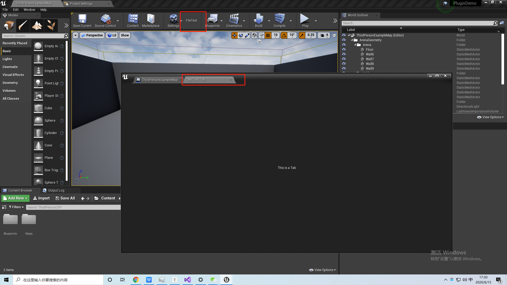

## 3 C++ 小技巧

### 3.1 UE4 C++ 创建对象的方法

* 普通的 C++ 类：new XXX
* UObject：New Object
* Actor：Spawn XXXActor
* Slate控件：SNew或者SAssignNew

```c++
/**
 * Slate widgets are constructed through SNew and SAssignNew.
 * e.g.
 *      
 *     TSharedRef<SButton> MyButton = SNew(SButton);
 *        or
 *     TSharedPtr<SButton> MyButton;
 *     SAssignNew( MyButton, SButton );
 *
 * Using SNew and SAssignNew ensures that widgets are populated
 */

#define SNew( WidgetType, ... ) \
	MakeTDecl<WidgetType>( #WidgetType, __FILE__, __LINE__, RequiredArgs::MakeRequiredArgs(__VA_ARGS__) ) <<= TYPENAME_OUTSIDE_TEMPLATE WidgetType::FArguments()


#define SAssignNew( ExposeAs, WidgetType, ... ) \
	MakeTDecl<WidgetType>( #WidgetType, __FILE__, __LINE__, RequiredArgs::MakeRequiredArgs(__VA_ARGS__) ) . Expose( ExposeAs ) <<= TYPENAME_OUTSIDE_TEMPLATE WidgetType::FArguments()

```

