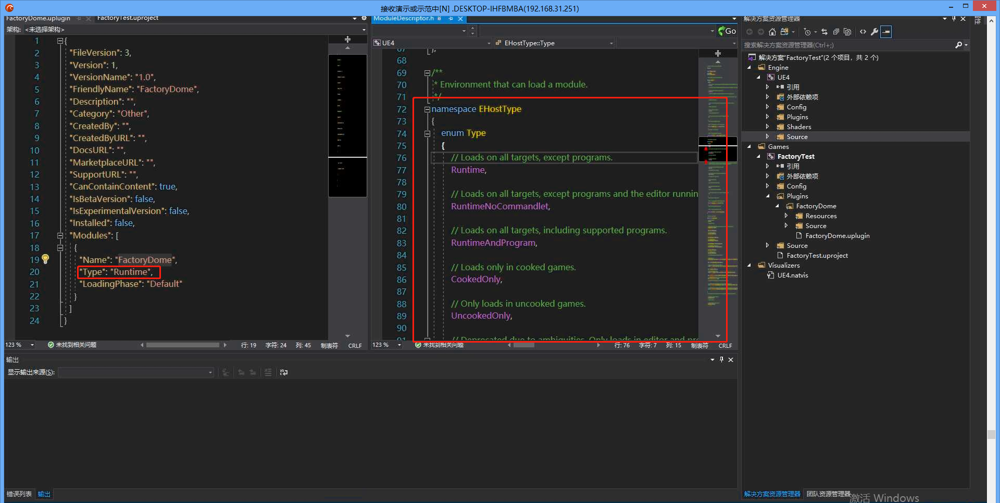
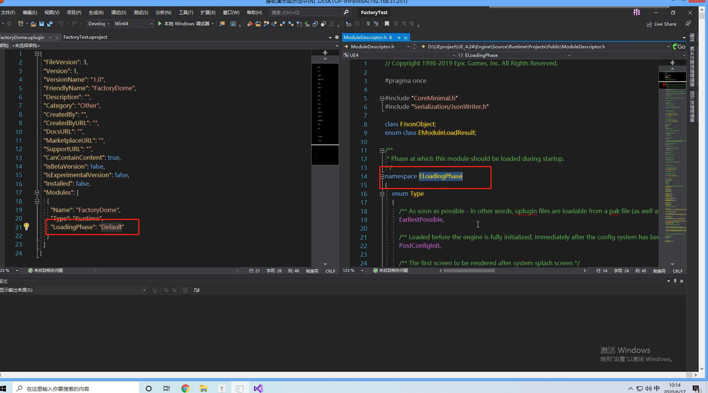
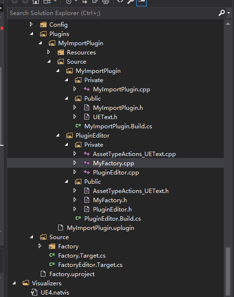
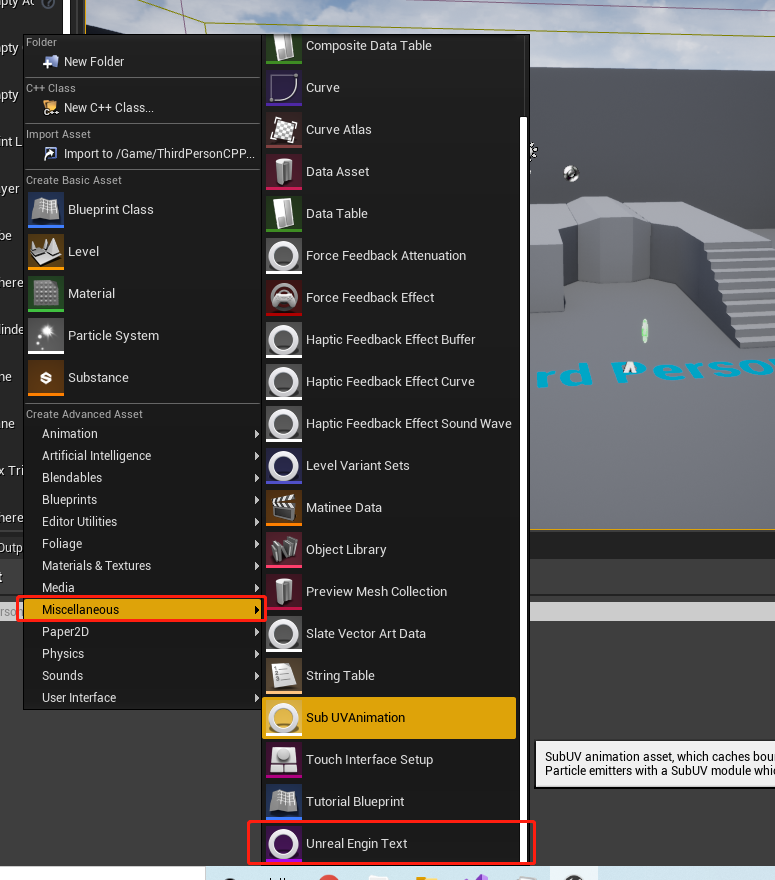
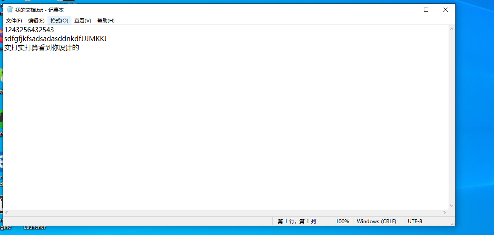
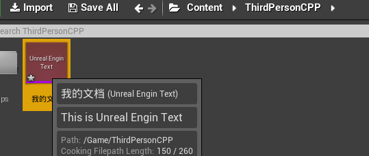
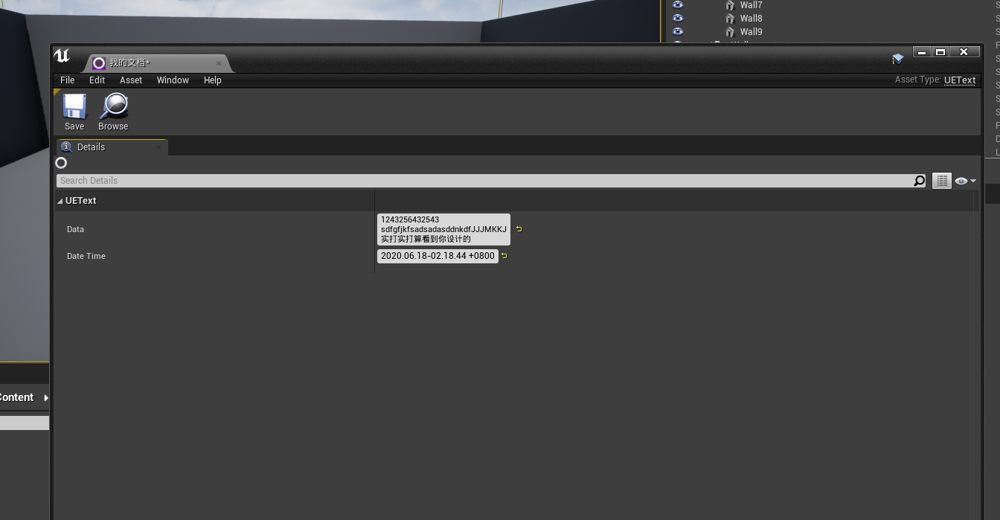

Factory-读取文件插件

## 1 模块中的Type类型

### 1.1 Type



### 1.2 LoadingPhase




## 2 新建一个类存储数据实体

```c++
#pragma once
#include "Engine.h"
#include "UEText.generated.h"

/**
* 新建一种UE4支持的格式类型，为UUEText
*/
UCLASS(BlueprintType, Blueprintable)
class MYIMPORTPLUGIN_API UUEText: public UObject {
	GENERATED_BODY()
public:
	/**
	* 存储数据的内容
	*/
	UPROPERTY(BlueprintReadWrite, EditAnywhere)
		FString data;
	/**
	* 修改的时间戳
	*/
	UPROPERTY(BlueprintReadWrite, EditAnywhere)
		FDateTime dateTime;
};
```

## 3 新建一个插件模块

```C++
// Copyright 1998-2019 Epic Games, Inc. All Rights Reserved.

#pragma once

#include "CoreMinimal.h"
#include "Modules/ModuleManager.h"
#include "AssetToolsModule.h"
#include "IAssetTools.h"
#include "AssetTypeActions_UEText.h"

class FPluginEditorModule : public IModuleInterface
{
public:

	/** IModuleInterface implementation */
	virtual void StartupModule() override;
	virtual void ShutdownModule() override;
};

```

```c++
// Copyright 1998-2019 Epic Games, Inc. All Rights Reserved.

#include "../Public/PluginEditor.h"

#define LOCTEXT_NAMESPACE "FPluginEditorModule"

void FPluginEditorModule::StartupModule()
{
	// 将UEText 文件格式注册到 UE4 系统中，让它识别
	IAssetTools& assetTool = FModuleManager::LoadModuleChecked<FAssetToolsModule>("AssetTools").Get();
	TSharedRef<IAssetTypeActions> UETextActions = MakeShareable(new FAssetTypeActions_UEText);
	assetTool.RegisterAssetTypeActions(UETextActions);
}

void FPluginEditorModule::ShutdownModule()
{
	// This function may be called during shutdown to clean up your module.  For modules that support dynamic reloading,
	// we call this function before unloading the module.
}

#undef LOCTEXT_NAMESPACE

IMPLEMENT_MODULE(FPluginEditorModule, PluginEditor)
```


## 4 新建让UE4识别格式类型

```c++
#pragma once
#include "AssetTypeActions_Base.h"
#include "UEText.h"
/**
* 定义UE4 支持的格式类型
*/
class FAssetTypeActions_UEText :public FAssetTypeActions_Base {
	/**
	* 设置支持格式
	*/
	virtual UClass* GetSupportedClass() const override;
	virtual FText GetName() const override;
	virtual FText GetAssetDescription(const struct FAssetData& AssetData) const override;
	/**
	* 设置分类，这样会让该格式出现在对应的地方
	*/
	virtual uint32 GetCategories() override;
	virtual FColor GetTypeColor() const override;
};
```

```C++
#include "AssetTypeActions_UEText.h"

UClass* FAssetTypeActions_UEText::GetSupportedClass() const
{
	return UUEText::StaticClass();
}

FText FAssetTypeActions_UEText::GetName() const
{
	return FText::FromString(TEXT("Unreal Engin Text"));
}

FText FAssetTypeActions_UEText::GetAssetDescription(const FAssetData& AssetData) const
{
	return FText::FromString(TEXT("This is Unreal Engin Text"));
}

uint32 FAssetTypeActions_UEText::GetCategories()
{
	return EAssetTypeCategories::UI + EAssetTypeCategories::Misc;;
}

FColor FAssetTypeActions_UEText::GetTypeColor() const
{
	return FColor::Purple;
}

```

## 5 创建工厂类，让UE4 实现自定义读写

```c++
#pragma once
#include "Engine.h"
#include "UEText.h"
#include "Factories/Factory.h"
#include "Misc/Paths.h"
#include "MyFactory.generated.h"

/**
* 一个工厂类，让 UE4 支持定义的文件文件格式
*/
UCLASS()
class UMyFactory : public UFactory {
	GENERATED_UCLASS_BODY()
public:
	virtual UObject* FactoryCreateNew(UClass* InClass, UObject* InParent, FName InName, EObjectFlags Flags, UObject* Context, FFeedbackContext* Warn)override;
	/**
	* 是否可以导入，根据条件判断，这里指定`txt`格式
	*/
	virtual bool FactoryCanImport(const FString& Filename);
	virtual UObject* FactoryCreateText(UClass* InClass, UObject* InParent, FName InName, EObjectFlags Flags, UObject* Context, const TCHAR* Type, const TCHAR*& Buffer, const TCHAR* BufferEnd, FFeedbackContext* Warn, bool& bOutOperationCanceled);
	virtual bool ShouldShowInNewMenu() const override;
};
```

```C++
#include "MyFactory.h"

UMyFactory::UMyFactory(const FObjectInitializer& objectInitializer): Super(objectInitializer) {
	this->SupportedClass = UUEText::StaticClass();
	this->bCreateNew = false;
	this->Formats.Add(TEXT("txt;Text Document"));
	this->bEditorImport = true;
	this->bText = true;

}

UObject* UMyFactory::FactoryCreateNew(UClass* InClass, UObject* InParent, FName InName, EObjectFlags Flags, UObject* Context, FFeedbackContext* Warn) {
	UUEText* temp = NewObject<UUEText>(InParent, InName, Flags);
	temp->dateTime = FDateTime::Now();
	return temp;
}

bool UMyFactory::FactoryCanImport(const FString& Filename) {
	FString ext = FPaths::GetExtension(Filename);
	return ext == TEXT("txt");
}

UObject* UMyFactory::FactoryCreateText(UClass* InClass, UObject* InParent, FName InName, EObjectFlags Flags, UObject* Context, const TCHAR* Type, const TCHAR*& Buffer, const TCHAR* BufferEnd, FFeedbackContext* Warn, bool& bOutOperationCanceled) {
	UUEText* temp = NewObject<UUEText>(InParent, InName, Flags);
	temp->dateTime = FDateTime::Now();
	temp->data = FString(Buffer);
	return temp;
}

bool UMyFactory::ShouldShowInNewMenu() const
{
	return true;
}
```

需要添加的模块：

```C#
// Copyright 1998-2019 Epic Games, Inc. All Rights Reserved.

using UnrealBuildTool;

public class PluginEditor : ModuleRules
{
	public PluginEditor(ReadOnlyTargetRules Target) : base(Target)
	{
		PCHUsage = ModuleRules.PCHUsageMode.UseExplicitOrSharedPCHs;

		PublicIncludePaths.AddRange(
			new string[] {
				// ... add public include paths required here ...
			}
			);


		PrivateIncludePaths.AddRange(
			new string[] {
				// ... add other private include paths required here ...
			}
			);


		PublicDependencyModuleNames.AddRange(
			new string[]
			{
				"Core",
				"MyImportPlugin",
				"AssetTools",
				"UnrealEd"
				// ... add other public dependencies that you statically link with here ...
			}
			);


		PrivateDependencyModuleNames.AddRange(
			new string[]
			{
				"CoreUObject",
				"Engine",
				"Slate",
				"SlateCore",
				// ... add private dependencies that you statically link with here ...	
			}
			);


		DynamicallyLoadedModuleNames.AddRange(
			new string[]
			{
				// ... add any modules that your module loads dynamically here ...
			}
			);
	}
}

```


## 6 项目的目录结构



## 7 最终运行效果

### 7.1 在 UE4 显示格式



### 7.2 导入文本文件





