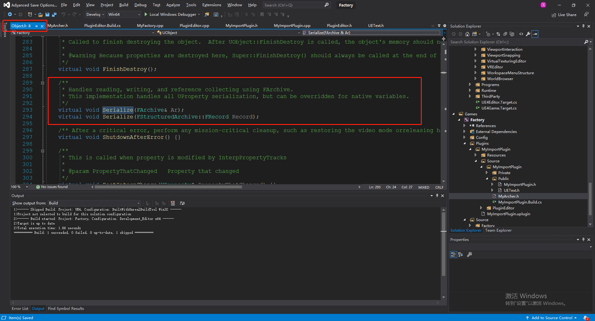

# Archive

## 1 概述

Archive 是一个负责对UE4 对象序列化的类，在UObject中的序列方法：

 


## 2 UE4 C++ 使用的小技巧

```c++
#pragma once
#include "Engine.h"
#include "Serialization/Archive.h"

class FMyArchive : public FArchive {
private:
	/**
	* 数据
	*/
	TArray<uint8> data; 
	/**
	*读写指针，代表位置偏移
	*/
	uint32 ptr;
public:

	/**
	* 根据位置和长度获取二进制数据，并且返回到一个数组
	* @param start 数据开始位置
	* @param length 需要读取的长度
	* @param isForced 当长度越界的时候，如果 isForced 为true, 返回start~数据末尾，否则返回空数组。
	* @return TArray<uint8> 字节数组
	*/
	TArray<uint8> getAnyBin(int32 start, int32 length, bool isForced = false);
	void addAnyBin(int32 start, TArray<uint8> bin);
	void addCurrentBin(TArray<uint8> bin);
	TArray<uint8> getCurrentBin(int32 length);
	FMyArchive& operator<<(uint8& other);
	FMyArchive& operator<<(int32& other);
	FMyArchive& operator<<(float& other);
	FMyArchive& operator<<(FVector4& other);
	FMyArchive& operator<<(FString& other);

	//====================== 文件操作 ===============================
	/**
	* 扫描某个文件夹下面的文件
	* @param path 文件路径
	* @param isContainsFile 是否包含文件
	* @param isContainsDirectory 是否包含文件夹
	*/
	TArray<FString> scanDirectoryOrFile(FString path, bool isContainsFile, bool isContainsDirectory);

	/**
	* 判断该目录下的文件是否存在
	* @param path 文件目录
	*/
	bool isExist(FString path);

	/**
	* 创建目录
	*/
	bool createDirectory(FString path);

	/**
	* 加载文件
	*/
	void loadFile(FString path);

	/**
	* 保存文件
	*/
	void saveFile(FString path);

	/**
	* 从文件中读取字符串
	*/
	void loadString(FString path);

	/**
	* 保存字符串到文件中
	*/
	void saveString(FString path);

	/**
	* 分割字符串
	*/
	TArray<FString> splitString(FString str, FString separator);
};
```


```c++
#include "MyArchive.h"

TArray<uint8> FMyArchive::getAnyBin(int32 start, int32 length, bool isForced)
{
	TArray<uint8> buffer;
	if (start < 0) {
		return buffer;
	}
	int32 nowLength = 0;
	// 如果越界且强制，返回start~数据结尾，否则返回空数组
	if (start + length > this->data.Num()) {
		if (isForced) {
			nowLength = this->data.Num() - start;
		}
		else {
			return buffer;
		}
	}
	else {
		nowLength = length;
	}
	buffer = TArray<uint8>(this->data.GetData() + start, nowLength);
	return buffer;
}

void FMyArchive::addAnyBin(int32 start, TArray<uint8> bin)
{
	if (start + bin.Num() > this->data.Num()) {
		int32 moreLength = start + bin.Num() - this->data.Num();
		this->data.AddUninitialized(moreLength);
	}
	for (int32 a = 0; a < bin.Num(); a++) {
		this->data[start + a] = bin[a];
	}
}

void FMyArchive::addCurrentBin(TArray<uint8> bin)
{
	addAnyBin(this->ptr, bin);
	this->ptr += bin.Num();
}


TArray<uint8> FMyArchive::getCurrentBin(int32 length)
{
	TArray<uint8> buffer = this->getAnyBin(this->ptr, length, false);
	if (buffer.Num() != 0) {
		this->ptr += length;
	}
	return buffer;
}

FMyArchive& FMyArchive::operator<<(uint8& other) 
{
	if (this->IsLoading()) {
		TArray<uint8> loadBuffer = this->getCurrentBin(1);
		if (loadBuffer.Num() == 1) {
			other = loadBuffer[0];
		}
		else {
			other = 0;
		}
	}
	else if (this->IsSaveGame()) {
		TArray<uint8> saveBuffer;
		saveBuffer.Add(other);
		addCurrentBin(saveBuffer);
	}
	return *this;
}

FMyArchive& FMyArchive::operator<<(int32& other)
{
	if (this->IsLoading()) {
		TArray<uint8> loadBuffer = this->getCurrentBin(4);
		if (loadBuffer.Num() == 0) {
			other = 0;
		}
		else {
			// 让 int32 执行一块四字节的内存地址，这样就可以把四个元素的字节数组变成正数
			int32* i32 = (int32*)loadBuffer.GetData();
			other = *i32;
		}
	}
	else if (this->IsSaving()) {
		int32* saveBuffer = new int32();
		*saveBuffer = other;
		TArray<uint8> bs;
		// 将一个 int32 转换为四个 int8
		for (int32 a = 0; a < 4; a++) {
			bs.Add(*((uint8*)saveBuffer + a));
		}
		this->addCurrentBin(bs);
	}
	return *this;
}

FMyArchive& FMyArchive::operator<<(float& other)
{
	return *this;
}

FMyArchive& FMyArchive::operator<<(FVector4& other)
{
	return *this;
}

FMyArchive& FMyArchive::operator<<(FString& other)
{
	if (this->IsLoading()) {
		int32 length = 0;
		// 读取字符串长度
		*this << length;
		// 将末尾的`\0`也算为一个长度
		length = length + 1;
		if (length <= 1) {
			other = TEXT("");
			return *this;
		}
		// 由于FString中一个字符使用`wchar_t` 表示，占两个字节，因此这里需要将length*2进行字节读取
		TArray<uint8> loadBuffer = getCurrentBin(length * 2);
		if (loadBuffer.Num() != length * 2) {
			other = TEXT("");
			return *this;
		}
		// 解码开始
		TArray<TCHAR> chars;
		chars.AddUninitialized(length);
		for (int i = 0; i < length; i++) {
			chars[i] =(TCHAR)((uint16)loadBuffer[i * 2] + (uint16)loadBuffer[i * 2 + 1] * 255);
		}
		FString tempStr;
		tempStr.AppendChars(chars.GetData(), chars.Num());
		other = tempStr;
		return *this;
	}
	else if (this->IsSaving()) {
		int32 saveLength = other.Len();
		*this << saveLength;
		TArray<TCHAR> codes = other.GetCharArray();
		TArray<uint8> codeBuffer;
		codeBuffer.AddUninitialized(saveLength * 2);
		TCHAR* tempCode = new TCHAR();
		for (int32 i = 0; i < codes.Num(); i++) {
			*tempCode = codes[i];
			codeBuffer.Add(*((uint8*)(tempCode)));
			codeBuffer.Add(*((uint8*)(tempCode + 1)));
		}
		delete tempCode;
		return *this;
	}
	return *this;
}

TArray<FString> FMyArchive::scanDirectoryOrFile(FString path, bool isContainsFile, bool isContainsDirectory)
{
	TArray<FString> result;
	IFileManager::Get().FindFiles(result, *path, isContainsFile, isContainsDirectory);
	return result;
}

bool FMyArchive::isExist(FString path)
{

	return FPaths::FileExists(path);
	// return FPaths::DirectoryExists(path);
}

bool FMyArchive::createDirectory(FString path)
{
	return FPlatformFileManager::Get().GetPlatformFile().CreateDirectoryTree(*path);
}

void FMyArchive::loadFile(FString path)
{
	FFileHelper::LoadFileToArray(this->data, *path);
}

void FMyArchive::saveFile(FString path)
{
	FFileHelper::SaveArrayToFile(data, *path);
}

void FMyArchive::loadString(FString path)
{
	FString result;
	FFileHelper::LoadFileToString(result, *path);
}

void FMyArchive::saveString(FString path)
{
	FString str;
	FFileHelper::SaveStringToFile(str, *path);
}

TArray<FString> FMyArchive::splitString(FString str, FString separator)
{
	TArray<FString> results;
	FString* left = new FString();
	FString* right = new FString();
	FString content = str;
	while (content.Split(separator, left, right)) {
		results.Add(*left);
		content = *right;
	}
	if (!content.IsEmpty()) {
		results.Add(content);
	}
	return results;
}


```

