# 动画

## 1 骨骼

### 1.1 骨骼重新绑定

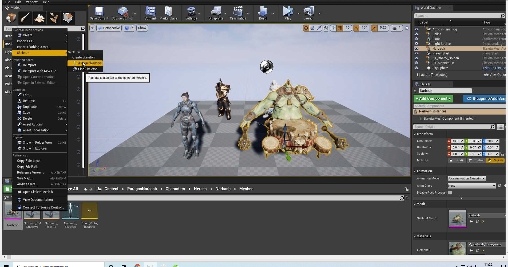

## 2 动画重定向

将相同的动画应用到不同身高、胖瘦的角色自动缩放同一套动画。

0. 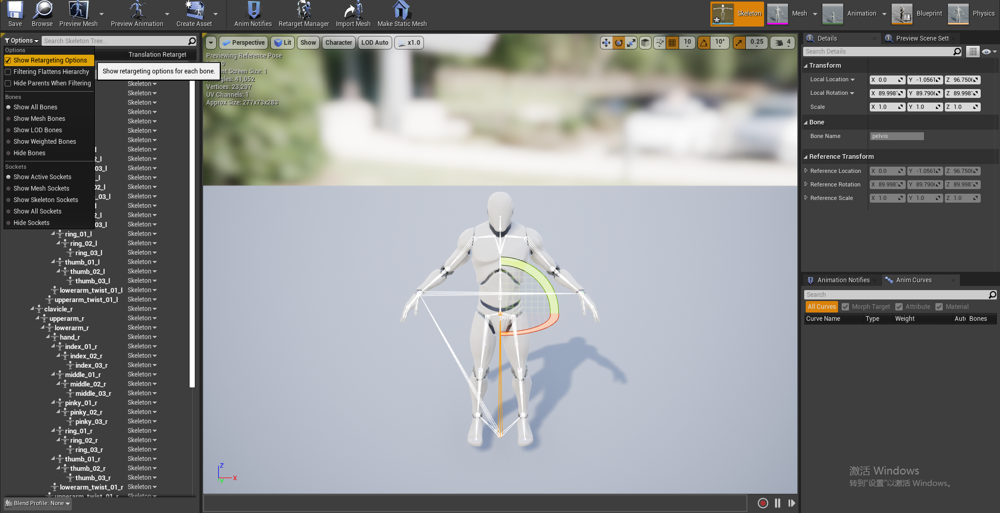

1. 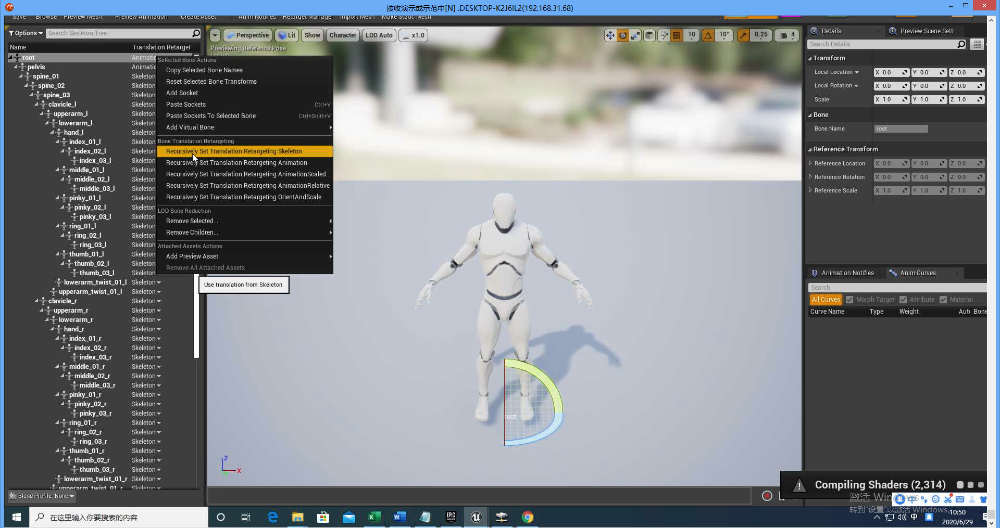
2. 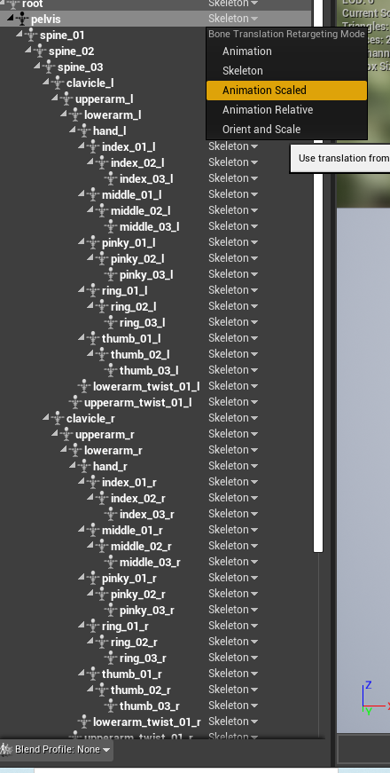

3. 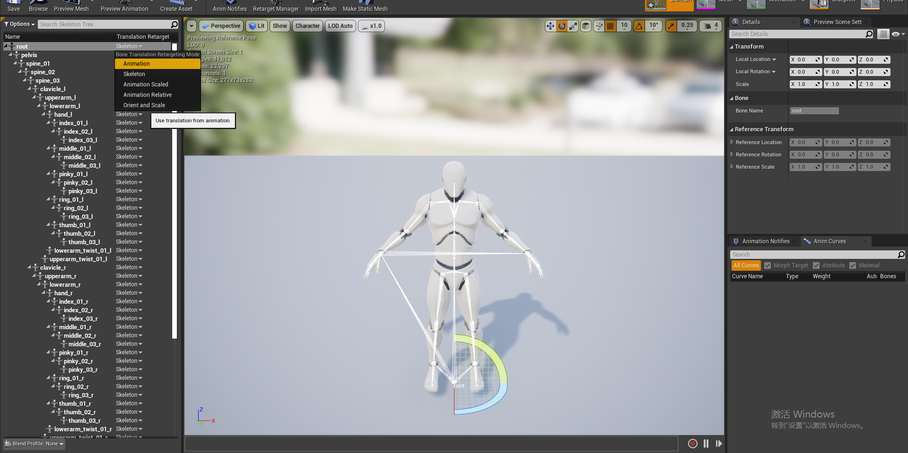

## 3 重定向管理器

用来将一种骨骼和另外一只骨骼进行绑定，构建一个桥梁。

例如一个狗的骨骼和人的骨骼做绑定，让狗做一些人的动作，就可以做如下的操作：

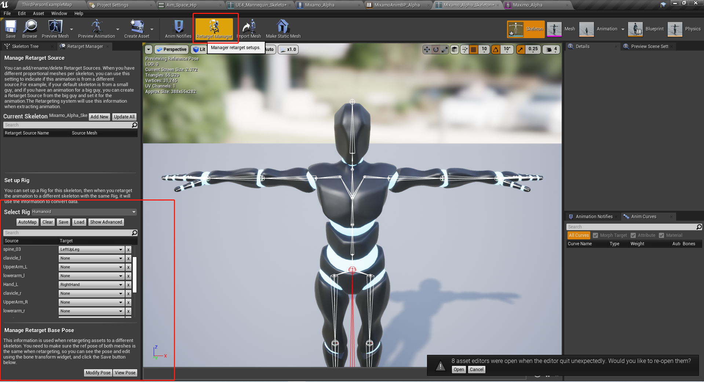

1. 复制人的动画

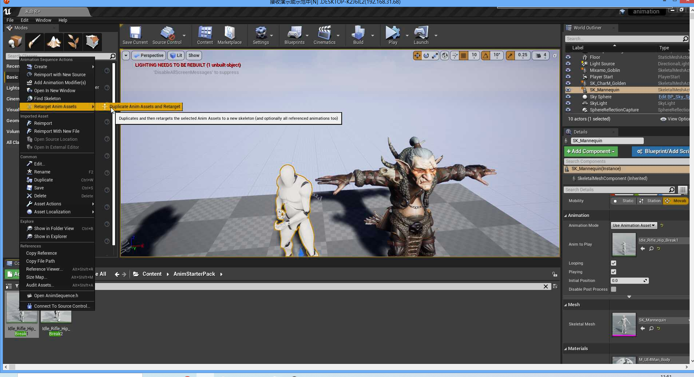

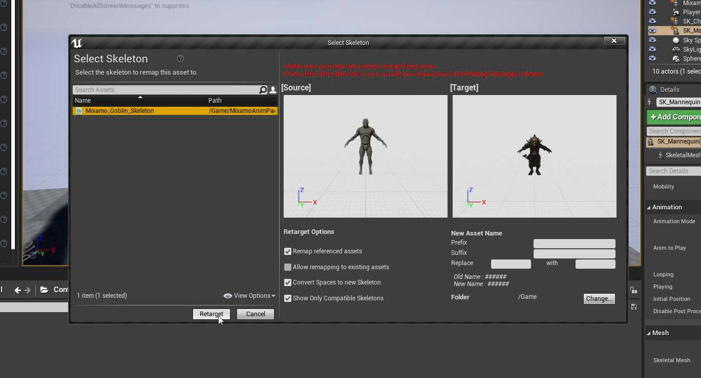

## 4 动画蓝图

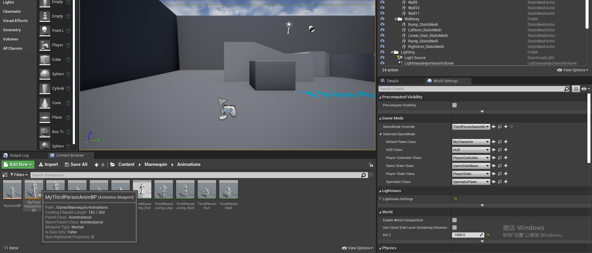

动画蓝图里面有各种动画状态机等来控制动画的切换。

角色蓝图中修正跳跃的高度：

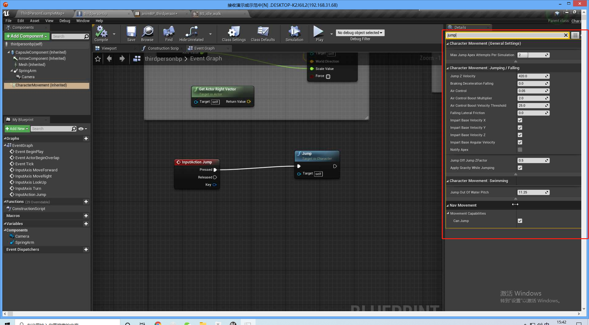

循环播放动画：

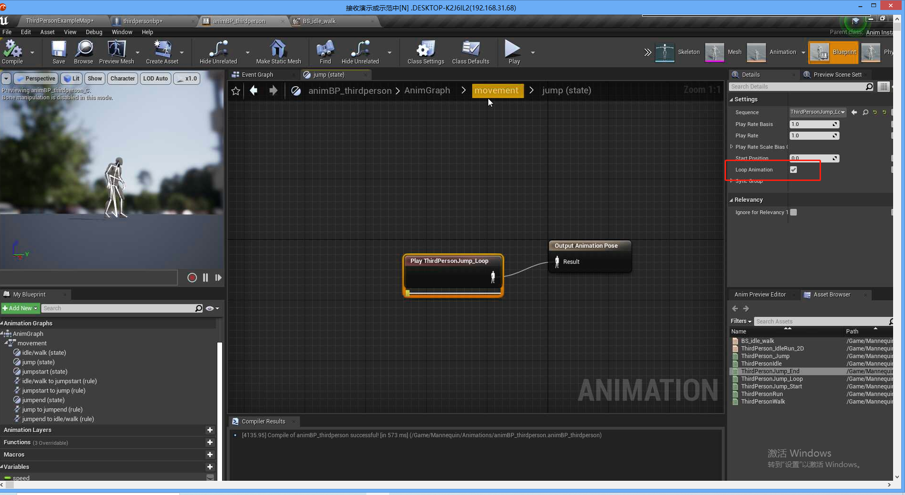

状态机的融合方式：

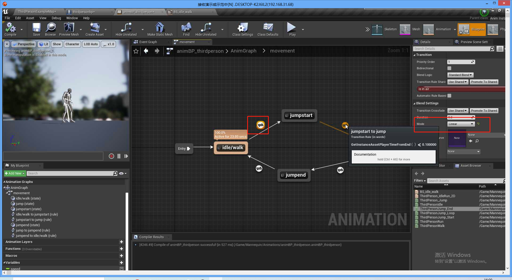

通过动画的剩余时间来判断下一个状态：

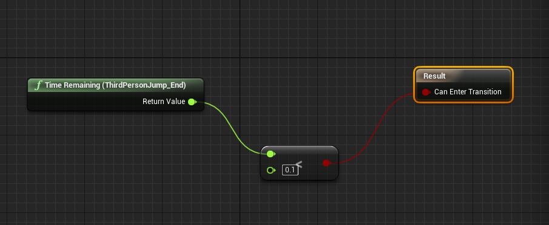

### 4.1 让角色在移动时朝向自己

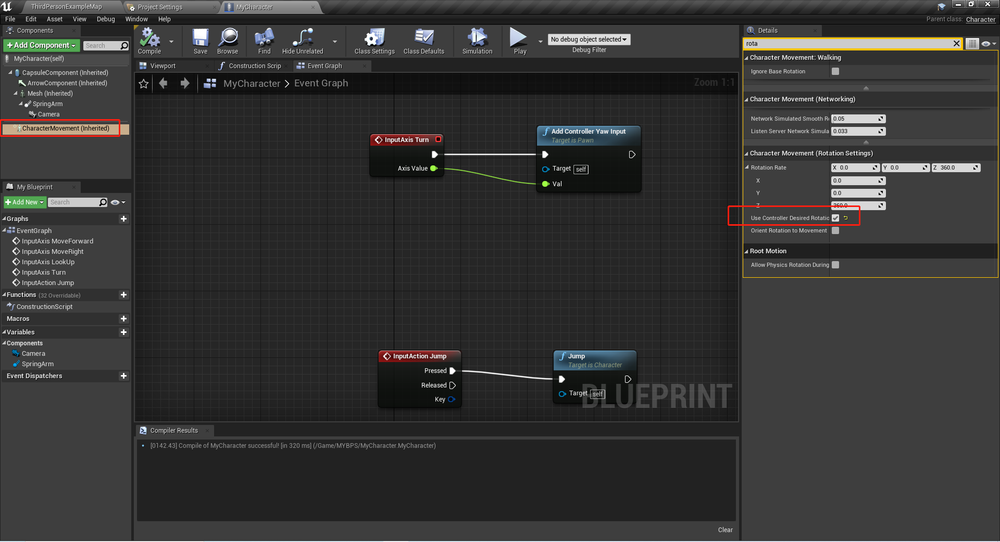

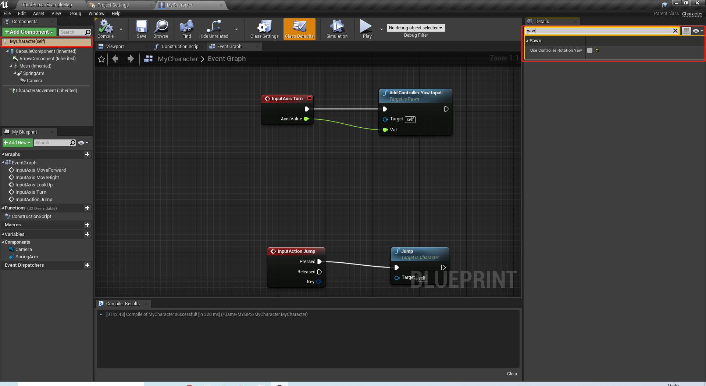