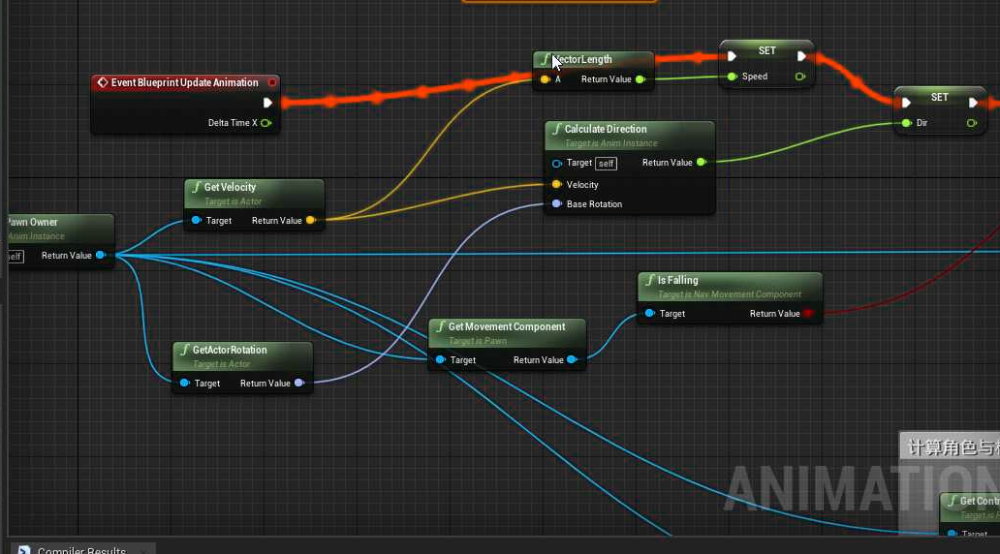
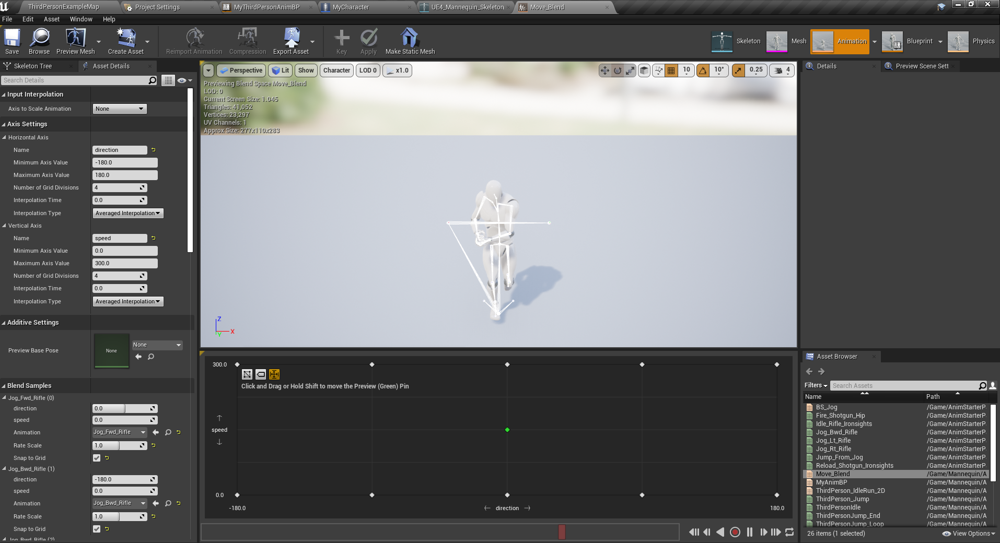
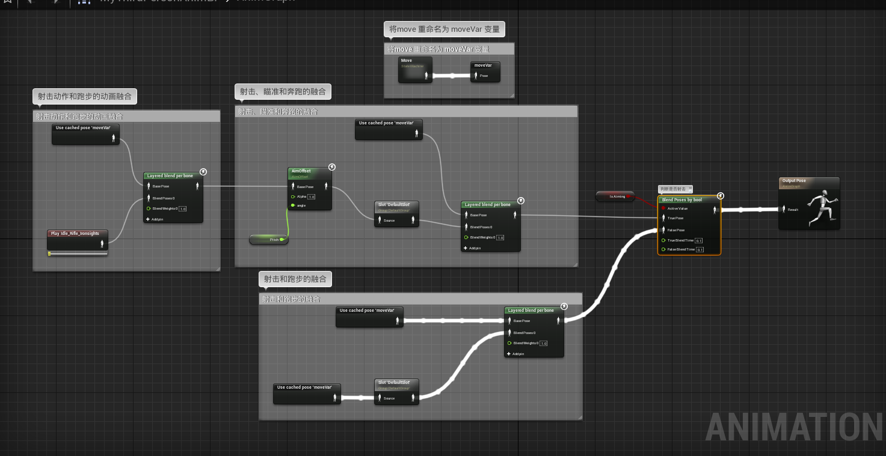

# 动画融合大作业

## 1 2D 融合

### 1.1 获取玩家方向

### 1.2 2D 混合

## 2 动画融合案例

## 3 一些理解

### 3.1 关于混合

在一个动画的基础上添加另一个动画，例如边跑边开枪，此时需要将开枪的动画和跑步的动画进入融合，在播放，如果仅播放开枪动画，角色的腿会不摆动。

### 3.2 关于状态机

如果可以的话，尽可能使用状态机来播放动画，因为根据状态来控制角色是合理的。