# AI 导航

## 1 简单的导航寻路

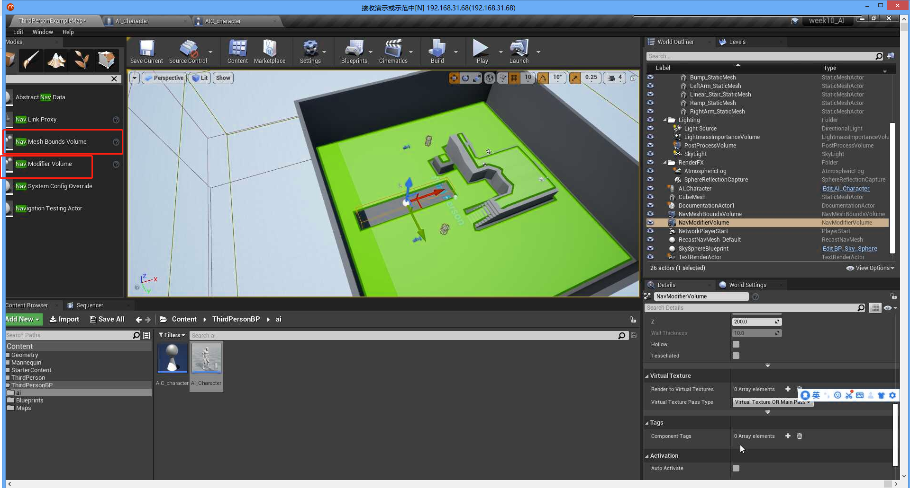

可以按`P`键切换视图

 AI 移动：

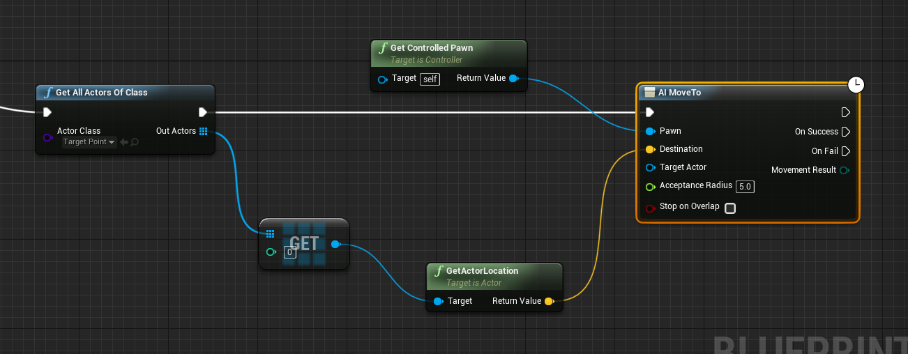

按下键盘上的`"`键，显示调试信息，可以按下小键盘的数字打开具体的信息：

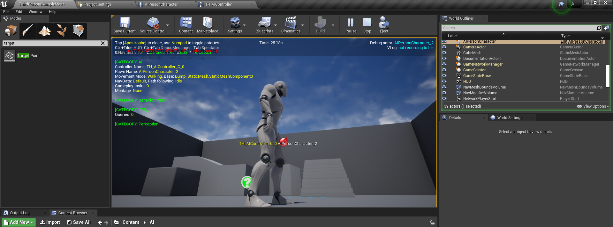

导航代理，可以实现让 AI 跳跃等功能

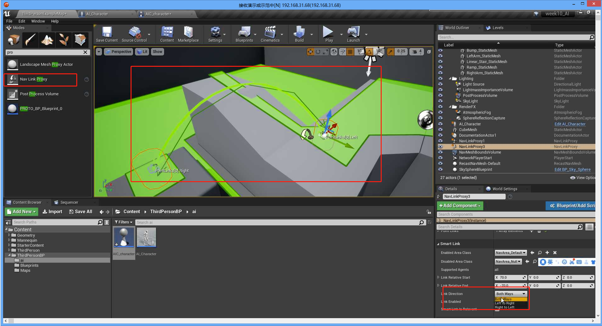

### 1.1 Build Paths

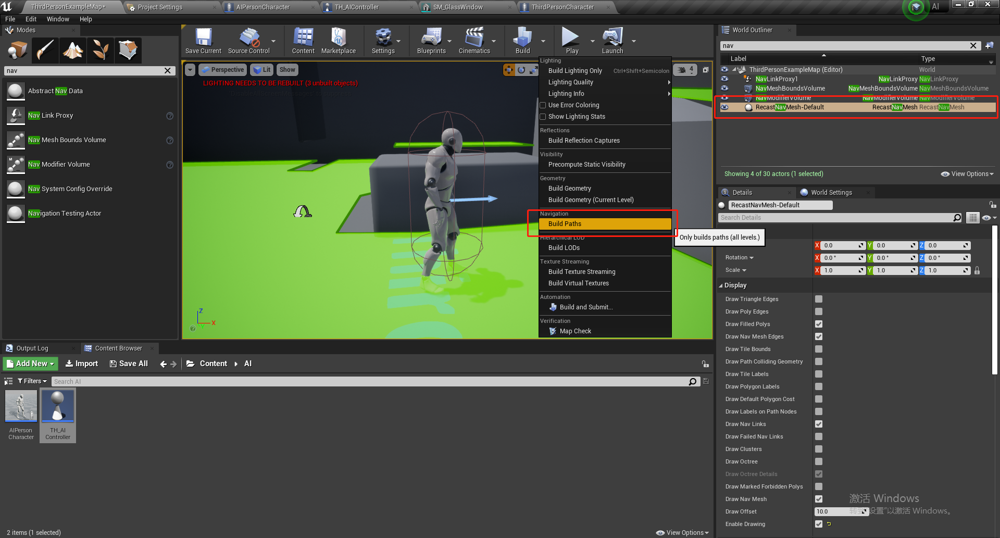

AI 地图的一些设置：

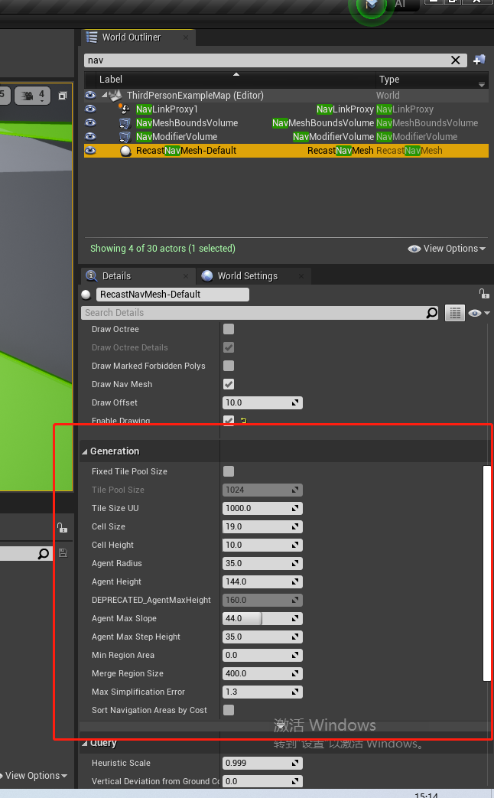

## 2 AI 感知

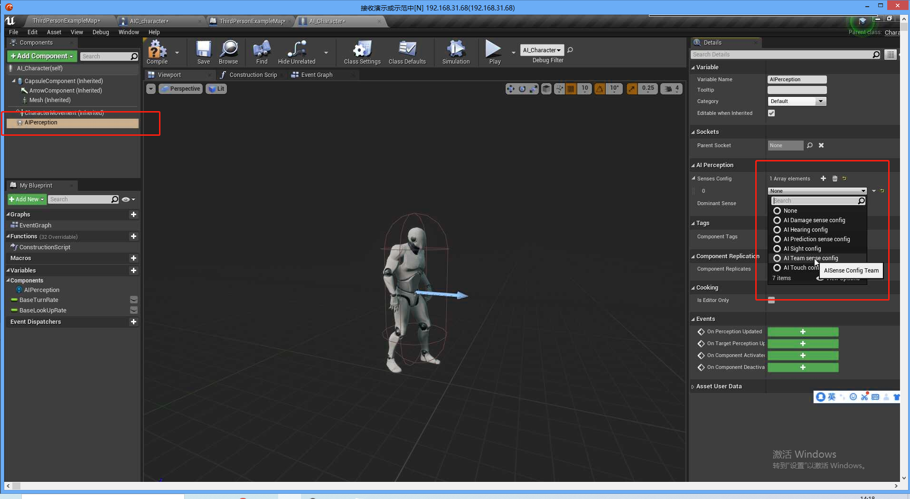

### 2.1 视觉

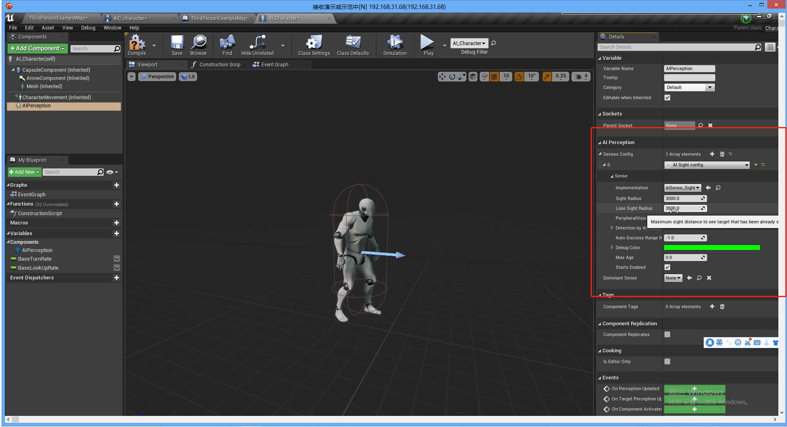

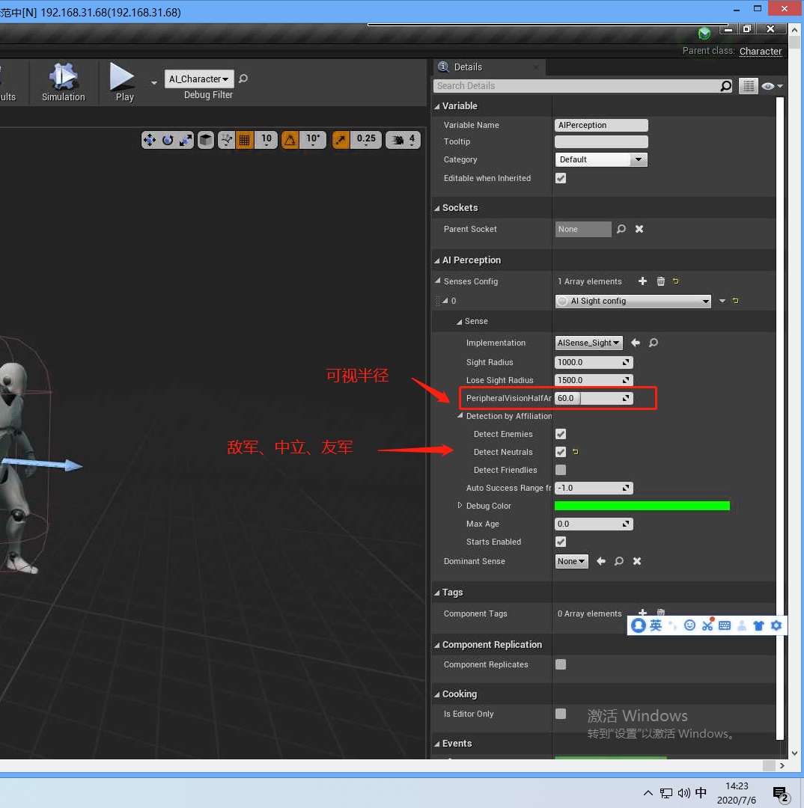

这些感知配置也可以添加到`AIController`中

### 2.2 刺激源

给可以看到的角色设置一个刺激源，对于需要被看见的物品，需要添加一个：

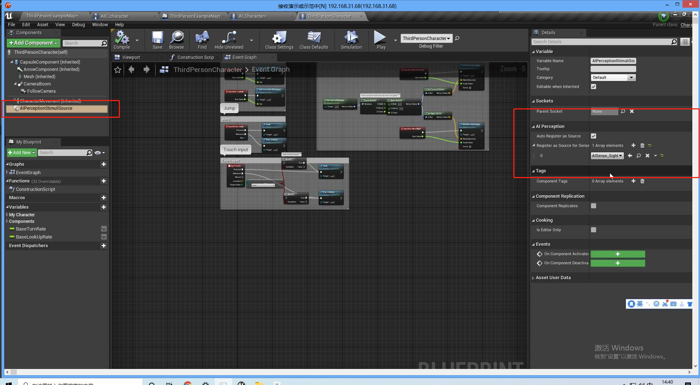

对于普通的Actor,需要被看到时，必须要添加一个刺激源

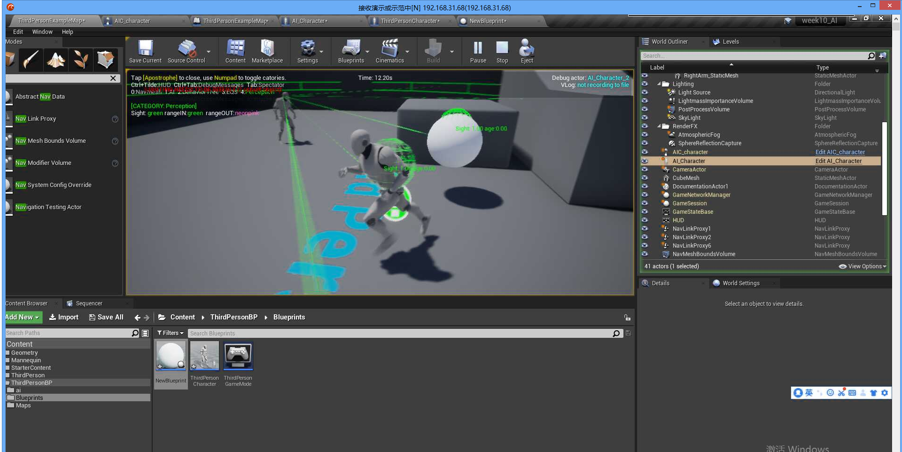

### 2.3 可感知事件

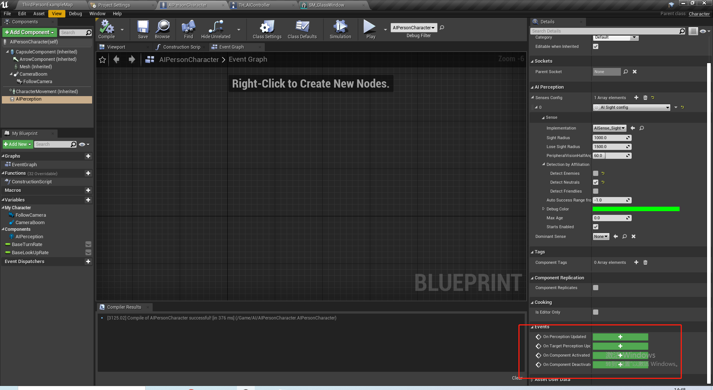

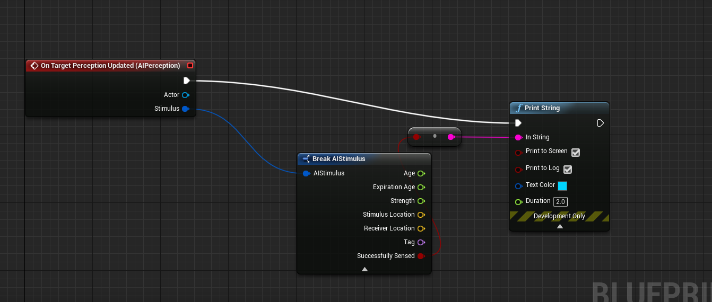

### 2.4 实现 AI跟踪

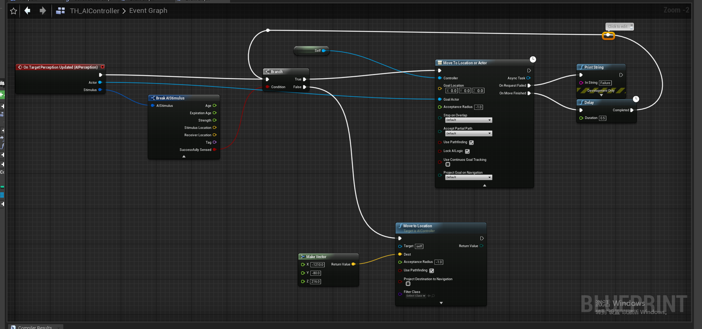

## 3 听觉

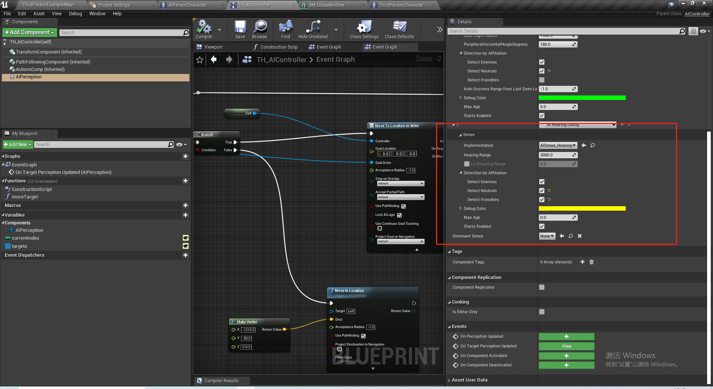

### 3.1 触发噪声

`report noise Event` 让 AI 感知发声

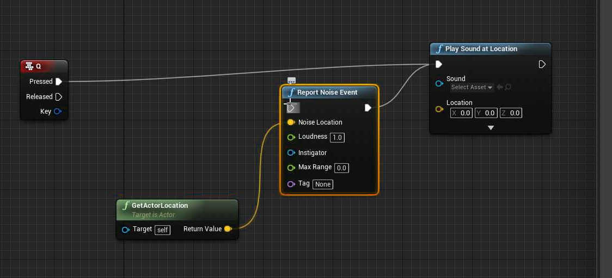

``

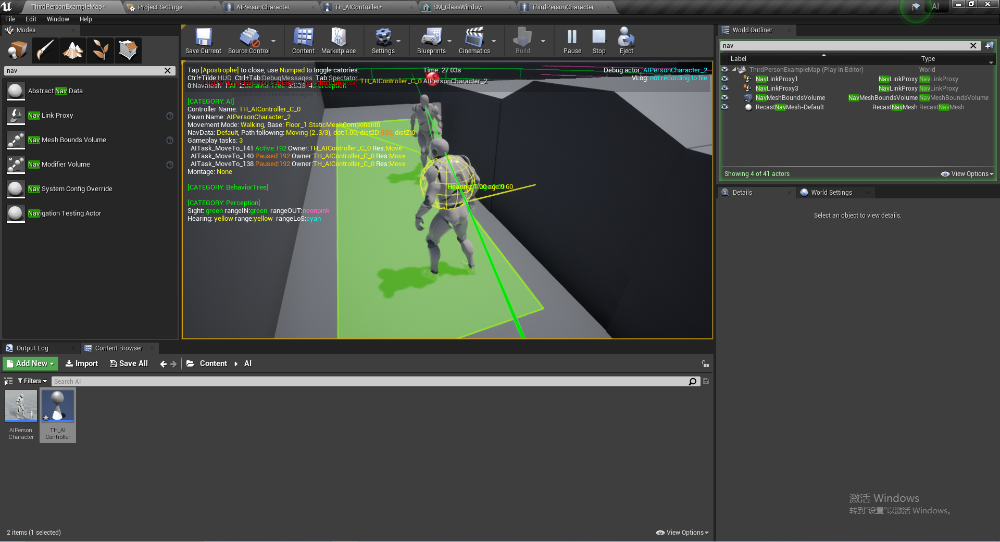

这个方法既可以感受到听觉和视觉：

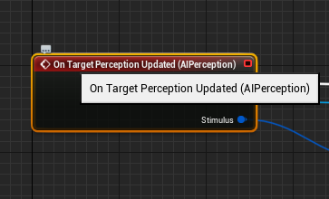