# EQS

## 1 概述

### 1.1 启用 EQS

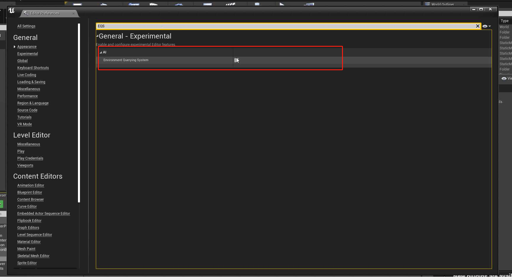

### 1.2 创建 EQS

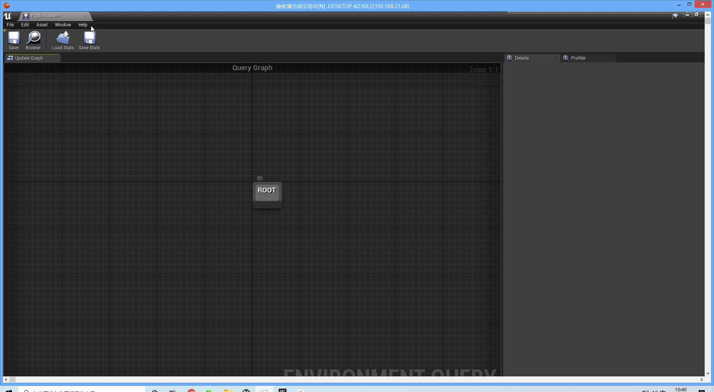

### 1.3 新建 EQS Testing Pawn

拖到场景中，绑定对应的EQS:

## 2 Actor 监测

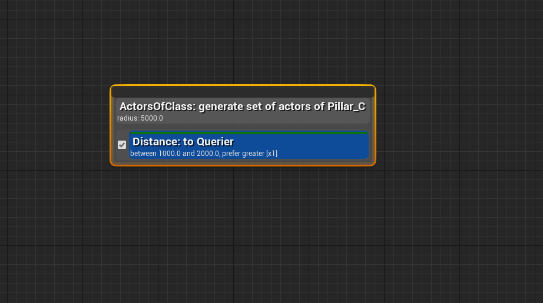

## 3 圆形检测

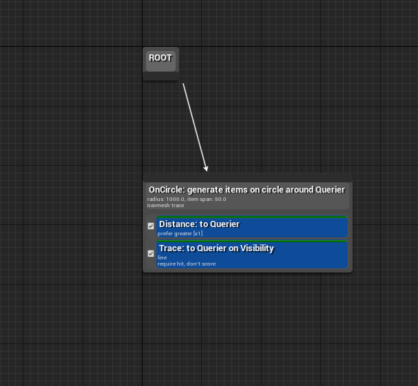

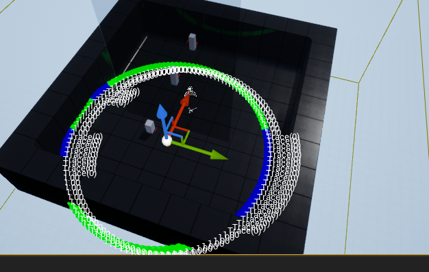

## 3 扇形监测

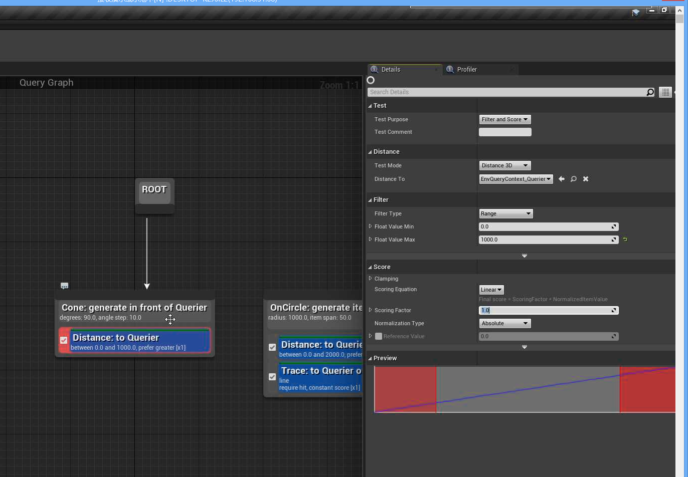

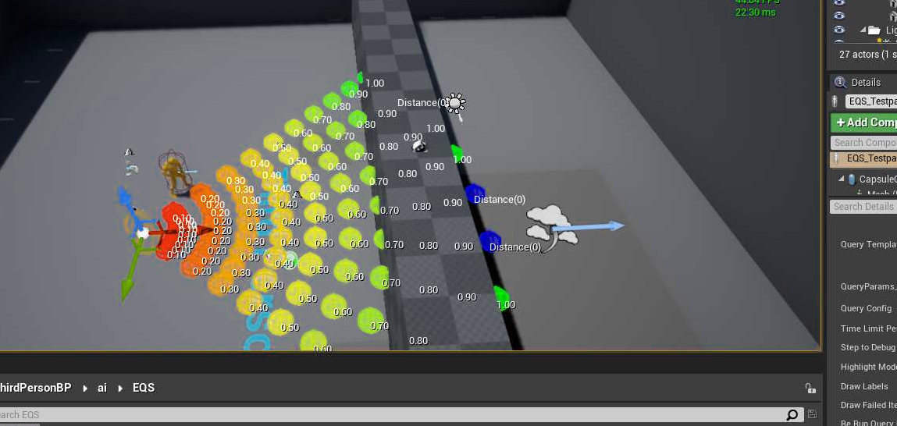

## 4 甜甜圈监测

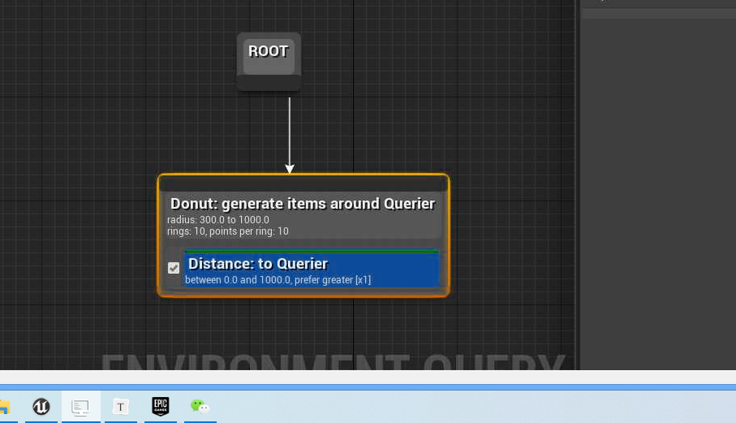

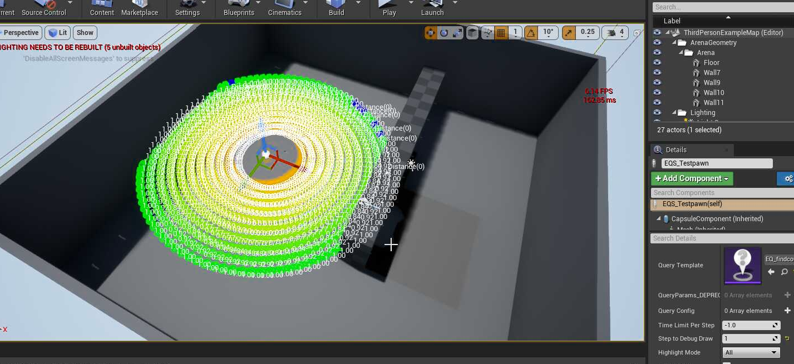

## 5 简单网格(Simple Grid)

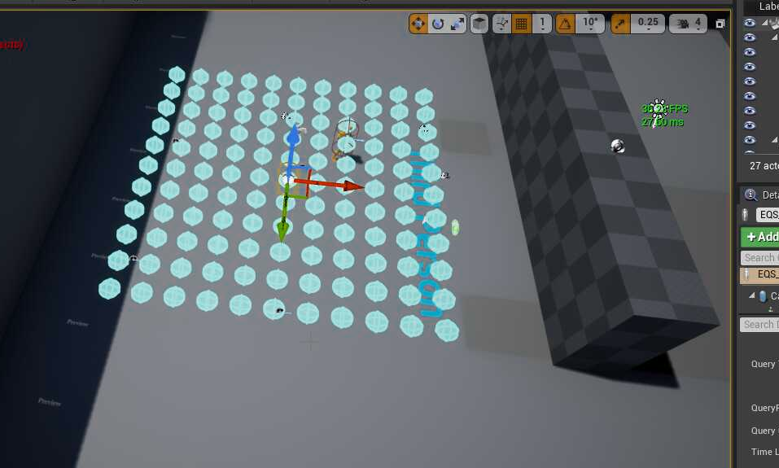

## 6 PathingGrid（路径网格）

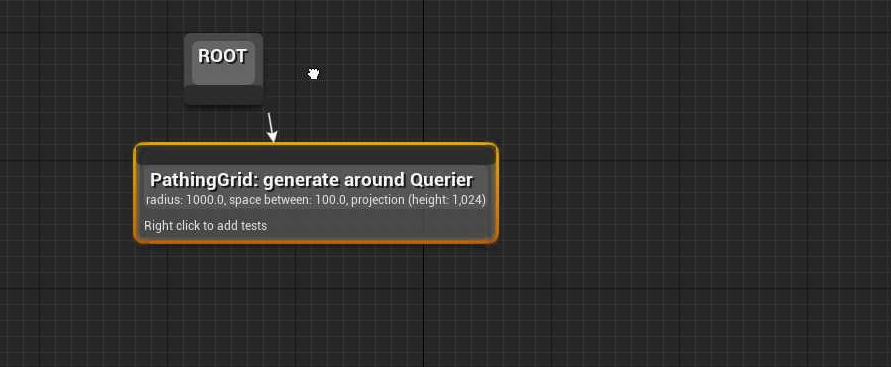

## 7 Composite

实现多种扫描的组合

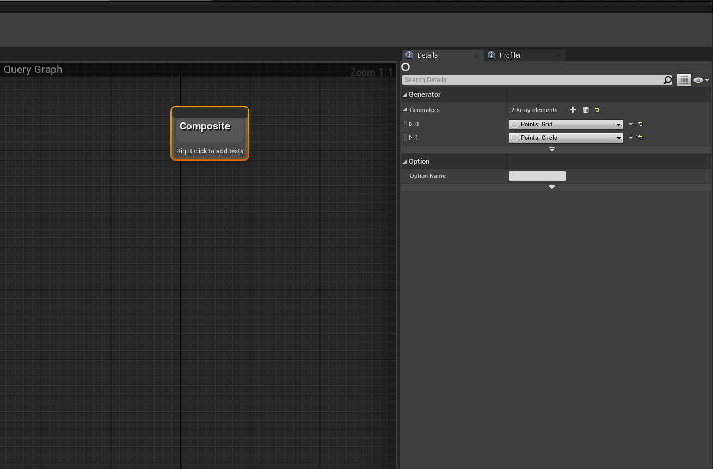

## 8 导航数据投射

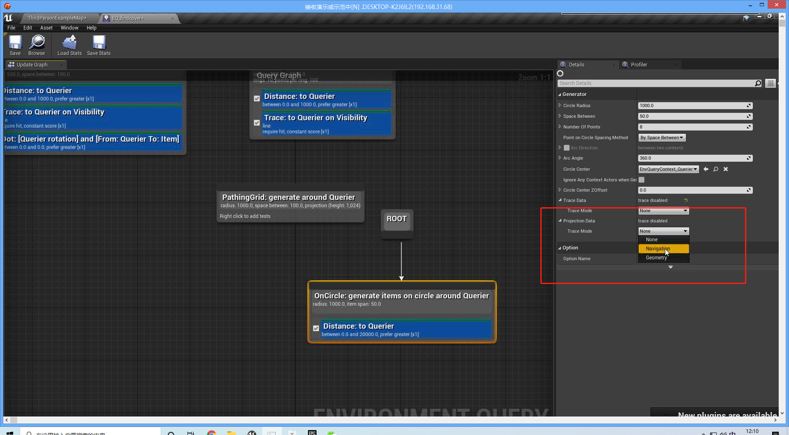

此时数据可以落在地上：

## 9 行为树绑定 EQS

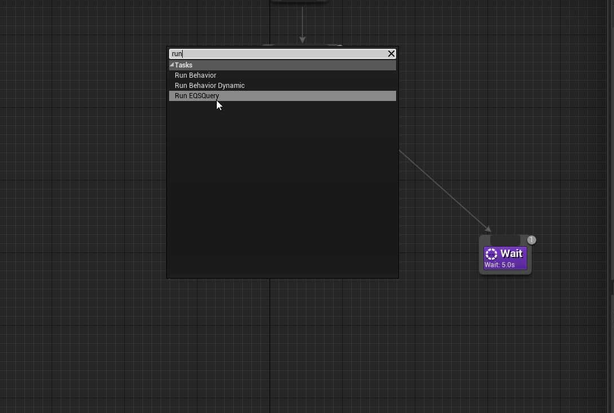

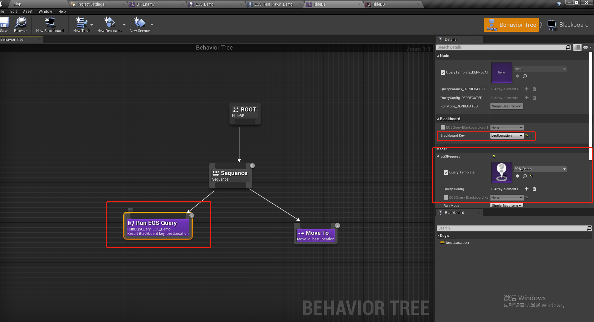

## 10 使用 EQS 实现躲猫猫

### 10.1 使用射线监测

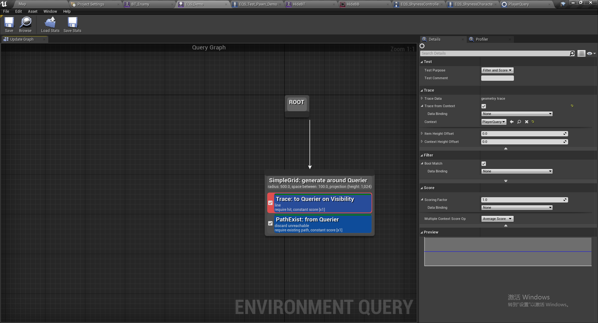

### 10.2 设置查询对象

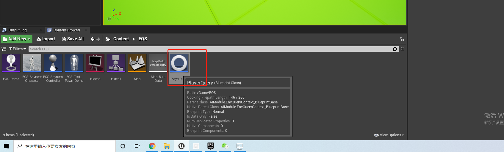

新建一个查询对象，以第三人称玩家作为查询模板：

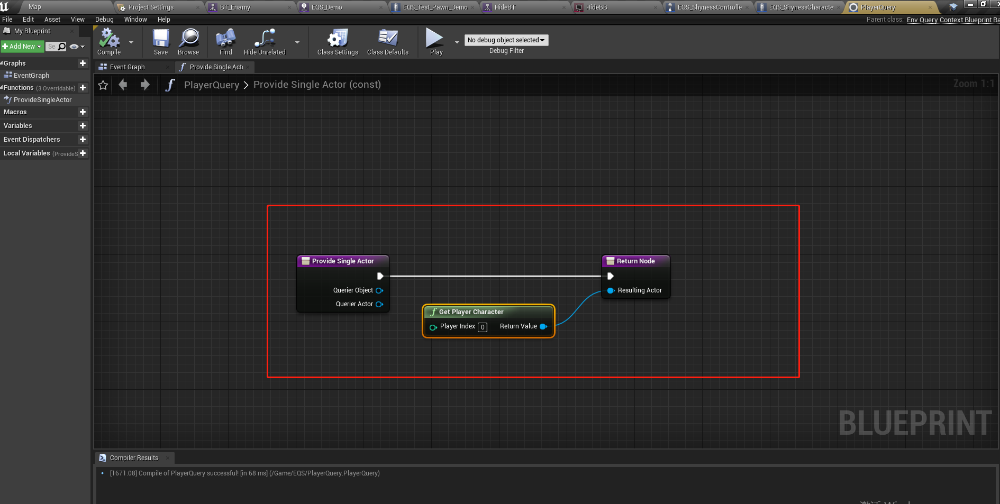

选择对应的查询对象：

在`Trace`中也需要绑定一次：

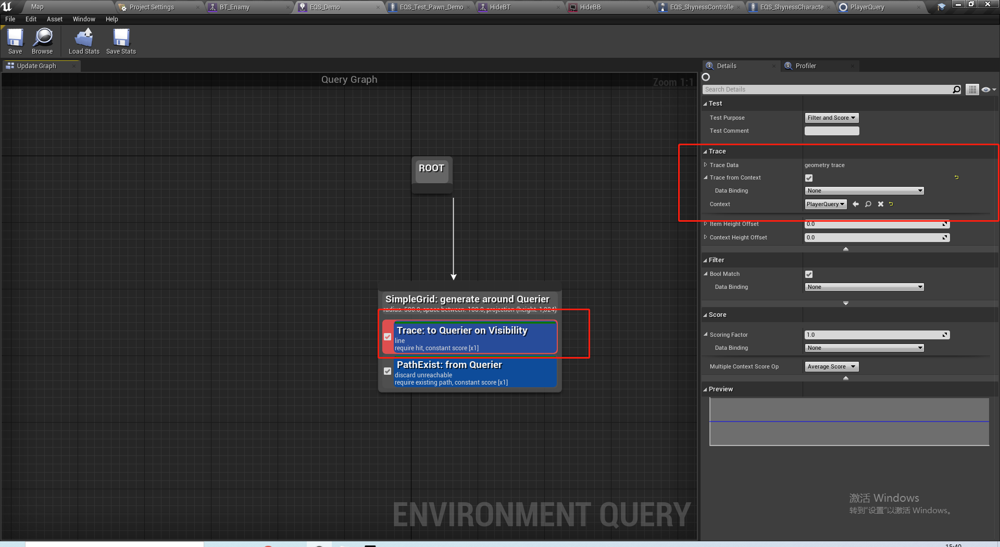

在行为树中执行EQS,并且选择最好的点：

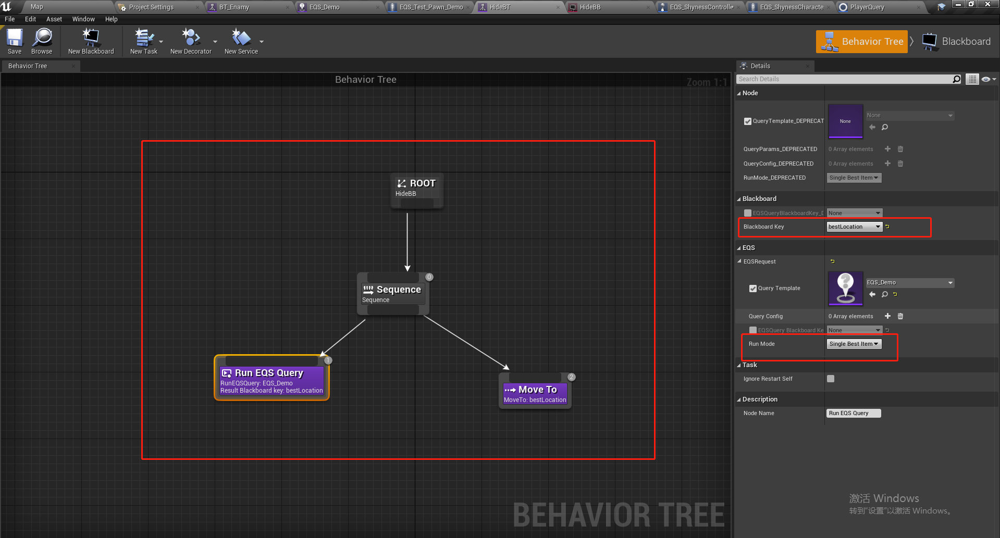