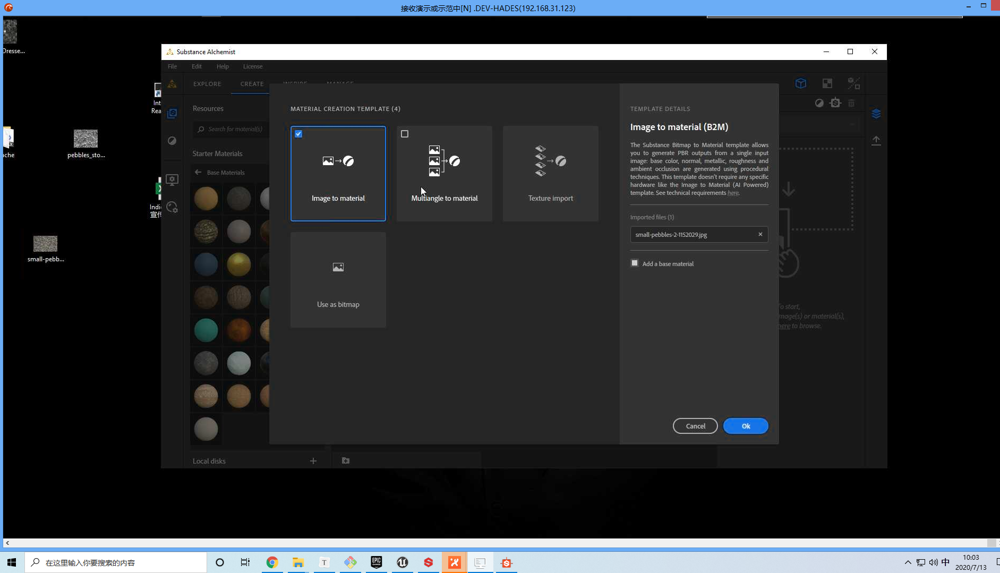

# 使用Substance Alchemist 设计简单的材质

## 1 环境安装

### 1.1安装 Subtance DESIGNER 和 Subtance AlCHEMIST

### 1.2 从 Stream 安装 Marmoset

## 2 创建材质

下载一张图片，随便什么都可以，尺寸尽可能大一点

更改预览类型：

添加各种材质：

保存：

保存信息：

按照 Ctrl+Shif 实现光影的移动：

## 3 Inspire

使用另一张图进行配色，随便下载一张图

### 3.1 使用另一张图进行配色

生成色卡：

增加色卡	数量：

### 3.2 拖动保存：

### 3.3导出

## 4 Alche

### 4.1 创建新项目

ue4 支持Metallic/Roughness 类型

四大模块

### 4.2 Manager

Resource 代表里面的资源，双击实现预览：

本地磁盘的资源：

### 4.3 Settings

#### 4.3.1 预览尺寸

预览尺寸：

#### 4.3.2 平铺

里面有偏移、旋转、和缩放三个参数可以调整

#### 4.3.4 Mesh

预览形状：

#### 4.3.5 Environment

环境设置

让环境可见：

下载环境，地址：https://hdrihaven.com/

加载下载的环境：

旋转和曝光：

#### 4.3.6 镜头视角

#### 4.3.7 Shader

调整细分曲面：

快捷操作，功能重复，只是快捷方式：

影子：

### 4.4 通道设置

一般根据项目的文件格式而确定

## 5 材质的细节

### 5.1 2D信息

材质叠加：

叠加的方式：

根据灰度图叠加：

水的污渍调整：

高级设置：

### 5.2 Adjusment

法线：

高度：

AO（阴影遮蔽）:

### 5.3 Blur(模糊)

### 5.4 隐藏疤痕

先按 Alt,选择一个没有疤的地方，在放大需要替换的疤痕位置。

### 5.5 Crop（裁切）

### 5.6 Tiling

对一个裁剪完的贴图，会有缝隙，使用 Tiling 实现无缝贴图

实现无缝贴图：

### 5.7 BrickWall Patten(砖墙)

将一块普通的凹凸材质变成有凹凸感的砖墙

#### 5.7.1 砖头形状

#### 5.7.2 混合

#### 5.7.3 缝隙（水泥）

#### 5.7.8 Age

显示砖块的年龄

### 5.8 Dust(灰尘)

### 5.9 Rust

铁锈

## 6 作业思路

### 6.1 墓道

墓道应该是青色石砖，因此使用`Slate`作为基本材质，在使用`BrikWall Patten` 铺砖和`Dust` 加上灰尘：

### 6.2 Keyboard

使用键盘贴图+砖墙 实现一个解谜的迷宫，必须按下指定的字母单词才能通关。

素材图片：

### 6.3 太极色子

根据拍的大理桌面和太极图蒙版，实现。

实现的素材：

### 6.4 用木材做个笔筒

使用`Crop`裁剪和`Tiling`实现无缝切换

