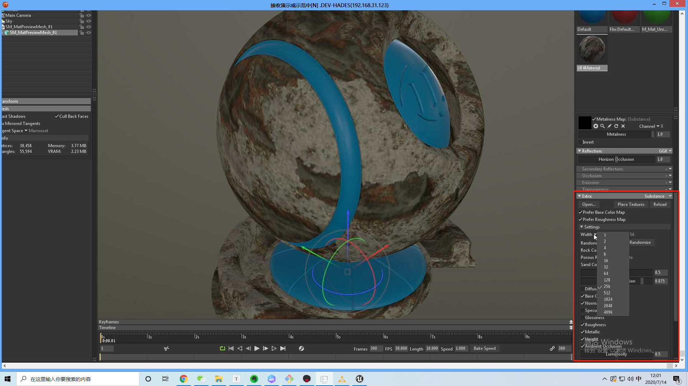
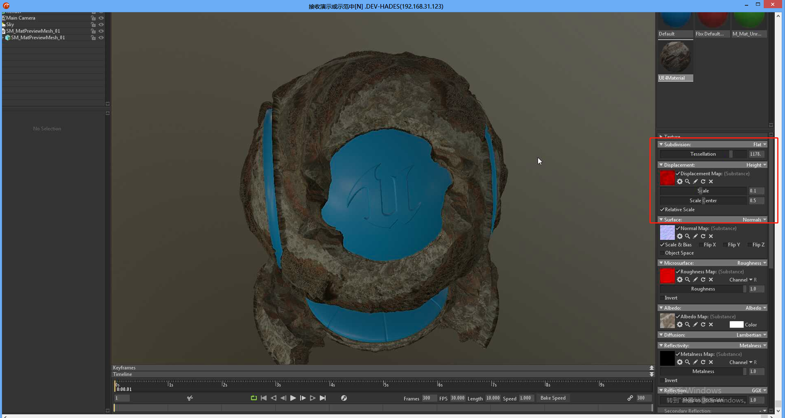
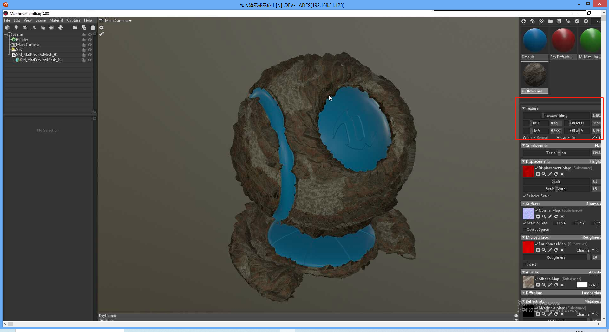
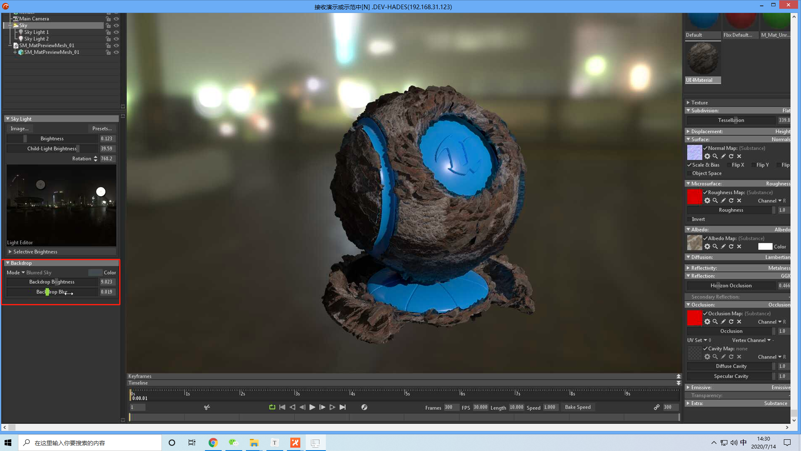
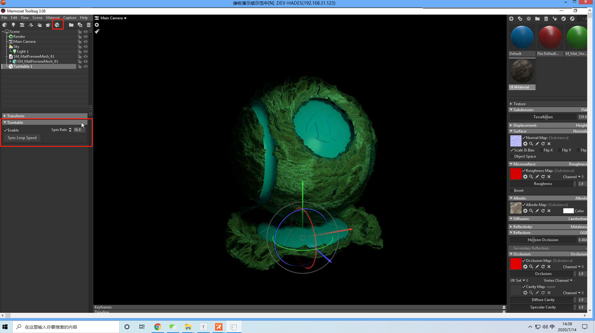

# 八猴子使用

## 1 八猴子使用

### 1.1 从 Substance Alchemist 导出文件

导出文件的格式为`.sbsar`,不需要修改其他格式。

导入后的样子，注意所有名称和路径均不能有中文：

将材质拖入八猴子的材质界面：

使用八猴子渲染：

设置渲染配置：

导入外部的文件：

修改参数配置：

使用多边形实现凸凹：

添加UV：

从 ue4 中导出模型：

导入选项：

法线翻转：

粗糙度：

基础颜色：

反光性：

阴影：

### 1.2  渲染

Scene：

viewport:

### 1.3 相机

### 1.4 Sky

添加子光源：

环境背景：

环境可以使用 https://hdrihaven.com/ 的背景

新建光源：

光源类型：

视频旋转：

将模型拖到turningTable下面：

