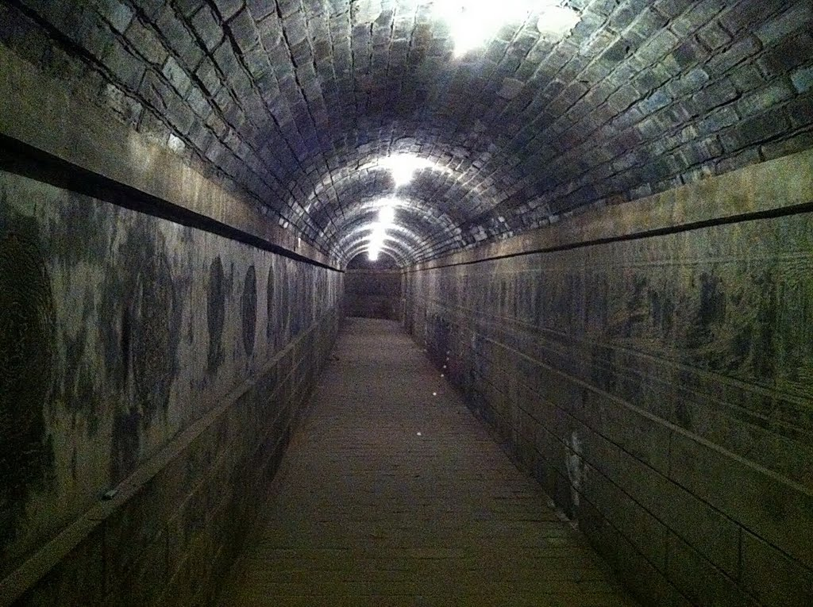
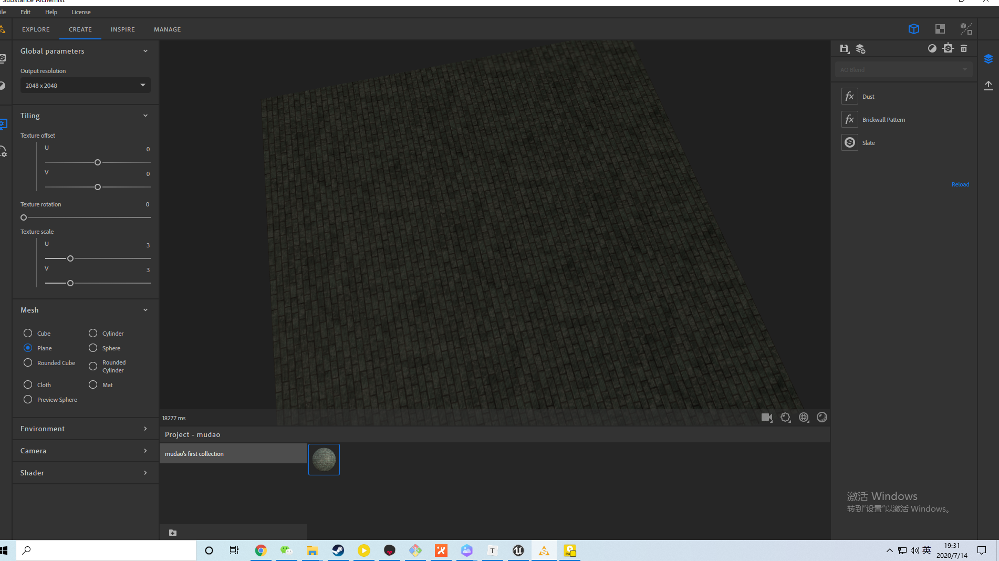
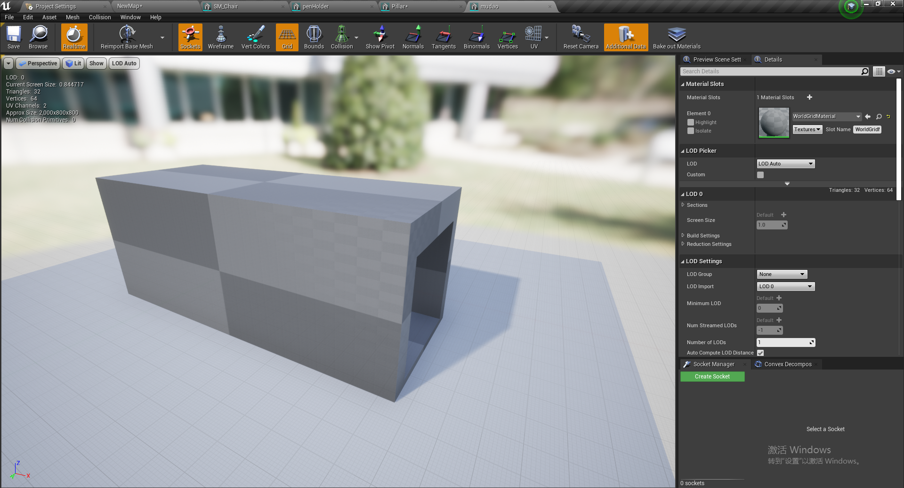
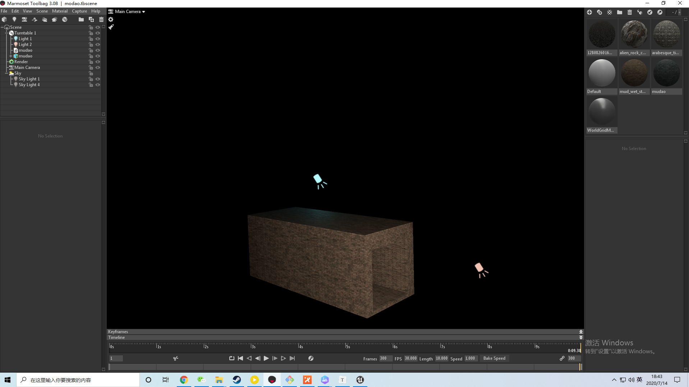
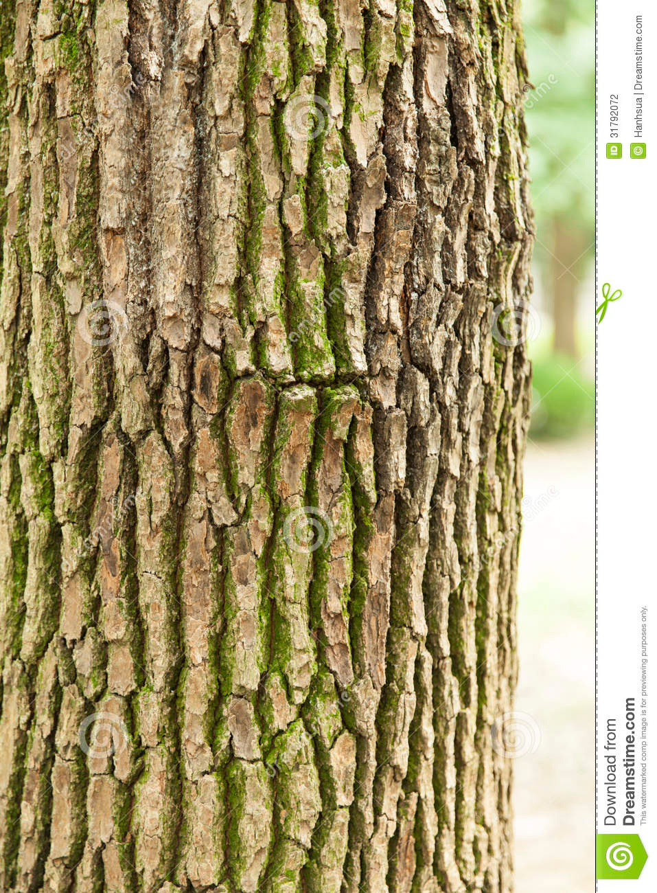
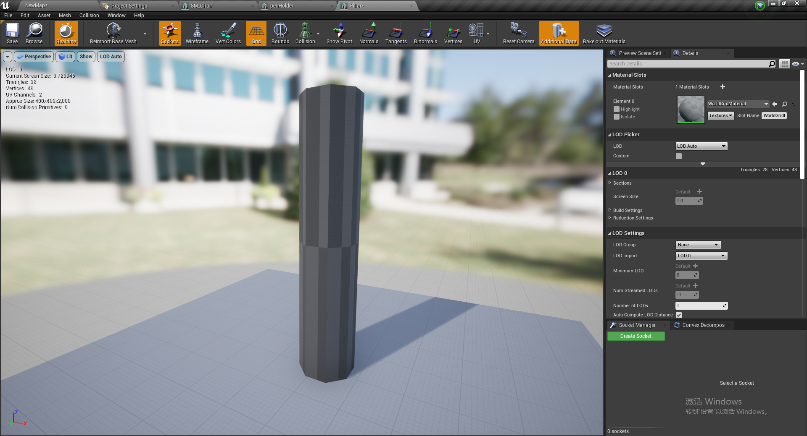
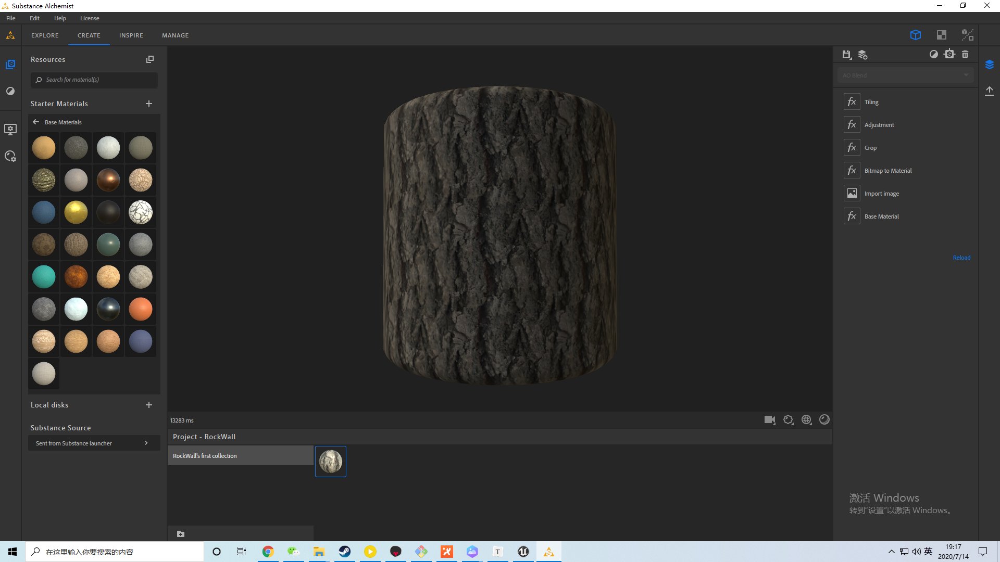
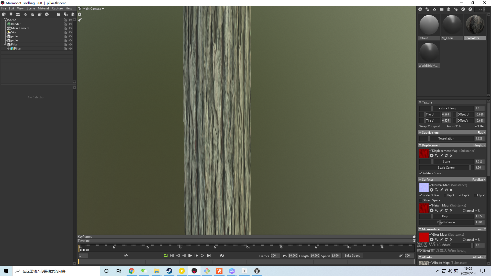

# 作业

## 1 墓道

参考图：

材质：

模型：

八猴子中效果：

视频旋转效果：

<video id="video" controls="" preload="none" poster="http://om2bks7xs.bkt.clouddn.com/2017-08-26-Markdown-Advance-Video.jpg"><source id="mp4" src="./video/mudao.mp4" type="video/mp4">
</video>

感谢张蕴畅同学的灯光指导。

## 2 树干

 参考图：

模型：

材质：

八猴子效果图：

<video id="video" controls="" preload="none" poster="http://om2bks7xs.bkt.clouddn.com/2017-08-26-Markdown-Advance-Video.jpg"><source id="mp4" src="./video/pillar.mp4" type="video/mp4">
</video>