# Substance Designer 高级用法

噪波加入法线，造成凹凸：

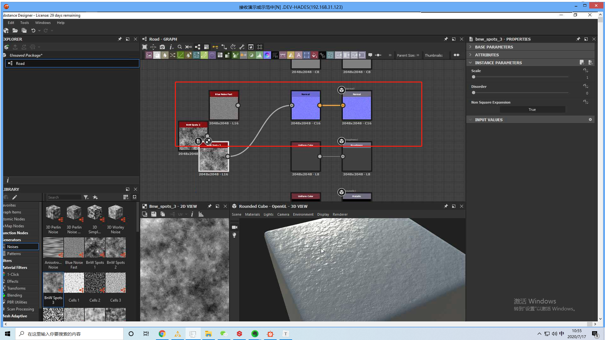

blend @ 通道 连接噪波：

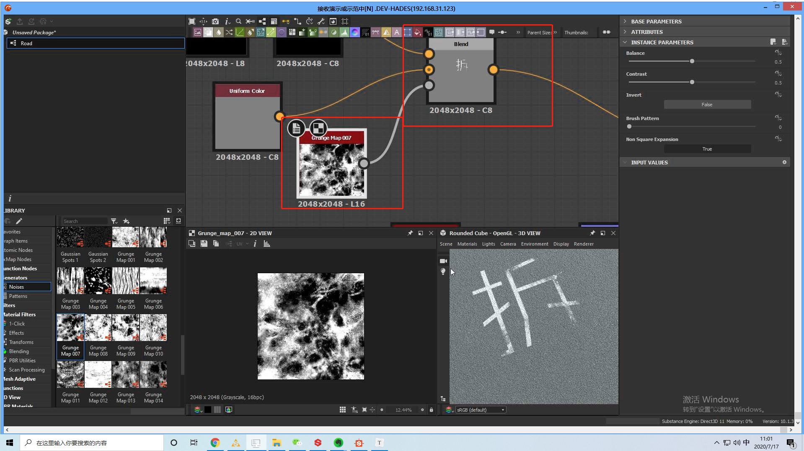

使用 `Construct`和 `Level` 来实现参数调整，或者将参数暴露出去。

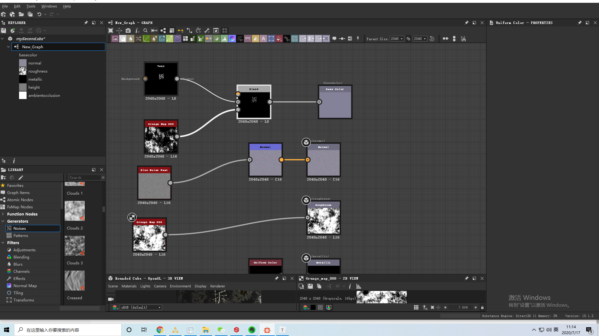

## 实现是湿滑且带文字的路面：

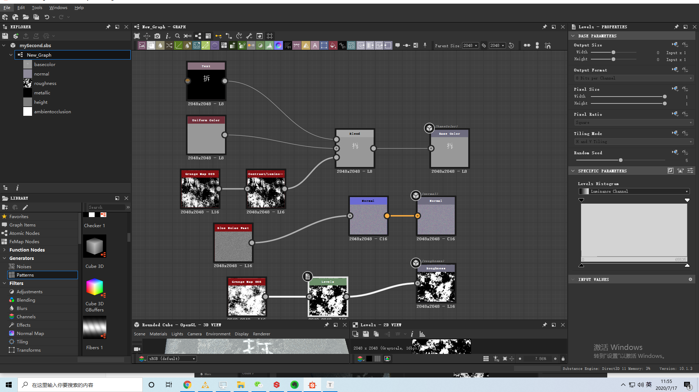

效果图：

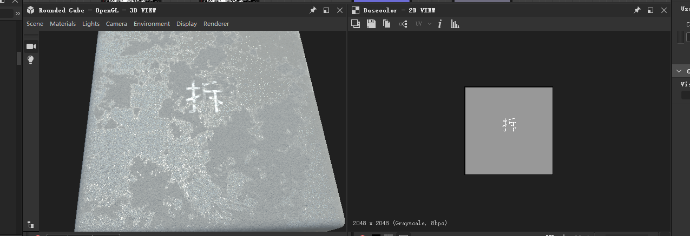

使用 Svg 的方法可以节省节点，又可以达到矢量图的结果：

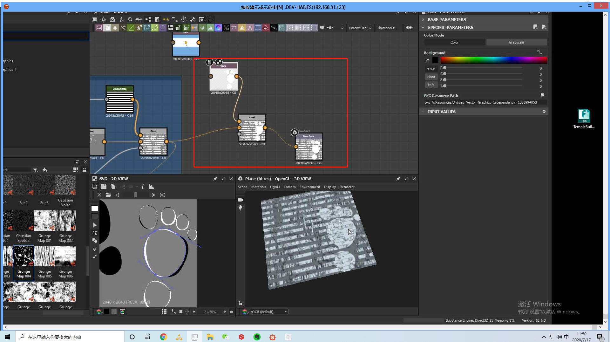

## 实现红色的砖墙：

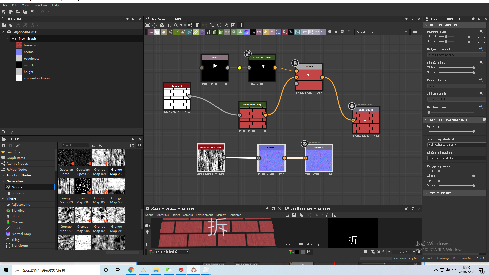

## Tile Generator

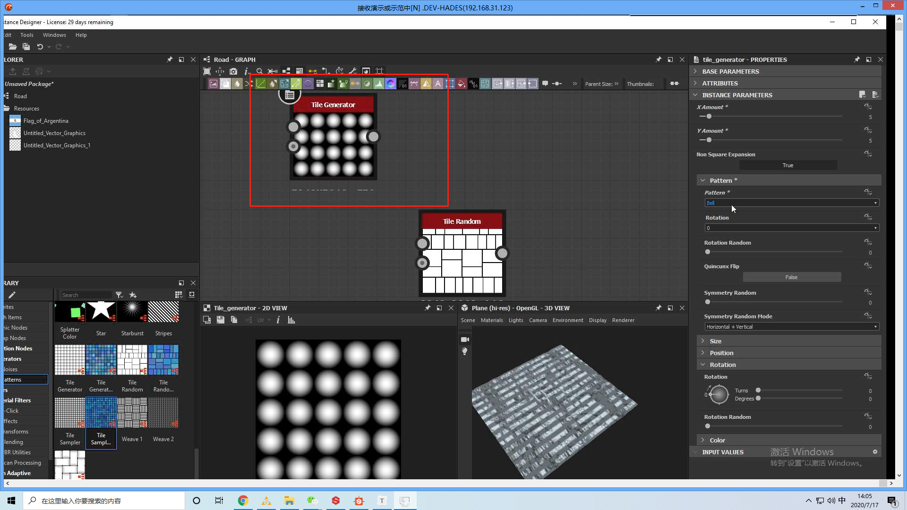

### 自定义输入

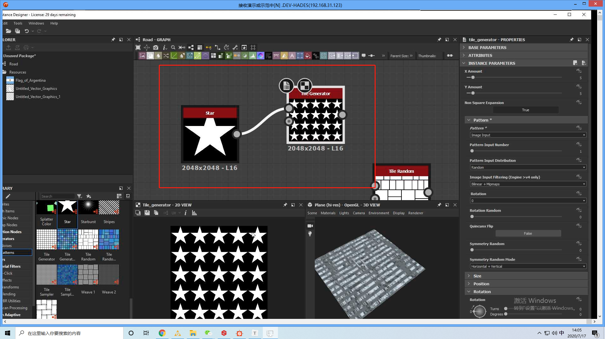

### 随机层叠

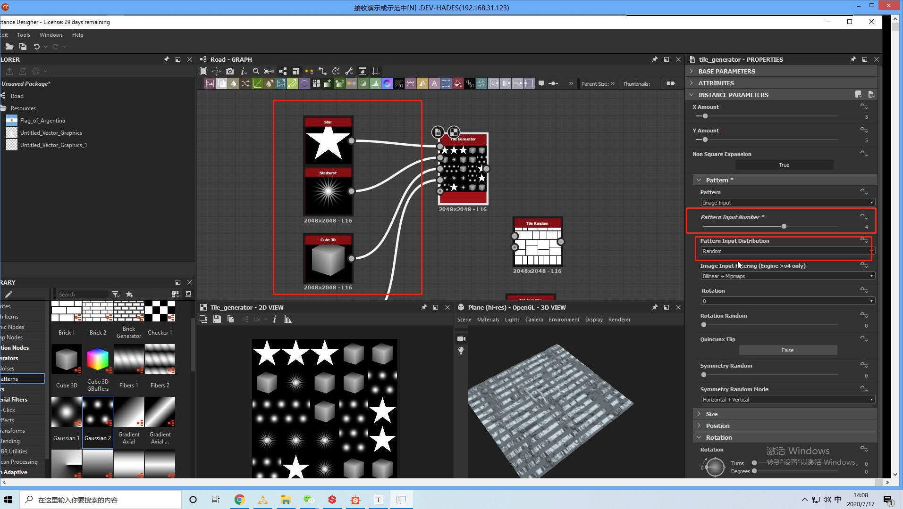

做墙的时候，可以叠上几个不同破碎的砖头，这样可以用来实现一个墙上多种不同的破碎砖头。

### 尺寸调整

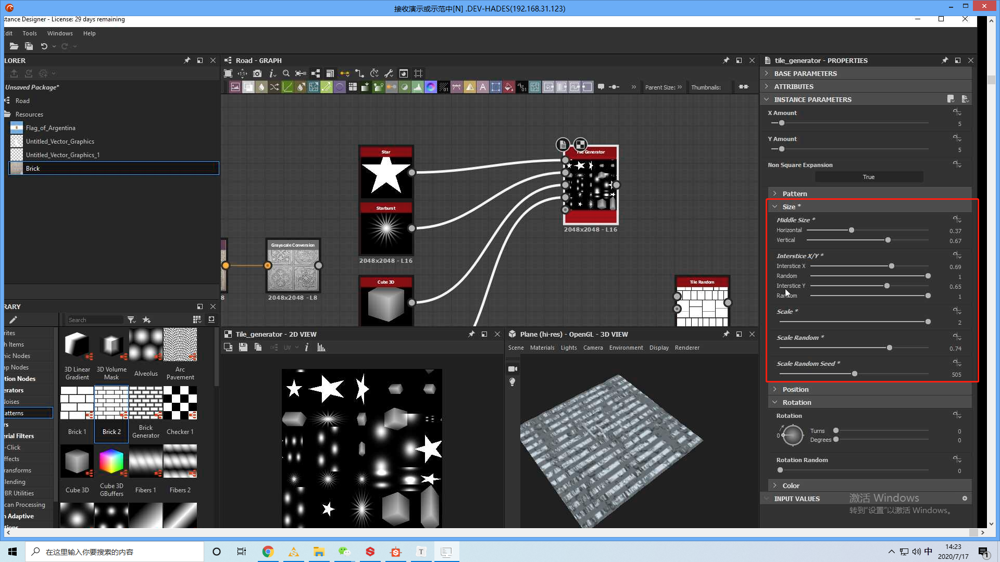

### 位置调整

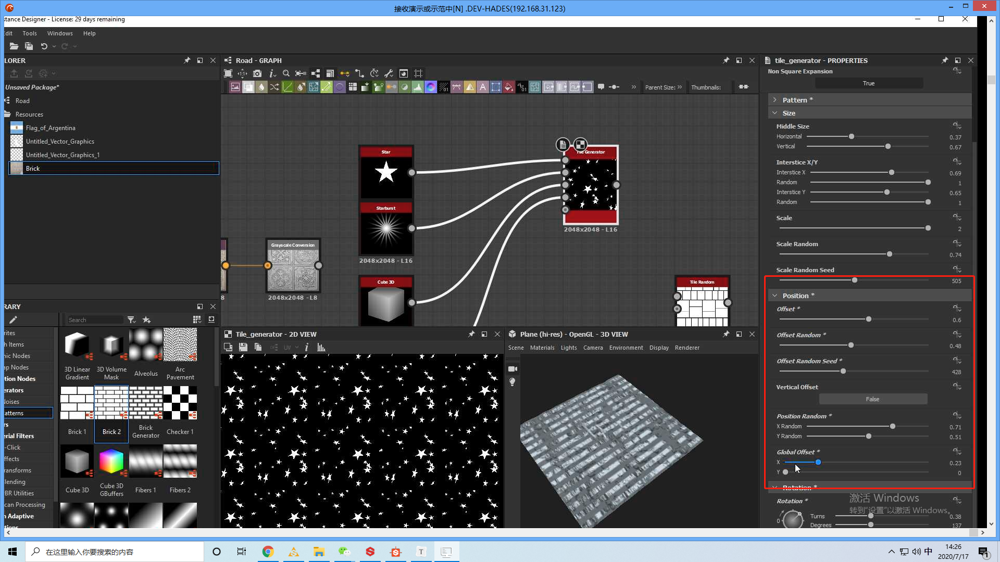

### 按空格键实现全屏预览切换

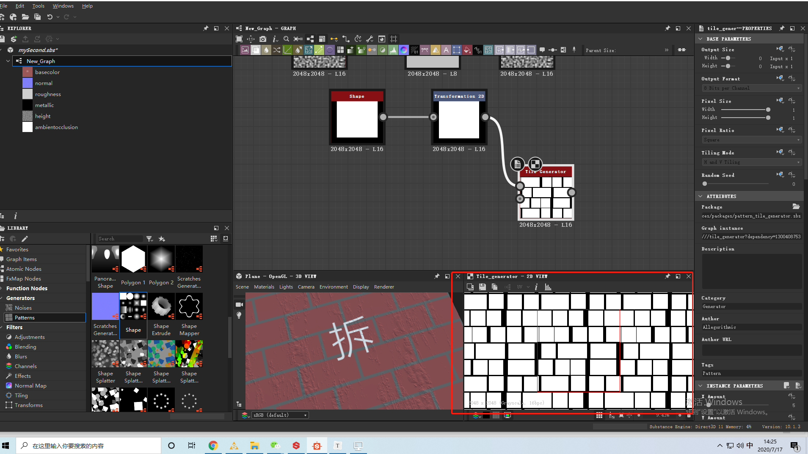

### 通过颜色的黑白来设置高度、法线等信息：

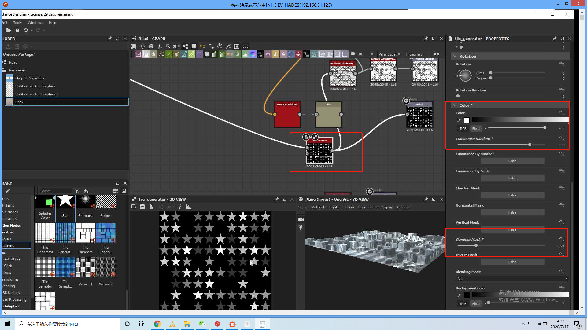

如果想要看到高度的明显变化，需要调整为高分辨率的曲面：

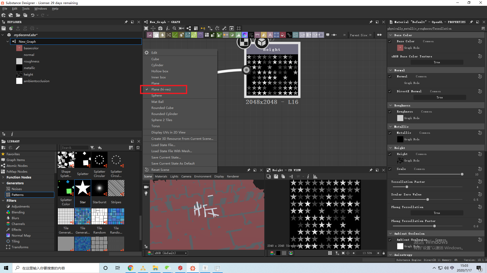

### 扭曲

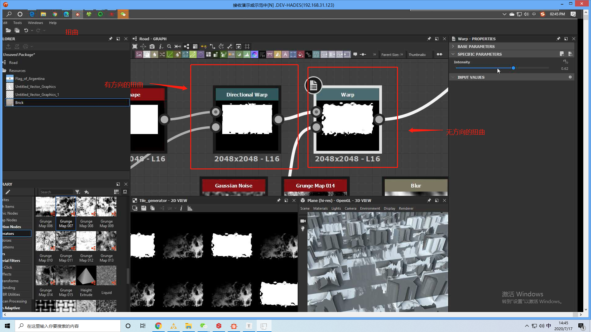