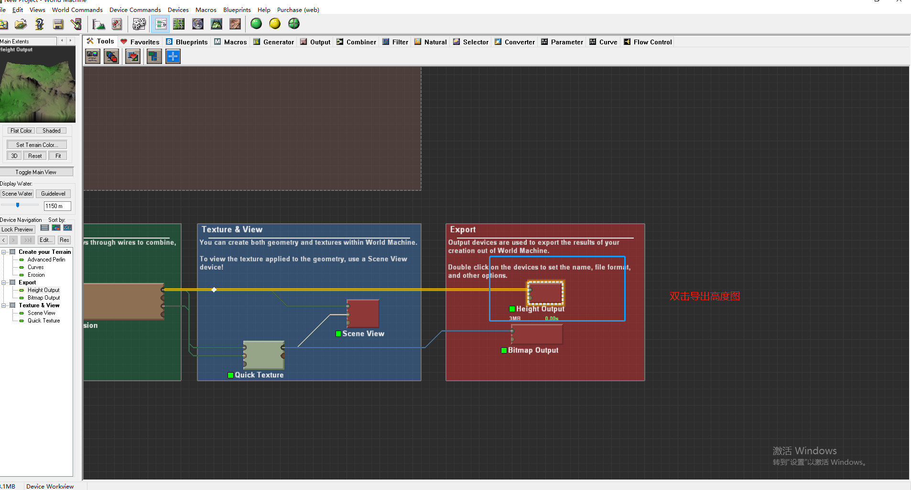
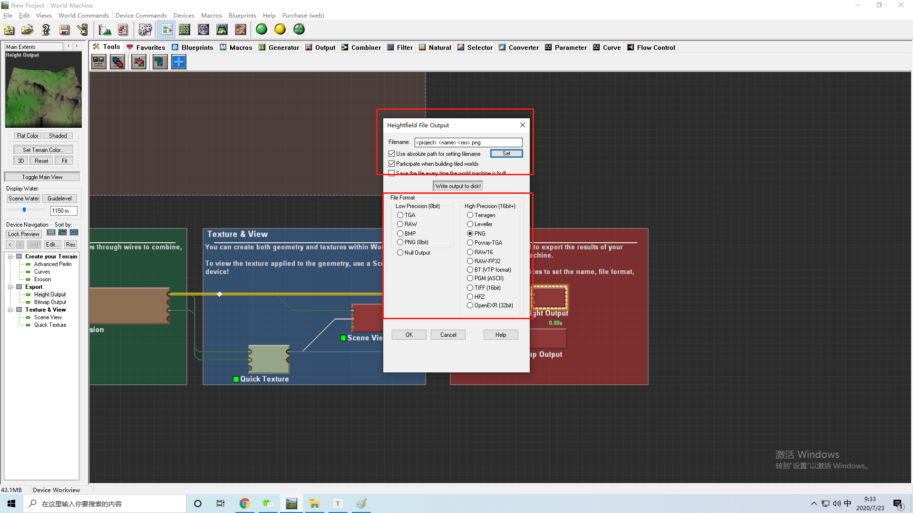
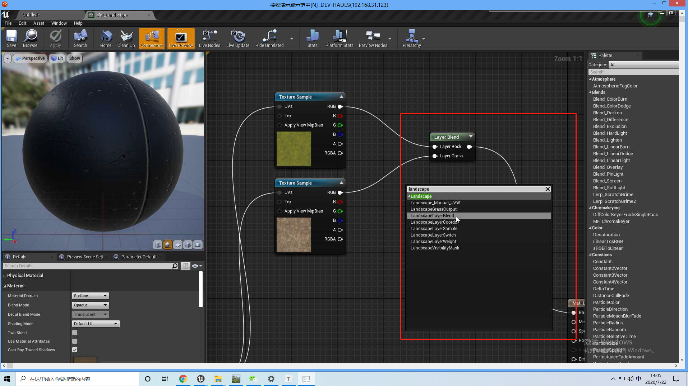
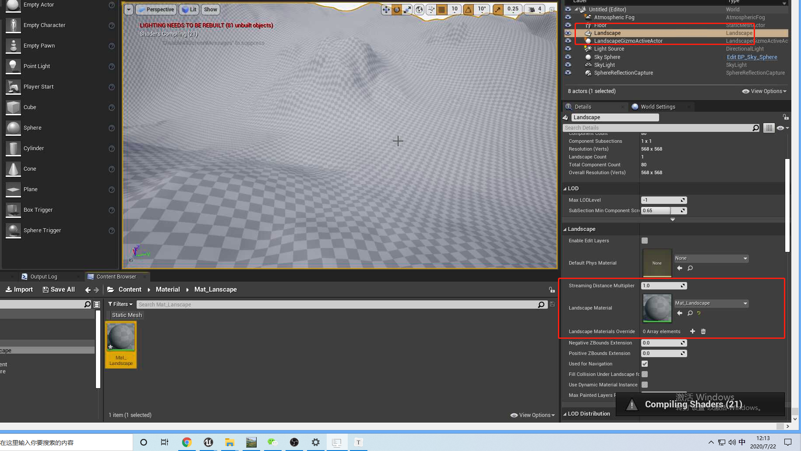
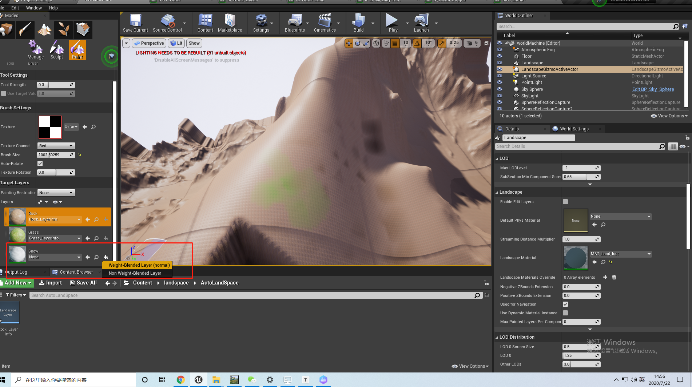
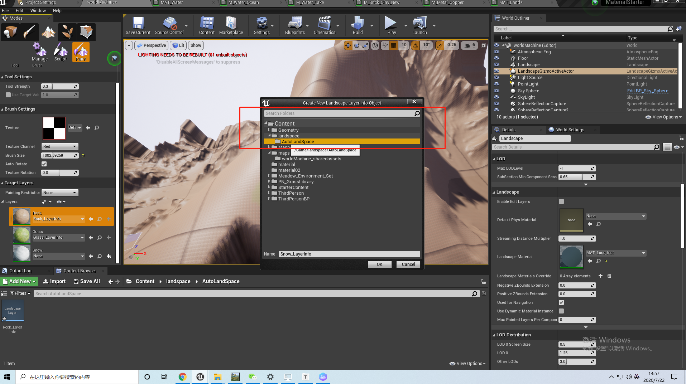
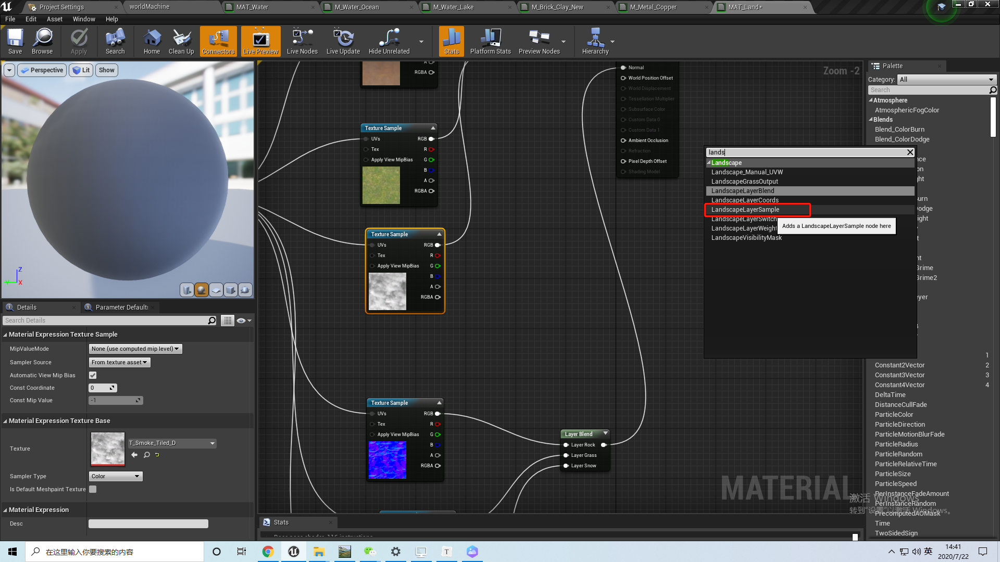
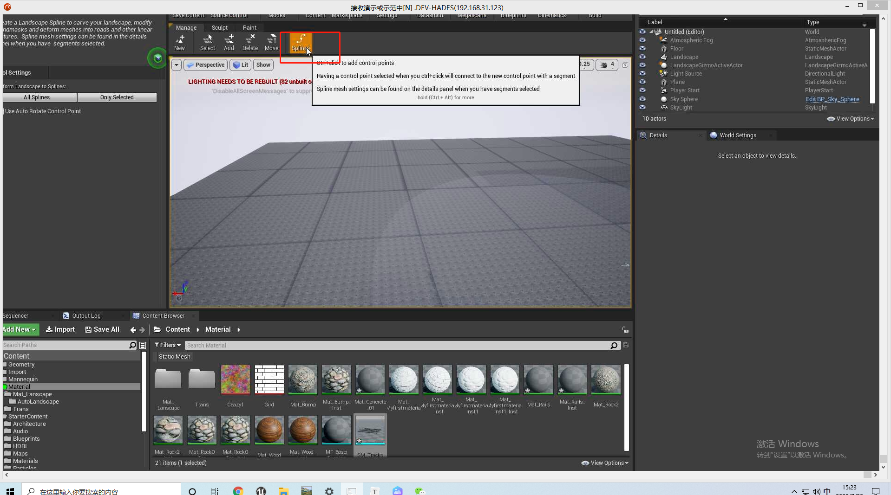
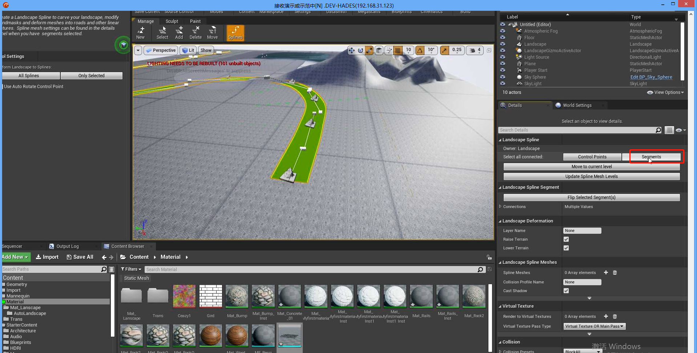
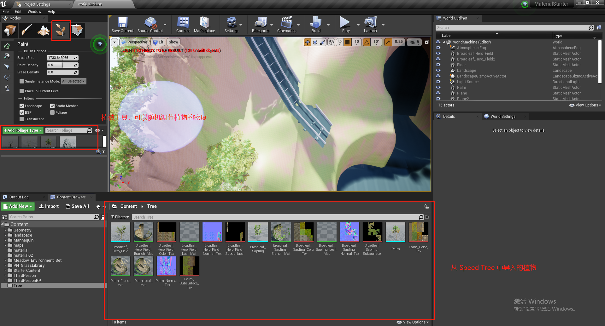

# 地形

## 0 WorldMachine

https://help.world-machine.com/

一款制作地形的软件

### 0.1 导出地形高度图

导出高度图：

 

选择文件路径和文件格式：

## 1 地形材质混合

## 2 地形材质分层

绑定材质：

添加材质：

## 3 自动地形材质

## 4 样条线

地形的样条线适合做河流、公路。

鼠标左键+Ctr 新增样条点。 

全选：

## 4 植物

### 4.1 Speed Tree

一款专门做植被的软件

### 4.2 UE4 植物

