#

## 制作冰挂

http://blueprintue.cn/blueprint/ecki7quz/

开启表面颜色，这种材质可以用来做皮肤：

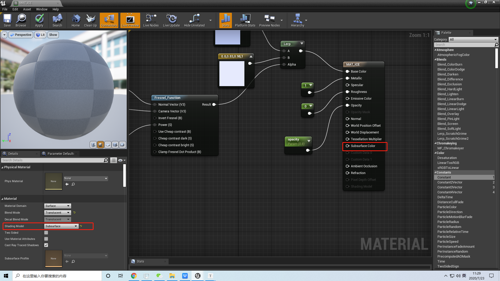

制作冰凌的材质：

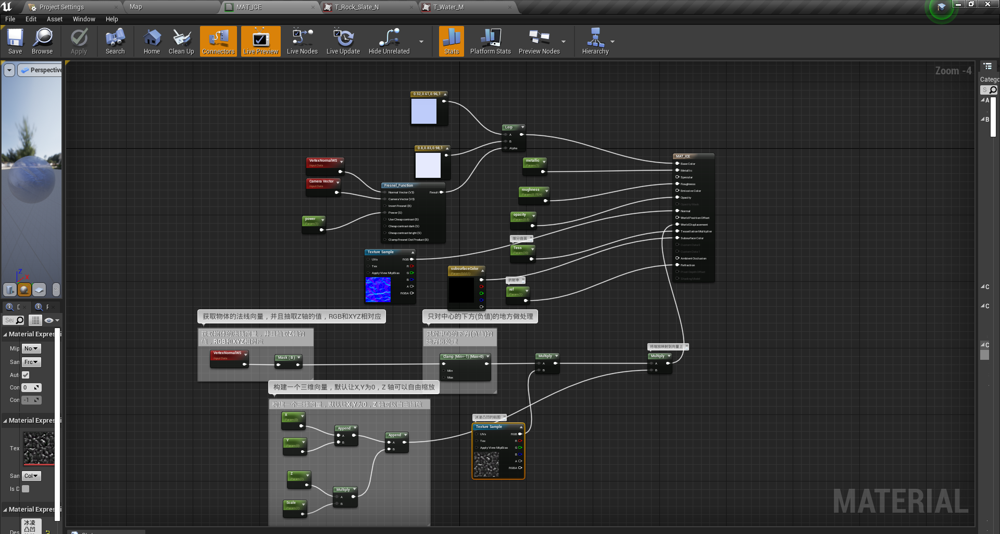

效果图：低于中心点以下都会下凸。

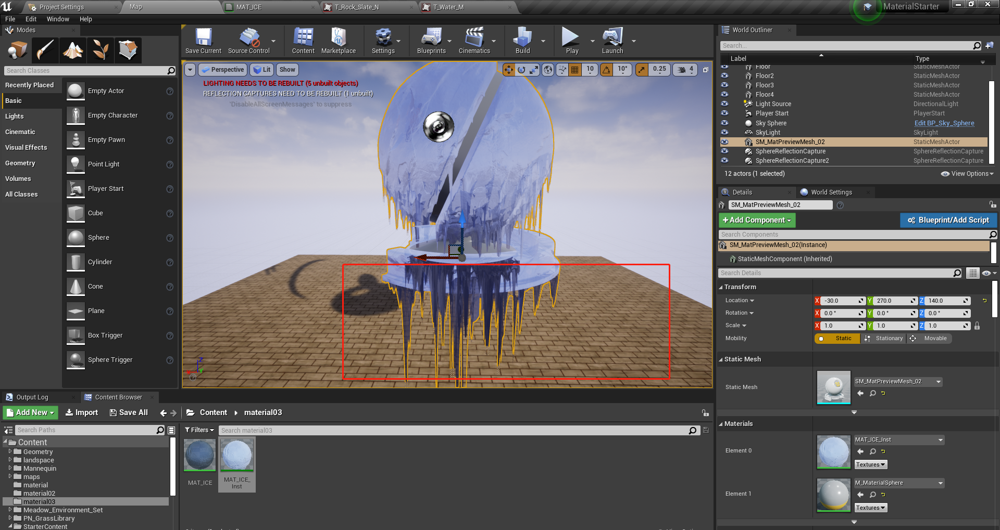

使用法线拉伸还可以做一些落了雪的岩石，在法线上面的地方覆盖的雪的材质，下面使用岩石的材质。

## 2 Speed Tree

### 2.1 树的节点

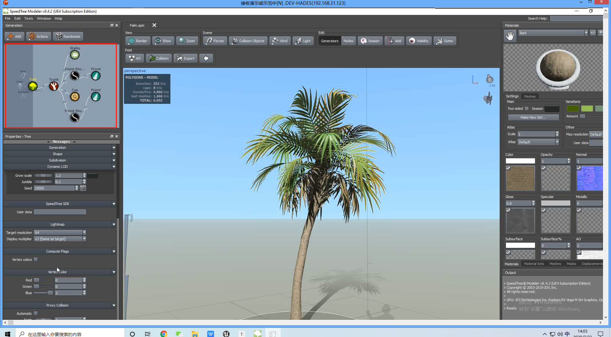

### 2.2 添加材质

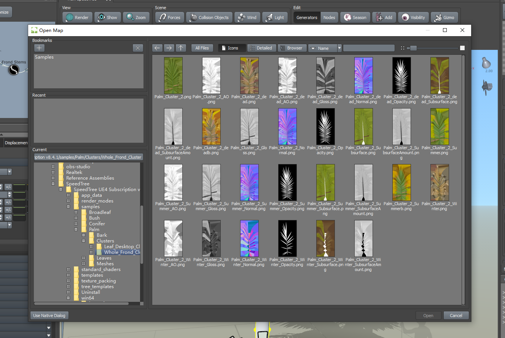

导出 到 UE4

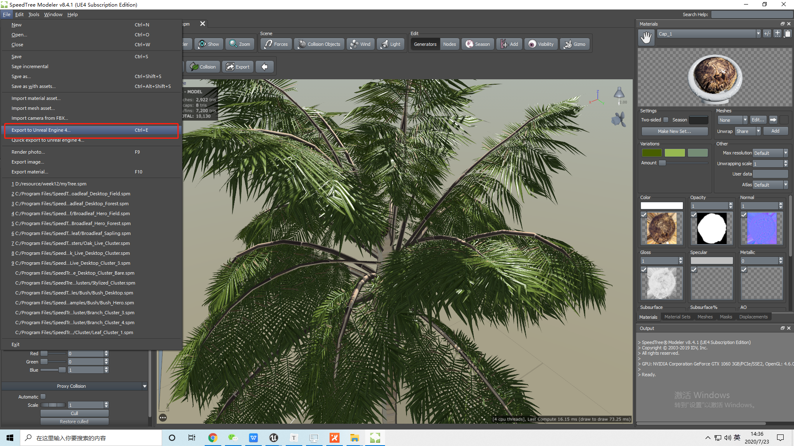

### 2.3 新建空白树

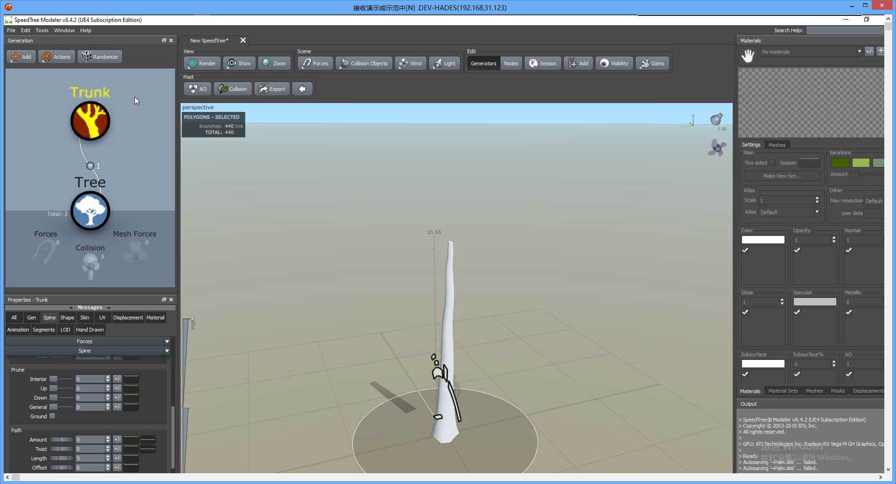

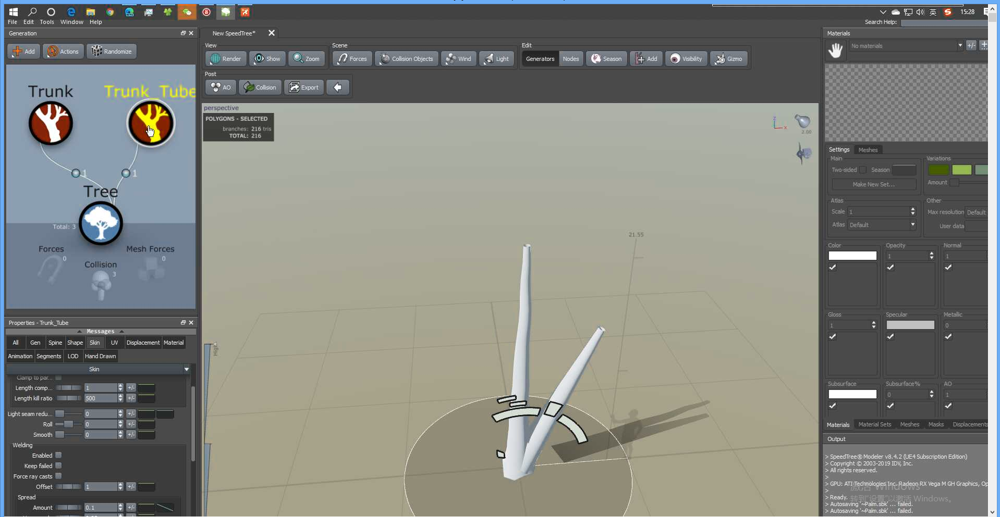

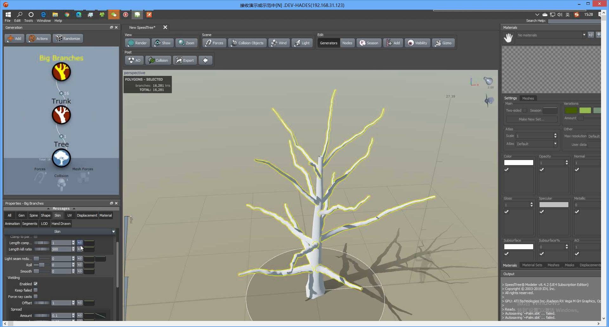

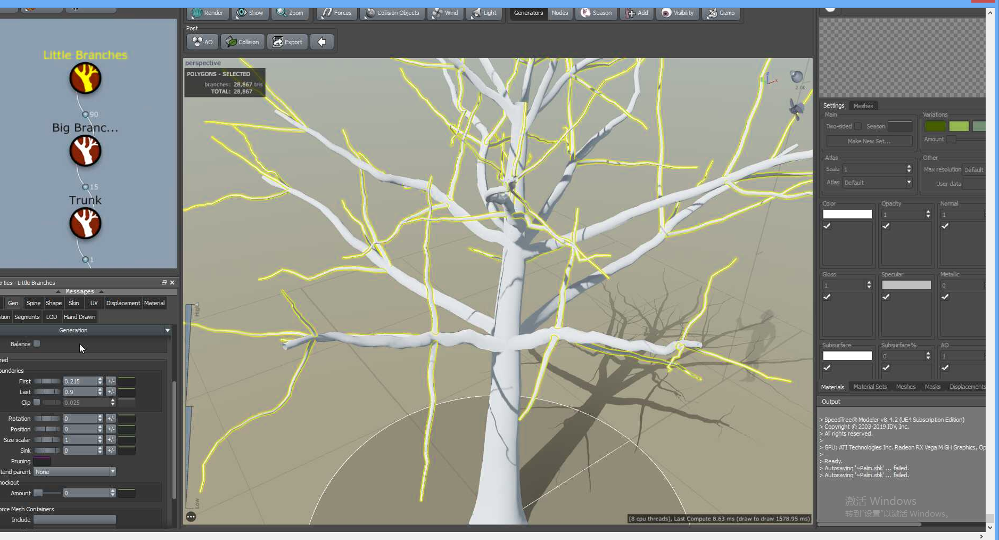

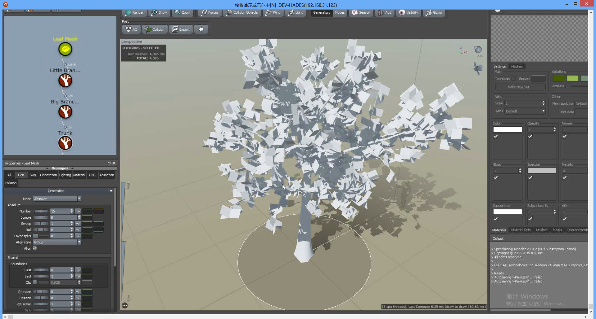

### 2.4 LOD 优化

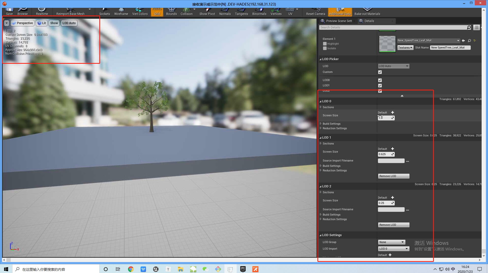

修正原有的 LOD：

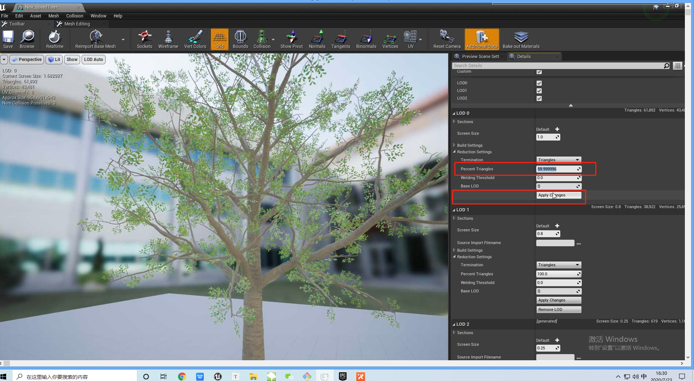

修改LOD数量：

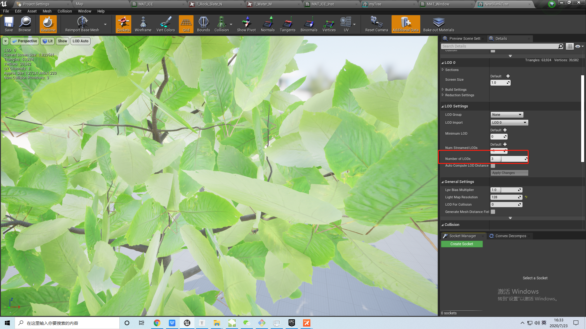