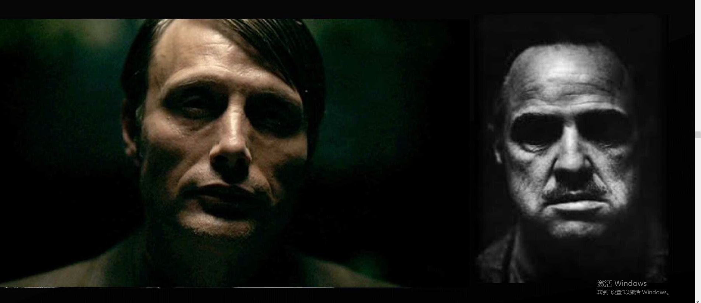
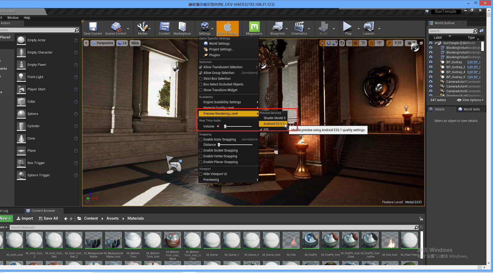

# 角色打光

## 1 影子

案例：

### 1.1 灯光上移

 案例：

### 1.2 顶光

案例：

#### 1.2.1 BUT

### 1.3 剪影灯光

#### 1.3.1 BUT

### 1.4 侧面灯光

### 1.5 底面灯光

### 1.6 伦勃朗光

角色正义感，阳光，积极

### 1.7 双色光源

### 1.8 库布里克的凝视

### 1.9 角色光照总结

## 2 一只猫的故事

### 2.1 逆光

### 2.2 教父光

### 2.3 底光

## 3 灯光小案例

### 3.1 灯光优先Build 体积

### 3.2 灯光反弹

#### 3.2.1 一次反弹

#### 3.2.2 三次反弹

发现效果好了很多

#### 3.2.3 30次灯光反弹

发现和3次反弹差不多，其实灯光每次反弹会有能量折损，后面多次反射肉眼无法识别：

#### 3.2.4 灯光世界设置

### 3.3 自动曝光

关闭自动曝光后，使用天空光来让室内不全黑：

### 3.4 使用高度雾和聚光灯模拟上帝光

高度雾的配置：

聚光灯打开雾的配置：

### 3.5 ConstTrain

用来实现摇摆的物件。例如人提着吊灯，人带着耳环等。

### 3.6 使用聚光灯和板子来模拟摄影棚

材质只使用baseColor为（0.5,0.5,0.5），其余值不写即可，可以调节亮度来达到较亮的效果。

### 3.7 可以使用面光源来模拟摄影棚

### 3.8 切换平台预览

### 3.9 LightMass Portal——增强门或者窗户的通光度

