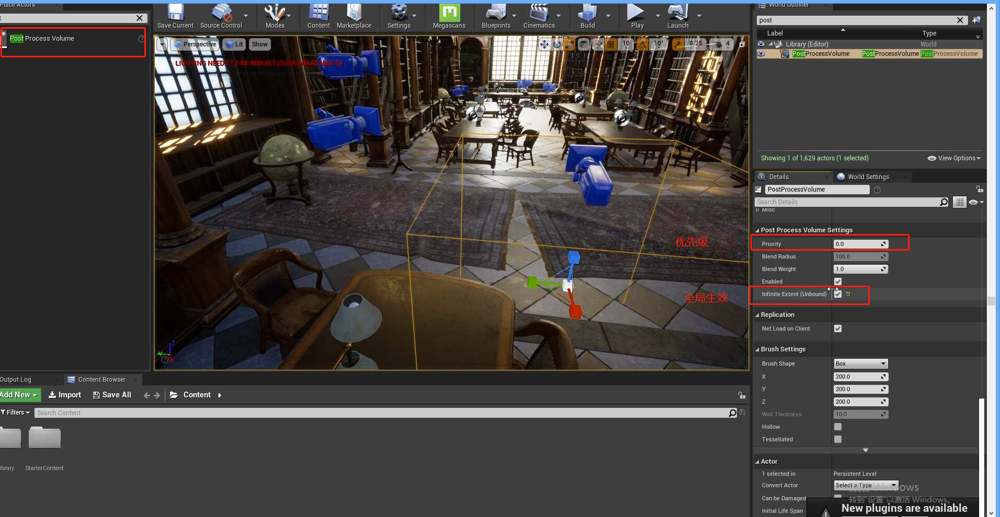
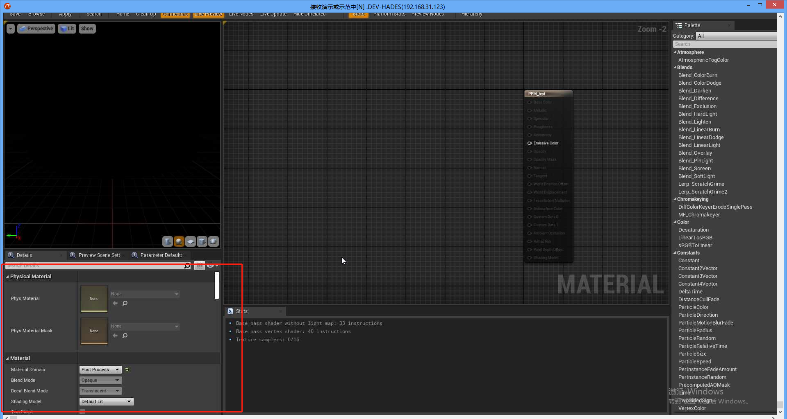

# 后期处理（POST PROCESS）

## 1 后期处理体积

### 1.1 全局生效

### 1.2 混合权重(Blend Widget)

当多个后期处理框交叠的时候，每个部分站得比重

## 2 Lens(镜头)

### 2.1 Mobile Depth of Field (手机端场景景深)

### 2.2 影视级摄像机

摄像机类型：

光圈：

光圈和清晰度:

### 2. 3 Bloom 灯光增益

### 2.4 Exposure 自动曝光

由明到暗时，模拟人眼产生的明暗变化。让场景变亮变暗。

### 2.5 Chromatic Aberration(迷幻效果)

模拟人喝醉酒之后的场景

### 2.6 Dirt Mask（污渍遮蔽）

### 2.7 Lens Flares(镜头炫光)

参数：

颜色效果：

### 2.8 Image Effect——摄像头效果

监视摄像头：

这些东西在影视摄像机里面都是可以单独设置的：

## 3 Color Grading 调色——重点

### 3.1 WhiteBlance(白平衡)

染色：

### 3.2 Global 全局颜色

Saturation:饱和度

Contrast:对比度

Gamma: 

Gain:增益

Offset 颜色偏移：

### 3.3 Height Lighness(高光)

只针对高光的地方做处理

### 3.4 Shadows(影子)

针对暗的地方调整

### 3.5 Misc(杂项，自定义色卡)

标准色卡：

获取修改色卡：

将修改丢入Misc:

此时需要将图片变成无压缩：

## 4 Rendering Features

### 4.1 Ambient Occlusion

### 4.2 全局光照

### 4.3 （Motion Blur） 动态模糊 

对于会动的东西产生一些模糊

### 4.4 反射和屏幕空间反射

### 4.5 折射

### 4.6 后期处理材质

材质的固定格式：

让场景变成粉色：

### 4.7 制作血色闪动

