# 后期处理材质

## 1 冰的效果

### 1.1 制作法线

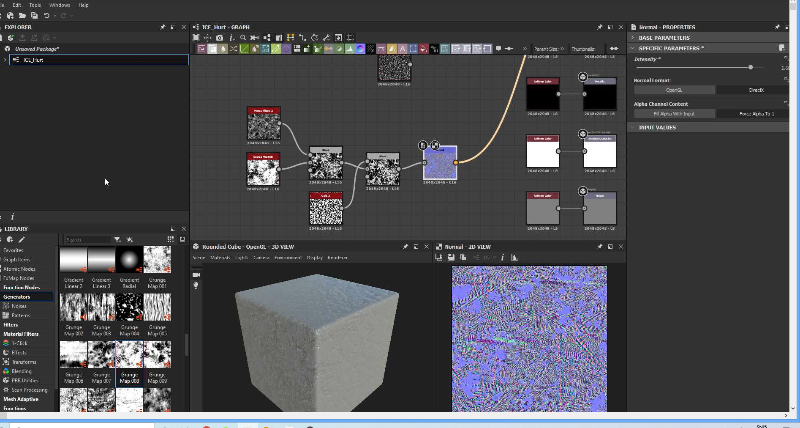


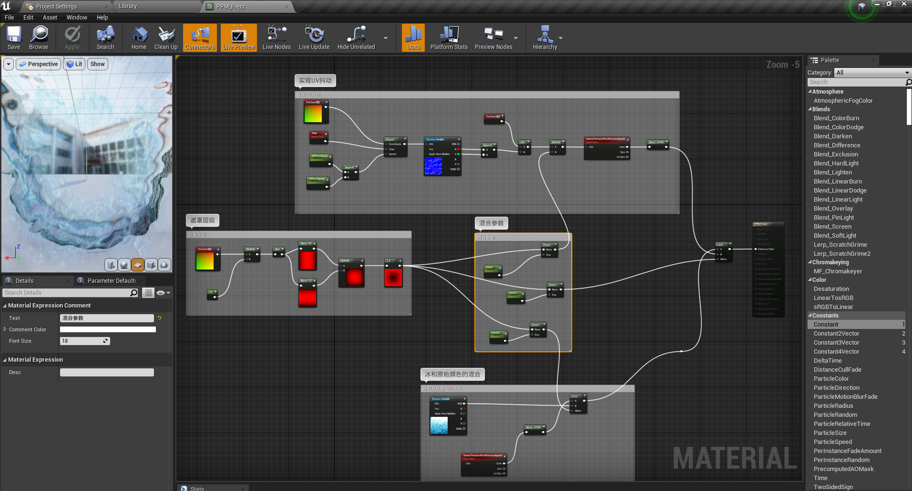

效果：

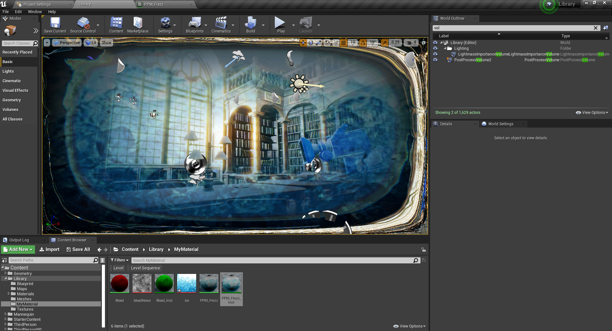

## 2 镜像模糊

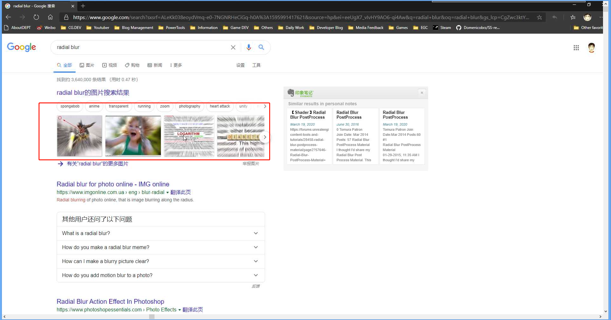

使用材质实现：

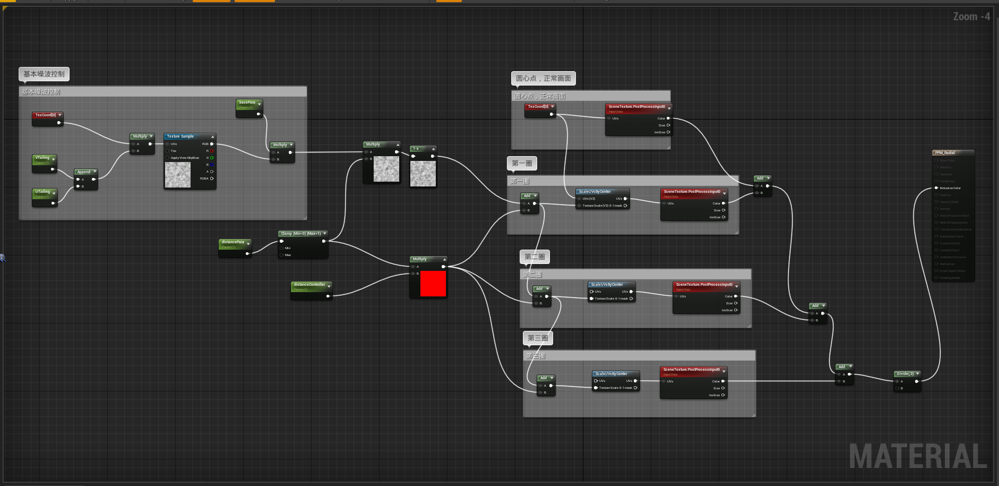

预览效果：

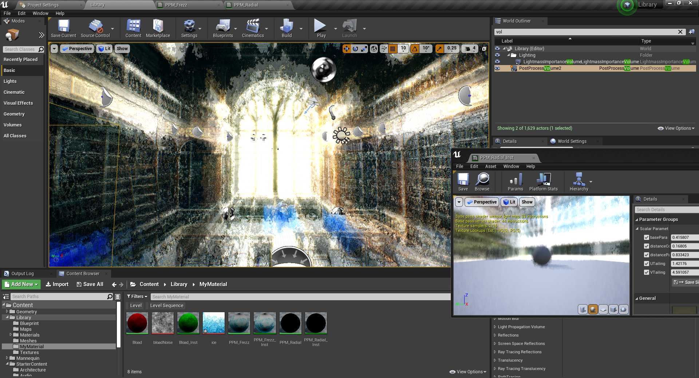


## 3 使用 HLSL 模拟镜像模糊

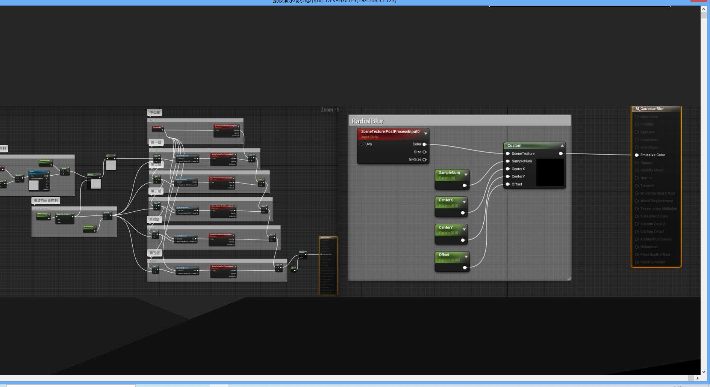


HLSL 代码，可以看到它使用 for 循环实现上面的五次相加，而且可以自定义次数，由此看来，使用 HLSL  来实现材质说一种非常简单的做饭。

```glsl
static const int SceneTextureId = 14;
float2 UV = GetDefaultSceneTextureUV(Parameters, SceneTextureId);
float3 Sum = float3(0, 0, 0);


float2 Dir = float2(CenterX, CenterY) - GetViewportUV(Parameters);
for (int it = 0; it < SampleNum; it++)
{
float2 UVOffset = it * Offset * length(Dir) * Dir;
#if SHADING_PATH_MOBILE
Sum += MobileSceneTextureLookup(Parameters, SceneTextureId, UV + UVOffset).rgb;
#else
Sum += SceneTextureLookup(UV + UVOffset, SceneTextureId, false).rgb;
#endif
}


return Sum/SampleNum;
```

参数暴露：

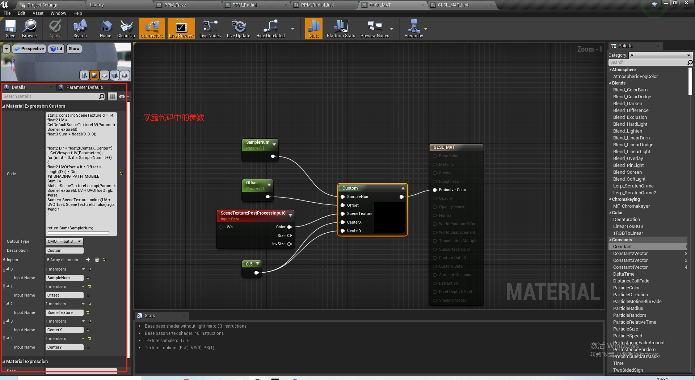


引擎自定义：Shader

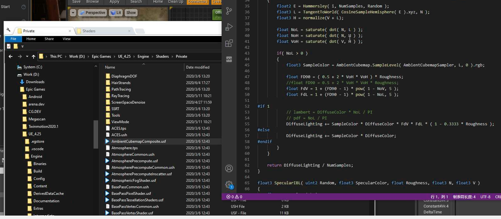

参考链接：

https://www.cnblogs.com/herenzhiming/articles/5276106.html
https://blog.csdn.net/Invokar/article/details/80277334
https://www.raywenderlich.com/57-unreal-engine-4-custom-shaders-tutorial


## 4 景深

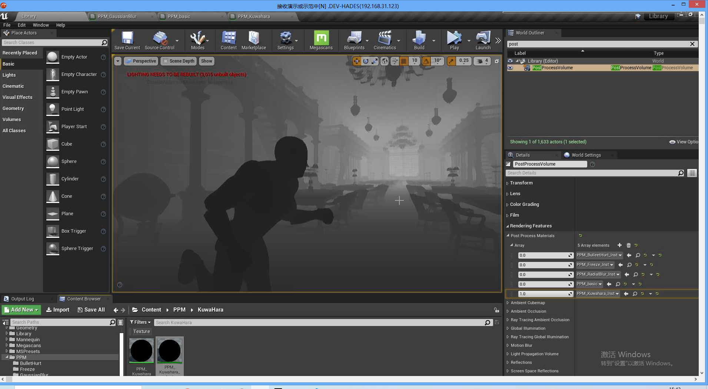


添加到自定义景深：

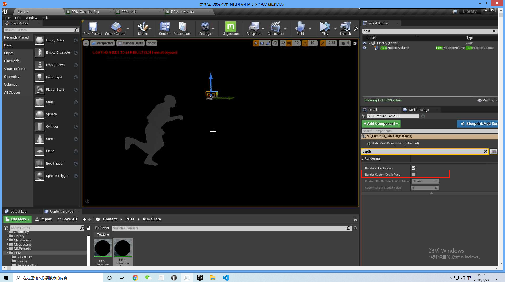